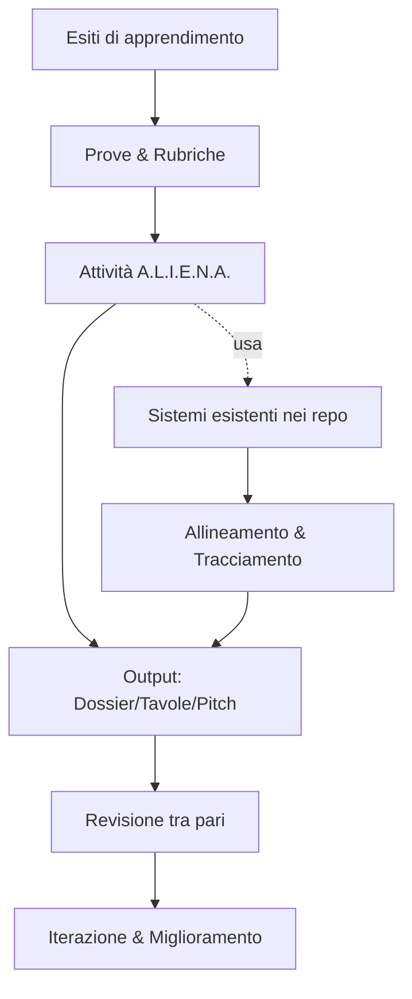

# Sistema **A.L.I.E.N.A.** — Documento Integrato
Versione: 1.0 · Data: 10 novembre 2025  
Autori: Team didattica & worldbuilding  
Licenze consigliate: **CC BY 4.0** (contenuti) · **MIT** (codice)

> **Scopo** — Unificare il metodo **A.L.I.E.N.A.** con i sistemi già presenti nei repository, creando un’unica fonte di verità (SSOT) per progettare, documentare e valutare specie aliene in modo coerente, ripetibile e tracciabile.

---

## Indice
1. [Sintesi del metodo A.L.I.E.N.A.](#sintesi-del-metodo-aliena)  
2. [Architettura di integrazione](#architettura-di-integrazione)  
3. [Mappa di convergenza con i sistemi dei repo](#mappa-di-convergenza-con-i-sistemi-dei-repo)  
4. [Workflow operativo (end‑to‑end)](#workflow-operativo-endtoend)  
5. [Standard di progetto: struttura cartelle & naming](#standard-di-progetto-struttura-cartelle--naming)  
6. [Canvas A.L.I.E.N.A. (template)](#canvas-aliena-template)  
7. [Unità didattica integrata (10–12 ore)](#unità-didattica-integrata-1012-ore)  
8. [Rubrica unificata (tabella & CSV)](#rubrica-unificata-tabella--csv)  
9. [Schema dati (JSON) per le specie](#schema-dati-json-per-le-specie)  
10. [Template operativi per repository](#template-operativi-per-repository)  
11. [Guida editoriale e standard qualitativi](#guida-editoriale-e-standard-qualitativi)  
12. [Versionamento, changelog e roadmap](#versionamento-changelog-e-roadmap)  
13. [Glossario](#glossario)  
14. [Appendici: checklist, FAQ](#appendici-checklist-faq)

---

## Sintesi del metodo A.L.I.E.N.A.

> **A.L.I.E.N.A.** = **A**mbiente · **L**inee evolutive · **I**mpianto morfo‑fisiologico · **E**cologia & comportamento · **N**orme socioculturali · **A**ncoraggio narrativo.

Principi didattici sottostanti (da allineare con i sistemi esistenti):
- **Backward Design / Understanding by Design** (esiti → evidenze → attività)
- **Constructive Alignment** (obiettivi ⇄ attività ⇄ valutazione)
- **Tassonomia di Bloom (rivista)** per formulare obiettivi osservabili
- **UDL** (Universal Design for Learning) per accessibilità e variabilità
- **PBL** (Project‑Based Learning) come cornice del progetto
- **Design Thinking** per iterazione rapida e test dei prototipi

**Deliverable principali A.L.I.E.N.A.**
- Dossier specie (max 6 pagine) + tavola visual / mockup 3D
- Pitch pubblico (5′) + peer review
- Metadati strutturati (JSON) per archivio e analisi

---

## Architettura di integrazione

Tre livelli complementari:

1) **Didattico‑valutativo** — obiettivi, rubriche, prove, UDL  
2) **Produttivo** — canvas, template, directory, naming, asset  
3) **Governance** — issue/PR template, branching, changelog, versioni



**Punti di aggancio** (da collegare ai repo):
- **Obiettivi & Programmazione** → `{/percorsi-repo}/didattica/obiettivi.md`
- **Rubriche** → `{/percorsi-repo}/valutazione/rubriche/`
- **Template** → `{/percorsi-repo}/template/`
- **Asset** (tavole, immagini, modelli) → `{/percorsi-repo}/assets/`
- **Documentazione** (site) → `{/percorsi-repo}/docs/`
> Sostituisci `{/percorsi-repo}` con i path reali del(i) tuo(i) repository.

---

## Mappa di convergenza con i sistemi dei repo

Compila la tabella sostituendo **{Sistema_X}** con il nome del sistema esistente (es. “Piano di lavoro 2024”, “Rubrica STEM”, “Kit Template Lezione”).

| Elemento A.L.I.E.N.A. | Campo/Dominio | Sistema esistente → Campo | Regole di mapping | Note/Decisoni |
|---|---|---|---|---|
| A — Ambiente | Parametri fisici (stella, gravità, atmosfera, idrosfera…), vincoli | **{Sistema_Ambiente}** → `{campo}` | 1:1 quando esiste; altrimenti crea nuovo campo | |
| L — Linee evolutive | Pressioni selettive, nicchie, analoghi | **{Sistema_Bio/Eco}** → `{campo}` | Normalizza in elenco strutturato | |
| I — Impianto morfo‑fisiologico | Piano corporeo, locomozione, sensi, metabolismo, scala | **{Sistema_Modeling}** → `{campo}` | Conforma a glossario condiviso | |
| E — Ecologia & comportamento | Reti trofiche, socialità, comunicazione | **{Sistema_Eco/Storyworld}** → `{campo}` | Mantieni tracciabilità fonti | |
| N — Norme socioculturali (se senzienti) | Habitat/cultura/tecnologia/valori | **{Sistema_Culture/Worldbuilding}** → `{campo}` | Indicare impatti ambientali min. 3 | |
| A — Ancoraggio narrativo | Tema, ruolo, conflitto, arco | **{Sistema_Narrativa/Game}** → `{campo}` | Evidenzia “cosa vogliono / cosa li frena” | |
| Obiettivi didattici | Verbi Bloom & UbD | **{Sistema_Obiettivi}** → `{campo}` | Usa verbi osservabili | |
| Valutazione | Criteri/rubrica a 4 livelli | **{Sistema_Rubriche}** → `{rubrica}` | Mappare criteri equivalenti | |
| Accessibilità UDL | Rappresentazione/Espressione/Coinvolgimento | **{Sistema_UDL}** → `{linee}` | Min. 1 scelta per dimensione | |

> Suggerimento: salva la mappa come `docs/integration/map_aliena.md` e referenziala nel menu del sito (vedi sotto).

---

## Workflow operativo (end‑to‑end)

1) **Definisci esiti & criteri** (Backward Design)  
   - Output: `docs/ubd/esiti.md`, `docs/ubd/criteri.md`
2) **Ricerca ambiente & astrobiologia** (A)  
   - Output: `species/<slug>/01_ambiente.md`
3) **Linee evolutive & pressioni** (L)  
   - Output: `species/<slug>/02_linee_evolutive.md`
4) **Impianto morfo‑fisiologico** (I) + **scala/allometria**  
   - Output: `species/<slug>/03_morfologia.md`
5) **Ecologia & comportamento** (E)  
   - Output: `species/<slug>/04_ecologia.md`
6) **Norme socioculturali** (N, se applicabile)  
   - Output: `species/<slug>/05_cultura.md`
7) **Ancoraggio narrativo** (A)  
   - Output: `species/<slug>/06_narrazione.md`
8) **Dossier & tavola** (impaginazione finale)  
   - Output: `deliverables/<slug>_dossier.pdf`, `deliverables/<slug>_tavola.png`
9) **Pitch & peer‑review**  
   - Output: `reviews/<slug>_peerreview.md` (protocollo warm/cool feedback)
10) **Revisione & release** (tag versione specie, es. `aliena-<slug>-v1.0`)

**Milestone Git suggerite**
- `feat/species/<slug>` → nuova specie
- `review/species/<slug>` → revisione tra pari
- `release/species/<slug>-vX.Y` → versione stabile

---

## Standard di progetto: struttura cartelle & naming

```
/docs/                    # Sito/MkDocs o Docusaurus
/docs/integration/        # Documenti di integrazione (questa guida, mappe)
/rubriche/                # Rubriche .md e .csv
/templates/               # Canvas, dossier, issue/PR templates
/species/<slug>/          # Cartella specie
/species/<slug>/assets/   # Immagini, modelli, fonti
/deliverables/            # Dossier finali, tavole, pitch
/reviews/                 # Feedback, revisioni, decisioni
.github/ISSUE_TEMPLATE/   # Template GitHub Issues
.github/PULL_REQUEST_TEMPLATE.md
/changelog.md
/roadmap.md
```

**Naming**
- Slug specie: `kebab-case`, es. `anemocantidi`
- File sequenziali, prefissi `01_`, `02_`, …
- Immagini: `<slug>_<tema>_<versione>.png` (es. `anemocantidi_tavola_v1.png`)

---

## Canvas A.L.I.E.N.A. (template)

Copia e compila in `templates/canvas_aliena.md` o direttamente in `species/<slug>/canvas.md`.

```md
# Canvas A.L.I.E.N.A. — {titolo specie}
- **Stella & Pianeta**: {tipo stella, orbita, gravità, atmosfera, idrosfera, radiazione}
- **Niche & Pressioni**: {3 pressioni selettive chiave + analoghi terrestri}
- **Forma** (I): {piano corporeo, locomozione, sensi, metabolismo, vincoli di scala}
- **Ecologia** (E): {ruolo trofico, mutualismi, comunicazione, difese}
- **Ciclo vitale**: {sviluppo, riproduzione, longevità}
- **Norme socioculturali** (N, se senzienti): {habitat, tecnologia, valori}
- **Ancoraggio narrativo** (A): {tema, ruolo, conflitto, posta in gioco}
- **Regola delle 3 frasi**: Poiché {ambiente} ⇒ serve {funzione} ⇒ quindi {forma/cultura}.
```

---

## Unità didattica integrata (10–12 ore)

**Obiettivi (Bloom)**: comprendere vincoli fisici/biologici; applicare/analizzare per generare tratti coerenti; valutare plausibilità; creare specie con dossier e presentazione.

**Sequenza**  
- **Lancio & domanda guida** (30')  
- **Ricerca guidata** su ambiente/astrobiologia + analoghi (90')  
- **Ideazione** Funzione→Forma (60')  
- **Prototipazione** morfo‑fisiologica con vincoli di scala (120')  
- **Ecologia & cultura** + narrative fit (90')  
- **Peer review** (45') → protocollo warm/cool feedback  
- **Revisione & pitch pubblico** (90')

**Valutazione**  
- Formativa: exit ticket ad ogni tappa.  
- Sommativa: rubrica a 4 livelli (vedi sotto).  
- UDL: ingressi multipli, modalità di espressione varie (testo/audio/modello).

---

## Rubrica unificata (tabella & CSV)

**Tabella (4 livelli)**

| Criterio | Esemplare (4) | Avanzato (3) | Base (2) | Da rivedere (1) |
|---|---|---|---|---|
| Plausibilità scientifica | Vincoli fisici/biologici sempre rispettati e giustificati | Minime imprecisioni | Diverse imprecisioni | Principi base ignorati |
| Coerenza eco‑morfo‑culturale | Forte catena ambiente→funzione→forma | Per lo più coerente | Alcune discrepanze | Contraddizioni frequenti |
| Originalità | Idee nuove non derivabili da cliché | Alcune idee originali | Derivativo | Stereotipato |
| Giustificazioni esplicite | Motivazioni chiare con fonti/analoghi | Motivazioni presenti | Parziali/generiche | Assenti |
| Qualità comunicativa | Dossier/tavola impeccabili, narrazione efficace | Chiara con minime lacune | Disomogenea | Confusa |

**CSV (importabile in foglio di calcolo)**
```csv
criterio,4_esemplare,3_avanzato,2_base,1_da_rivedere,peso
plausibilita,"Vincoli rispettati e giustificati","Minime imprecisioni","Diverse imprecisioni","Principi ignorati",0.30
coerenza,"Catena A→F→F forte","Per lo più coerente","Alcune discrepanze","Contraddizioni frequenti",0.25
originalita,"Idee nuove","Alcune idee originali","Derivativo","Stereotipato",0.15
giustificazioni,"Chiare con fonti","Presenti","Parziali","Assenti",0.15
comunicazione,"Dossier/tavola eccellenti","Chiara","Disomogenea","Confusa",0.15
```

---

## Schema dati (JSON) per le specie

Salva come `schemas/species.schema.json` e usa nei validatori/CI.

```json
{
  "$schema": "https://json-schema.org/draft/2020-12/schema",
  "title": "ALIENA Species",
  "version": "1.0.0",
  "type": "object",
  "required": ["id", "name", "environment", "pressures", "body_plan", "ecology", "narrative"],
  "properties": {
    "id": {"type": "string", "pattern": "^[a-z0-9-]+$"},
    "name": {"type": "string"},
    "version": {"type": "string", "pattern": "^v?\\d+\\.\\d+(\\.\\d+)?$"},
    "environment": {
      "type": "object",
      "required": ["star", "planet", "gravity", "atmosphere", "hydrosphere", "radiation"],
      "properties": {
        "star": {"type": "string"},
        "planet": {"type": "string"},
        "gravity": {"type": "number"},
        "atmosphere": {"type": "string"},
        "hydrosphere": {"type": "string"},
        "radiation": {"type": "string"}
      }
    },
    "pressures": {"type": "array", "items": {"type": "string"}, "minItems": 1},
    "body_plan": {
      "type": "object",
      "required": ["symmetry", "locomotion", "senses", "metabolism", "scaling_notes"],
      "properties": {
        "symmetry": {"type": "string"},
        "locomotion": {"type": "string"},
        "senses": {"type": "array", "items": {"type": "string"}},
        "metabolism": {"type": "string"},
        "scaling_notes": {"type": "string"}
      }
    },
    "ecology": {"type": "object"},
    "life_cycle": {"type": "object"},
    "culture": {"type": "object"},
    "narrative": {
      "type": "object",
      "required": ["role", "theme", "conflict"],
      "properties": {
        "role": {"type": "string"},
        "theme": {"type": "string"},
        "conflict": {"type": "string"}
      }
    },
    "assets": {"type": "array", "items": {"type": "string"}},
    "assessment": {"type": "object"},
    "references": {"type": "array", "items": {"type": "string"}}
  }
}
```

**Esempio minimo (`species/anemocantidi/species.json`)**
```json
{
  "id": "anemocantidi",
  "name": "Anemocantidi",
  "version": "v1.0",
  "environment": {
    "star": "M-dwarf",
    "planet": "terminatore crepuscolare",
    "gravity": 0.9,
    "atmosphere": "sottile azotata",
    "hydrosphere": "mari poco profondi",
    "radiation": "alta variabilità EM"
  },
  "pressures": ["bassa luce", "venti forti", "substrati conduttivi"],
  "body_plan": {
    "symmetry": "bilaterale basso profilo",
    "locomotion": "piedi-pinna palmati",
    "senses": ["linea laterale amplificata", "elettrorecettori"],
    "metabolism": "poichilotermo attivo",
    "scaling_notes": "vincoli quadrato-cubo; muscolatura distribuita"
  },
  "ecology": {"trophic_role": "erbivoro tappeti fototrofi"},
  "life_cycle": {"longevity": "15-20 anni"},
  "culture": {"if_sapient": false},
  "narrative": {"role": "alleati diffidenti", "theme": "protezione habitat", "conflict": "estrazione mineraria"},
  "assets": ["deliverables/anemocantidi_tavola_v1.png"],
  "assessment": {},
  "references": []
}
```

---

## Template operativi per repository

### 1) Template **Issue** — Nuova specie A.L.I.E.N.A.
Salva in `.github/ISSUE_TEMPLATE/natural-alien-species.yml`

```yaml
name: "Specie A.L.I.E.N.A."
description: "Richiedi o proponi una nuova specie"
title: "[SPECIE] <slug> — <titolo>"
labels: ["species", "aliena", "feat"]
body:
  - type: input
    id: slug
    attributes:
      label: Slug specie
      description: "kebab-case, es. anemocantidi"
      placeholder: "anemocantidi"
    validations:
      required: true
  - type: textarea
    id: ambiente
    attributes:
      label: A — Ambiente
      description: "Stella, pianeta, gravità, atmosfera, idrosfera, radiazione"
    validations:
      required: true
  - type: textarea
    id: linee
    attributes:
      label: L — Linee evolutive & pressioni
    validations:
      required: true
  - type: textarea
    id: morfo
    attributes:
      label: I — Impianto morfo‑fisiologico
  - type: textarea
    id: eco
    attributes:
      label: E — Ecologia & comportamento
  - type: textarea
    id: norme
    attributes:
      label: N — Norme socioculturali (se applicabile)
  - type: textarea
    id: narrazione
    attributes:
      label: A — Ancoraggio narrativo
  - type: dropdown
    id: rubrica
    attributes:
      label: Rubrica applicata
      options: ["default-4liv", "stem-extended"]
    validations:
      required: true
```

### 2) Template **Pull Request**
Salva in `.github/PULL_REQUEST_TEMPLATE.md`

```md
## Scopo
Descrivi cosa introduce/modifica questa PR.

## Checklist
- [ ] Mappa integrazione aggiornata (`docs/integration/map_aliena.md`)
- [ ] JSON valido secondo `schemas/species.schema.json`
- [ ] Dossier e tavola in `/deliverables/`
- [ ] Rubrica compilata in `/rubriche/`

## Note per i revisori
Link a issue di riferimento, decisioni, fonti.
```

### 3) Navigazione sito (MkDocs)
Estratto `mkdocs.yml`

```yaml
site_name: ALIENA Docs
nav:
  - Home: index.md
  - Integrazione:
    - Panoramica: docs/integration/README.md
    - Mappa: docs/integration/map_aliena.md
  - Metodologia: docs/method/aliena.md
  - Rubriche: rubriche/README.md
  - Specie:
    - Anemocantidi: species/anemocantidi/canvas.md
    - (Aggiungi altre specie...)
```

---

## Guida editoriale e standard qualitativi

- **Stile**: chiarezza, tecnicità essenziale, zero “magia” non giustificata.  
- **Regola F‑A‑F**: Funzione → Ambiente → Forma per ogni tratto.  
- **UDL**: prevedere sempre alternative (testo/audio/modello).  
- **Fonti**: cita analoghi terrestri e principi scientifici (allometria, convergenza).  
- **Accessibilità**: testo alternativo per immagini (`alt` descrittivo), colori accessibili.  
- **Licenze**: contenuti **CC BY 4.0**, codice **MIT** (o adatta ai repo).

---

## Versionamento, changelog e roadmap

- **Specie**: tag semantici (`aliena-<slug>-vX.Y.Z`)  
- **Schema**: versione in `schemas/species.schema.json` (`version`)  
- **Changelog**: `changelog.md` con sezioni *Added/Changed/Fixed/Removed*  
- **Roadmap**: `roadmap.md` con milestone trimestrali

---

## Glossario

- **Allometria**: relazione tra dimensione corporea e funzioni fisiologiche.  
- **Convergenza evolutiva**: soluzioni simili in linee evolutive differenti.  
- **Poichilotermo**: temperatura corporea variabile con l’ambiente.  
- **Lock mareale**: rotazione sincrona, stesso emisfero verso la stella.  
- **UDL**: Universal Design for Learning.

---

## Appendici: checklist, FAQ

**Checklist rapida** (prima della PR)
- [ ] Ogni tratto ha motivazione F‑A‑F
- [ ] Scala/energia coerenti con allometria
- [ ] Sensi selezionati vantaggiosi nell’ambiente
- [ ] Cultura/tecnologia legate a vincoli locali
- [ ] Rubrica compilata e allegata
- [ ] JSON valido e asset referenziati

**FAQ**  
- *Posso saltare il livello N (Norme)?* Sì, se la specie non è senziente.  
- *Serve sempre una tavola visual?* Sì, ma può essere sketch o mock 3D.  
- *Dove vanno le fonti?* In `species/<slug>/references.md` e nel campo `references` del JSON.

---

> **Istruzioni di integrazione**: duplica questo file in `docs/integration/README.md`, aggiorna i path `{/percorsi-repo}` e compila la **Mappa di convergenza** con i nomi dei tuoi sistemi. Questo documento diventa l’indice per tutto il flusso A.L.I.E.N.A. nel/i tuo/i repository.
