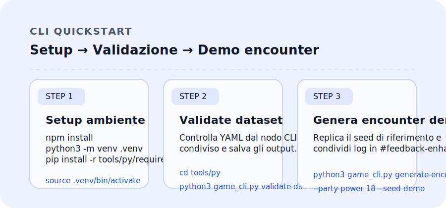
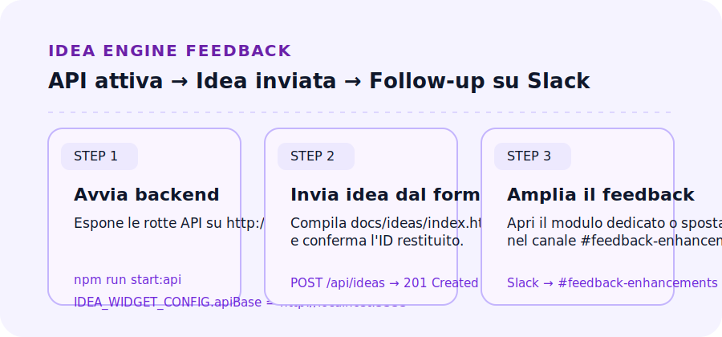
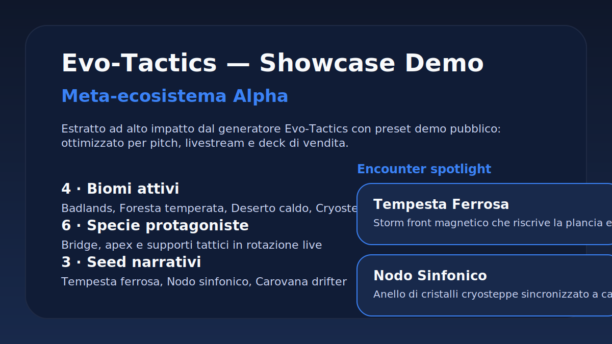

# Evo-Tactics — Starter Monorepo

Starter repository per il progetto tattico co-op con sistema d20 e progressione evolutiva modulare. Il pacchetto include dati YAML, CLI in Python/TypeScript, backend Idea Engine, webapp di test e pipeline di pubblicazione per condividere rapidamente build, report e materiali di presentazione.

## Indice

- [Panoramica](#panoramica)
- [Tour del repository](#tour-del-repository)
- [Setup rapido](#setup-rapido)
- [CLI & strumenti](#cli--strumenti)
- [Backend Idea Engine](#backend-idea-engine)
- [Dashboard web & showcase](#dashboard-web--showcase)
- [Dataset & Ecosystem Pack](#dataset--ecosystem-pack)
- [Stato database Evo Tactics](#stato-database-evo-tactics)
- [Storico aggiornamenti & archivio](#storico-aggiornamenti--archivio)
- [Stato operativo & tracker](#stato-operativo--tracker)
- [Report discrepanze & guida operativa](#report-discrepanze--guida-operativa)
- [Documentazione & tracker](#documentazione--tracker)
- [Automazione & workflow](#automazione--workflow)
- [QA & test](#qa--test)
- [Integrazioni esterne](#integrazioni-esterne)
- [Distribuzione & condivisione](#distribuzione--condivisione)
- [In arrivo](#in-arrivo)
- [Licenza](#licenza)

## Panoramica

- **Gioco**: tattico co-op con evoluzione a stadi, combinazioni MBTI/Enneagramma, biomi reattivi e mutazioni modulari.
- **Starter kit**: dati YAML verificati, strumenti CLI per validare/generare contenuti, workflow CI preconfigurati e materiale di presentazione condivisibile.
- **Obiettivo**: permettere bootstrap rapido di nuove istanze (locale o cloud) mantenendo consistenza tra dataset, orchestratore e deliverable di comunicazione.

## Settori e dipendenze

- **Flow (generazione & validazione)** – vive principalmente in `services/generation/`, `tools/py`, `tools/ts` e nei dataset `data/core/`.
  Orchestratore Python, CLI e validator TypeScript condividono gli stessi schema YAML; le pipeline front/back usano il registry condiviso in `webapp/src/config/dataSources.ts`.
- **Atlas (telemetria & dashboard)** – la webapp (`webapp/`) e le dashboard statiche in `docs/test-interface/` leggono gli snapshot `data/derived/` e i mock `webapp/public/data/`.
  Le variabili `VITE_*` armonizzano API live e fallback, mentre la configurazione `base` di Vite governa deploy statici e percorsi condivisi con Flow.
- **Backend Idea Engine** – `server/` e `services/` espongono endpoint Express utilizzati sia dalla webapp (Flow/Atlas) sia dagli script CLI.
  Dipende dai dataset `data/core/` e produce report in `reports/` e `packs/evo_tactics_pack/out/`.
- **Dataset & pack** – `data/`, `packs/` e `reports/` raccolgono la fonte unica per specie, trait, biomi e analisi.
  Ogni aggiornamento dei dataset è propagato verso Flow (validator/orchestratore), Atlas (snapshot), backend (API) e documentazione (`docs/catalog/`).

> Quando modifichi un settore, verifica le dipendenze a valle: ad esempio una variazione nei dataset implica rigenerare la webapp (`npm run webapp:deploy`, build + preview locale), aggiornare i report (`reports/`) e rieseguire i test backend (`npm run test:api`).

## Tour del repository

```
evo-tactics/
├─ data/                      # Dataset YAML (specie, biomi, telemetria, derived report)
├─ packs/evo_tactics_pack/    # Ecosystem pack v1.7 con validator, report e catalogo HTML
├─ tools/py/                  # CLI Python unificata e helper condivisi
├─ tools/ts/                  # CLI TypeScript + test Node/Playwright
├─ server/                    # API Express + orchestratore Idea Engine
├─ services/generation/       # Builder specie, runtime validator, bridge orchestrazione
├─ packages/contracts/        # Contratti JSON schema + tipi condivisi per Flow/Atlas
├─ webapp/                    # Dashboard Vue 3 + Vite con test Vitest
├─ docs/                      # Canvas progettuali, checklist, changelog, presentazioni
├─ scripts/                   # Utility (report incoming, sync Drive, builder taxonomy)
├─ tests/                     # Suite Node, pytest e E2E dedicate ai dataset e al backend
└─ public/                    # Asset condivisi (showcase, token cromatici)
```

## Setup rapido

1. **Clona il repository** e posizionati nella root.
2. **Dipendenze Node (root + tools/ts + webapp)**:
   ```bash
   npm install
   npm --prefix tools/ts install
   npm --prefix webapp install
   ```
3. **Dipendenze Python**:
   ```bash
   python3 -m venv .venv
   source .venv/bin/activate
   pip install -r tools/py/requirements.txt
   ```
4. (Facoltativo) Esporta variabili condivise per ambienti ottimizzati:
   ```bash
   export GAME_MODE=optimized
   export PYTHONPATH=tools/py
   ```

## Stack locale: sviluppo, test e verifica

- **Avvio simultaneo backend + webapp**:
  ```bash
  npm run dev:stack
  # oppure
  make dev-stack
  ```
  Lo script avvia `npm run start:api` e `npm run dev --workspace webapp`, interrompendo entrambi i processi se uno dei due termina o in caso di `CTRL+C`.
- **Test coordinati backend/frontend**:
  ```bash
  npm run test:stack
  # oppure
  make test-stack
  ```
  Esegue `npm run test:api` seguito dai test unitari della webapp (`npm run test --workspace webapp`).
- **Verifica pre-deploy**:
  ```bash
  npm run ci:stack
  # oppure
  make ci-stack
  ```
  Comprende lint (`npm run lint:stack` → Prettier sui file modificati dello stack), suite API e test webapp, più una build produzione con `VITE_BASE_PATH=./`.

## CLI & strumenti

### Strumenti Python (`tools/py`)

- Entry point unificato:
  ```bash
  cd tools/py
  python3 game_cli.py roll-pack entp invoker --seed demo
  python3 game_cli.py generate-encounter savana --party-power 18 --seed demo
  python3 game_cli.py validate-datasets
  python3 game_cli.py validate-ecosystem-pack \
    --json-out ../../packs/evo_tactics_pack/out/validation/last_report.json \
    --html-out ../../packs/evo_tactics_pack/out/validation/last_report.html
  python3 game_cli.py investigate ../../incoming --recursive --json --html --destination latest
  ```
- Wrapper legacy ancora disponibili (`roll_pack.py`, `generate_encounter.py`) reindirizzano al parser condiviso.
- Tutti i comandi accettano l'opzione globale `--profile <nome>` per caricare le variabili definite in `config/cli/<nome>.yaml`.

#### Quick start — Python

```bash
cd tools/py
# CLI unificata con seed riproducibile e path opzionali
python3 game_cli.py roll-pack entp invoker --seed demo
python3 game_cli.py generate-encounter savana --party-power 18 --seed demo
python3 game_cli.py validate-datasets
python3 game_cli.py validate-ecosystem-pack \
  --json-out ../../packs/evo_tactics_pack/out/validation/last_report.json \
  --html-out ../../packs/evo_tactics_pack/out/validation/last_report.html
python3 game_cli.py investigate ../../incoming --recursive --json --html --destination latest

# Wrapper legacy (reindirizzati al parser condiviso)
python3 roll_pack.py ENTP invoker
python3 generate_encounter.py savana
```

#### Tutorial rapido · CLI Evo Tactics

- Segui il [tutorial dedicato](docs/tutorials/cli-quickstart.md) per completare setup, validazione e roll demo.
- 
- Condividi anomalie o log significativi nel canale Slack `#feedback-enhancements`.

### Strumenti TypeScript (`tools/ts`)

- Build e roll pack demo:
  ```bash
  cd tools/ts
  npm install
  npm run build
  node dist/roll_pack.js ENTP invoker --seed demo
  ```
- Test Playwright e suite Web:
  ```bash
  npm test            # compila, lancia unit test Node e Playwright
  npm run test:web    # esegue solo i test Playwright
  npm run lighthouse:test-interface
  ```
- Script di supporto: `scripts/run_lighthouse.mjs`, `scripts/ensure_chromium.mjs`, `scripts/postbuild.mjs`.

#### Quick start — Node/TypeScript

```bash
cd tools/ts
npm install
npm run build
# Esegue il CLI (dataset implicito da ../../data/packs.yaml)
node dist/roll_pack.js ENTP invoker --seed demo

# Varianti
# ROLL_PACK_SEED=demo node dist/roll_pack.js ENTP invoker
# node dist/roll_pack.js ENTP invoker /percorso/custom/packs.yaml
```

## Backend Idea Engine

- **Avvio API**: `npm run start:api` espone l'app Express su `http://0.0.0.0:3333` (porta configurabile con `PORT`). Il database NeDB di default vive in `data/idea_engine.db` (sovrascrivibile con `IDEA_ENGINE_DB`).
- **Endpoint principali**:
  - `GET /api/health` – stato runtime.
  - `GET /api/ideas`, `POST /api/ideas`, `GET /api/ideas/:id`, `POST /api/ideas/:id/feedback` – gestione idee e feedback.
  - `POST /api/v1/generation/biomes` (`/api/biomes/generate` legacy) – genera sintesi bioma via `createBiomeSynthesizer`.
  - `POST /api/v1/validators/runtime` (`/api/validators/runtime` legacy) – esegue validator runtime sul payload fornito.
  - `POST /api/v1/quality/suggestions/apply` (`/api/quality/suggestions/apply` legacy) – applica suggerimenti qualità sul dataset ricevuto.
  - `POST /api/v1/generation/species` e `/api/v1/generation/species/batch` (`/api/generation/species[*]` legacy) – orchestrano la generazione specie integrando `SpeciesBuilder`, `TraitCatalog` e validator pack.
  - `GET /api/v1/atlas/dataset`, `/api/v1/atlas/telemetry`, `/api/v1/atlas/generator` – bundle dataset e telemetria Nebula (alias legacy aggregato `/api/nebula/atlas`).
  - `GET /api/mock/generation/snapshot`, `/api/mock/v1/generation/snapshot`, `/api/mock/atlas/dataset`, `/api/mock/atlas/telemetry` – versioni mock validate contro i contratti condivisi (fallback per webapp e QA).
  - `GET /api/v1/qa/status` (`/api/qa/status` legacy) – report QA corrente.
  - `GET /api/ideas/:id/report` – produce report Codex in HTML/JSON usando `server/report.js`.
- **Orchestrazione**: la pipeline combina normalizzazione slug, fallback automatici per trait non validi e log strutturati (vedi `services/generation/*`).
- **Bridge orchestrator**: il file di configurazione `config/orchestrator.json` controlla il pool Python usato dal bridge Node.
  - `poolSize` definisce quanti worker paralleli avviare (default 2) e può essere aumentato quando si simulano carichi più elevati.
  - `requestTimeoutMs` imposta la finestra massima (in millisecondi) per completare una generazione prima di forzare il retry/crash del worker.

### Flusso snapshot/telemetria demo (CLI → backend → webapp)

1. **Generazione CLI** – esegui `npm run mock:generate` per ricreare lo snapshot Flow e il bundle Nebula demo. Lo script legge i dataset sorgente (`data/flow-shell/atlas-snapshot.json` + telemetria QA), valida payload e specie contro `packages/contracts` tramite AJV e scrive i JSON rigenerati in `webapp/public/data/flow/snapshots/` e `webapp/public/data/nebula/`.
2. **Backend** – all'avvio Express registra gli stessi schemi (`generationSnapshot`, `species`, `telemetry`) e verifica ogni risposta sia live sia mock. Gli endpoint `/api/mock/*` servono direttamente i file generati dalla CLI garantendo coerenza con gli schemi condivisi.
3. **Webapp** – la configurazione `webapp/src/config/dataSources.ts` punta alle nuove sorgenti fallback (`data/flow/...` e `data/nebula/...`). Dopo aver rigenerato i mock basta rilanciare la webapp per visualizzare gli aggiornamenti senza ulteriori passaggi manuali.

> **Rigenera i mock** ogni volta che modifichi i dataset Flow/Nebula o i contratti: `npm run mock:generate` aggiorna snapshot e telemetria demo e fallisce immediatamente se lo schema non è rispettato.

### Pipeline generazione orchestrata

- **Endpoint backend** – `POST /api/v1/generation/species` (alias legacy `/api/generation/species`) instrada le richieste
  dell'UI verso l'orchestratore Python (`services/generation/orchestrator.py`),
  normalizzando gli input (`trait_ids`, `seed`, `biome_id`).
- **Orchestratore Python** – carica il `TraitCatalog`, costruisce il blueprint
  narrativo con `SpeciesBuilder` e invoca i validator runtime del pack
  (`packs/evo_tactics_pack/validators`) per correggere e certificare l'output.
- **Fallback automatico** – se i trait richiesti non sono validi oppure la
  validazione produce errori bloccanti, viene applicato un set di trait di
  sicurezza (`artigli_sette_vie`, `coda_frusta_cinetica`,
  `scheletro_idro_regolante`). Tutti gli eventi (successo, fallback, failure)
  vengono loggati in formato JSON strutturato (`component = generation-orchestrator`).
- **Risposta UI** – il payload JSON combina `blueprint` (story + mechanics),
  `validation` (messaggi e correzioni applicate) e `meta` (request id,
  fallback, numero di tentativi) così che Vue possa renderizzare
  immediatamente alert e summary coerenti.

### Tutorial rapido · Feedback Idea Engine

- Abilita il backend seguendo il [tutorial passo-passo](docs/tutorials/idea-engine-feedback.md).
- 
- Dopo ogni invio, annota follow-up o richieste extra in `#feedback-enhancements` (modulo Slack ora attivo di default).

## Dashboard web & showcase

- **Dashboard test interface** (`docs/test-interface/`): carica YAML da `data/`, consente smoke test dei dataset e fetch manuali. Avvia un server statico locale con `python3 -m http.server 8000` e visita `http://localhost:8000/docs/test-interface/`.
- **Deploy continuo**: il workflow GitHub Actions `deploy-test-interface` pubblica la dashboard su GitHub Pages. Imposta una sola volta Pages (`Settings → Pages → GitHub Actions`).
- **Showcase pubblico**:
  - `docs/presentations/showcase/evo-tactics-showcase-dossier.html`
  - `docs/presentations/showcase/evo-tactics-showcase-dossier.pdf.base64` (decodifica con `python -m base64 -d ...`)
  - Rigenera asset con `python tools/py/build_showcase_materials.py`, che aggiorna HTML, Base64 del PDF e cover SVG in `public/showcase-dossier.svg`.

- **Overlay HUD Smart Alerts** — Il componente `public/hud/Overlay.tsx` espone i filtri canary con routing automatico verso `#feedback-enhancements`. Consulta il mock aggiornato (`assets/hud/overlay/mock-timeline.svg`) e il Canvas [Sync HUD · dicembre 2025](docs/Canvas/feature-updates.md#sync-hud--dicembre-2025) per mantenere la UX allineata con i materiali condivisi.【F:public/hud/Overlay.tsx†L1-L151】【F:assets/hud/overlay/mock-timeline.svg†L1-L33】【F:docs/Canvas/feature-updates.md†L23-L39】
- **Analytics SquadSync adaptive** — La pagina `/analytics/squadsync/` mette in evidenza le risposte adaptive e i picchi Delta provenienti dall'HUD; usa il mock aggiornato (`assets/analytics/squadsync_mock.svg`) e la dashboard canary (`tools/feedback/hud_canary_dashboard.yaml`) per condividere rapidamente KPI e follow-up.【F:public/analytics/squadsync/index.tsx†L1-L320】【F:assets/analytics/squadsync_mock.svg†L1-L58】【F:tools/feedback/hud_canary_dashboard.yaml†L1-L53】

### Showcase demo · preset "Bundle demo pubblico"



- **Tutorial rapido · Dashboard & Showcase** — [Guida sintetica](docs/tutorials/dashboard-tour.md) per avviare Vite e raccogliere materiale.
  
  Condividi sempre risultati e note in `#feedback-enhancements` specificando seed, branch e dataset.

- **Tutorial rapido · Overlay HUD canary** — [Quick guide](docs/tutorials/hud-overlay-quickstart.md) per attivare l'overlay Smart Alerts, configurare i tag `hud_canary` e validare il refresh della dashboard canary durante i playtest.【F:docs/tutorials/hud-overlay-quickstart.md†L1-L116】
- **Tutorial rapido · Adaptive engine SquadSync** — [Procedura rapida](docs/tutorials/adaptive-engine-quickstart.md) per estrarre il payload adaptive dall'ETL, lanciare i test (`tests/analytics/squadsync_responses.test.ts`) e instradare i follow-up su `#feedback-enhancements`.【F:docs/tutorials/adaptive-engine-quickstart.md†L1-L129】【F:tests/analytics/squadsync_responses.test.ts†L1-L210】

- **Dossier HTML** — [`docs/presentations/showcase/evo-tactics-showcase-dossier.html`](docs/presentations/showcase/evo-tactics-showcase-dossier.html) riutilizza il template export del generatore mantenendo i token cromatici (`--color-accent-400`, palette `public/`).
- **Press kit PDF** — [`docs/presentations/showcase/evo-tactics-showcase-dossier.pdf.base64`](docs/presentations/showcase/evo-tactics-showcase-dossier.pdf.base64) conserva l'export in formato Base64; decodificalo con `python -m base64 -d docs/presentations/showcase/evo-tactics-showcase-dossier.pdf.base64 > docs/presentations/showcase/dist/evo-tactics-showcase-dossier.pdf` (o con `base64 --decode`) per ottenere il PDF pronto alla distribuzione.
- **Rigenerazione rapida** — esegui `python tools/py/build_showcase_materials.py` per aggiornare HTML, Base64 del PDF e cover `SVG` in `public/` partendo dal payload curato (`docs/presentations/showcase/showcase_dossier.yaml`).

## Dataset & Ecosystem Pack

- **Dataset principali** in `data/` (specie, biomi, telemetria, trait) e `data/derived/analysis/trait_coverage_report.json` per insight sulla copertura trait/specie.
- **Pack v1.7** (`packs/evo_tactics_pack/`): struttura autosufficiente con `data/`, `docs/`, `tools/` e report in `out/validation/`. Segui il README del pack per approfondimenti.
- **Aggiornare il pack**:
  1. Modifica YAML in `packs/evo_tactics_pack/data/`.
  2. Rigenera la validazione:
     ```bash
     python3 tools/py/game_cli.py validate-datasets
     python3 tools/py/game_cli.py validate-ecosystem-pack \
       --json-out packs/evo_tactics_pack/out/validation/last_report.json \
       --html-out packs/evo_tactics_pack/out/validation/last_report.html
     ```
  3. Controlla i log in `reports/incoming/` e `logs/traits_tracking.md`.
- **Copertura trait/specie**: report aggiornati e quicklook disponibili in `docs/catalog/species_trait_matrix.json` e `docs/catalog/species_trait_quicklook.csv`.
- **Trait Editor standalone** (`Trait Editor/`): consulta [docs/trait-editor.md](docs/trait-editor.md) per setup, variabili `VITE_*`, script disponibili (`npm run dev`, `npm run build`, `npm run preview`) e workflow di deploy statico con dataset remoti.

## Stato database Evo Tactics

### Situazione attuale

- ✅ **Trace hash**: tutte le specie ed ecosistemi in `packs/evo_tactics_pack/` e `data/ecosystems/` hanno `receipt.trace_hash` calcolati tramite [`tools/py/update_trace_hashes.py`](tools/py/update_trace_hashes.py) e verificati dalla suite `tests/scripts/test_trace_hashes.py`.
- ⚠️ **Mirror documentazione**: gli asset JSON replicati in `docs/evo-tactics-pack/` e `public/docs/evo-tactics-pack/` espongono ancora percorsi `../../data/...` non risolvibili fuori dal pack; è necessario riallinearli a `../../packs/evo_tactics_pack/data/...` tramite `scripts/sync_evo_pack_assets.js`.
- ⚠️ **Fallback locale biomi**: in modalità senza MongoDB il loader `services/generation/biomeSynthesizer.js` non propaga i metadati `metadata.schema_version`/`updated_at` ai pool caricati da `data/core/traits/biome_pools.json`, causando discrepanze rispetto ai seed ufficiali.

### Test da eseguire prima del rilascio database

1. ```bash
   python3 tools/py/game_cli.py validate-datasets
   ```
   Convalida specie, trait e ecosistemi YAML con gli schema condivisi.
2. ```bash
   python3 tools/py/game_cli.py validate-ecosystem-pack \
     --json-out packs/evo_tactics_pack/out/validation/last_report.json \
     --html-out packs/evo_tactics_pack/out/validation/last_report.html
   ```
   Rigenera i report di consistenza per il pack distribuito.
3. ```bash
   pytest tests/scripts/test_trace_hashes.py
   ```
   Verifica che nessun manifesto mantenga `trace_hash = "to-fill"` o percorsi mancanti.
4. _(Da introdurre)_ Test automatico per assicurare che i mirror `docs/` e `public/` non contengano più riferimenti `../../data/` una volta aggiornato `scripts/sync_evo_pack_assets.js`.

### Tracker progressi database

- [x] Calcolo e allineamento dei `trace_hash` tra sorgenti canoniche e mirror.
- [ ] Normalizzazione dei percorsi nei mirror documentali (`scripts/sync_evo_pack_assets.js`).
- [ ] Iniezione metadati `metadata.schema_version`/`updated_at` nel fallback locale dei biome pool.
- [ ] Aggiunta test regressione sui percorsi mirror e sui metadati dei pool bioma.
- [ ] Aggiornamento finale della documentazione database post-validazione.

> Aggiorna questa sezione al termine di ogni sprint database: annota data, commit di riferimento e risultati dei test in `logs/traits_tracking.md` e collega eventuali ticket Jira/Linear nel tracker interno.

## Storico aggiornamenti & archivio

- **Release 2025-12-06 — HUD Smart Alerts & SquadSync bridge** — aggiornato il Canvas con mock HUD/SquadSync, integrata la dashboard canary (`tools/feedback/hud_canary_dashboard.yaml`) e instradati i feedback overlay su `#feedback-enhancements`. Include i nuovi tutorial rapidi overlay/adaptive e refresh del changelog centrale.【F:docs/Canvas/feature-updates.md†L23-L39】【F:tools/feedback/hud_canary_dashboard.yaml†L1-L53】【F:docs/tutorials/hud-overlay-quickstart.md†L1-L116】【F:docs/tutorials/adaptive-engine-quickstart.md†L1-L129】 Dettagli completi in [`docs/changelog.md`](docs/changelog.md#2025-12-06-hud-smart-alerts--squadsync-bridge).
- **Release 2025-12-02 — Feedback & Tutorial boost** — integrazione changelog nel README, attivazione del modulo feedback con Slack `#feedback-enhancements` e nuovi tutorial multimediali. Dettagli completi in [`docs/changelog.md`](docs/changelog.md#2025-12-02-feedback--tutorial-boost).
- **Suite Badlands riallineata (2025-11-16)** — i YAML aggiornati in `packs/evo_tactics_pack/data/species/badlands/` sono stati verificati con `python tools/py/report_trait_coverage.py` riportando `traits_with_species = 27/29` e nessuna regola senza specie (`rules_missing_species_total = 0`). Consulta `data/analysis/trait_coverage_report.json`, `docs/catalog/species_trait_matrix.json` e `docs/catalog/species_trait_quicklook.csv` per il dettaglio e i pairing core/opzionali.
- **Checklist rollout trait** — il log operativo [`logs/traits_tracking.md`](logs/traits_tracking.md) conserva le note di QA e i gate da rieseguire prima dei prossimi playtest; usa la sezione commenti per nuovi feedback rapidi e aggiorna la casella QA Lead entro le scadenze indicate.
- **Idea Engine — modulo feedback sempre attivo** — il widget embed (`docs/public/embed.js`) ora propone il modulo feedback anche offline, reindirizzando al canale `#feedback-enhancements` quando l'API non è configurata. Per la cronologia dettagliata consulta [`docs/ideas/changelog.md`](docs/ideas/changelog.md).

## Stato operativo & tracker

- **Indice tracker & stato**: usa `docs/00-INDEX.md` per checklist quotidiane, log e roadmap; la sezione viene aggiornata automaticamente da [`scripts/daily_tracker_refresh.py`](scripts/daily_tracker_refresh.py) tramite il workflow [`daily-tracker-refresh`](.github/workflows/daily-tracker-refresh.yml).
- **Log di riferimento**: `logs/traits_tracking.md`, `logs/web_status.md` e i report in `reports/incoming/` documentano l'avanzamento tecnico delle ultime sessioni.

### Recap operativo & prossimi step

- [ ] Rivedi i log in `reports/incoming/validation/` e apri ticket per eventuali regressioni.
- [ ] Aggiorna i tracker operativi in [`docs/00-INDEX.md`](docs/00-INDEX.md#tracker-operativi-e-log) dopo ogni sessione.
- [ ] Riesegui `./scripts/report_incoming.sh --destination sessione-YYYY-MM-DD` al termine di ogni batch di upload.
- [ ] Condividi su Drive i materiali rigenerati (`docs/presentations/showcase/*`) una volta verificati.

### Barra di completamento

<progress value="0.7" max="1"></progress> **70 %** completato — aggiornare dopo il prossimo ciclo di validazione.

## Report discrepanze & guida operativa

- **CLI Python vs. documentazione storica**: alcuni tutorial precedenti citano ancora il comando `validate-ecosystem`; l'entrypoint supportato è `python tools/py/game_cli.py validate-ecosystem-pack` (gli alias legacy vengono normalizzati dal parser). Riferimenti aggiornati e lista completa dei sottocomandi sono disponibili nella [FAQ Support/QA](docs/faq.md#comandi-disponibili-della-cli-python) e nel [tutorial rapido CLI](docs/tutorials/cli-quickstart.md).【F:docs/faq.md†L21-L43】【F:docs/tutorials/cli-quickstart.md†L1-L73】
- **Percorsi log degli smoke test**: per evitare discrepanze tra ticket e asset, usa i file generati automaticamente da `scripts/cli_smoke.sh` (`logs/cli/smoke-YYYYMMDDTHHMMSSZ.log` e `logs/cli/latest-smoke.log`). Con `--label <nome>` ottieni lo slug `logs/cli/<slug>-YYYYMMDDTHHMMSSZ.log` più gli snapshot `logs/cli/<slug>.log` e `logs/cli/latest-<slug>.log`; `--log-subdir qa/2025-11-18` salva tutto in `logs/cli/qa/2025-11-18/`. Mantieni questi percorsi nei template bug e nei bucket Drive di Support/QA.【F:scripts/cli_smoke.sh†L300-L421】【F:docs/faq.md†L9-L36】【F:docs/adr/ADR-2025-11-18-cli-rollout.md†L9-L21】【F:docs/support/bug-template.md†L6-L12】
- **Mirror documentazione & fallback biomi**: i mirror statici in `docs/evo-tactics-pack/` e `public/docs/evo-tactics-pack/` espongono ancora percorsi relativi non risolvibili (`../../data/...`) finché non viene eseguito `scripts/sync_evo_pack_assets.js`; i pool bioma caricati offline non includono i metadati `metadata.schema_version`/`updated_at`. Fino alla correzione, usa i dataset canonici (`packs/evo_tactics_pack/data/…`) per i report e annota le eccezioni nei log operativi. Dettagli nel [tracker database](#tracker-progressi-database) e nell'[ADR refactor CLI](docs/adr/ADR-2025-11-refactor-cli.md).【F:README.md†L277-L285】【F:docs/adr/ADR-2025-11-refactor-cli.md†L9-L25】

> Quando riscontri nuove discrepanze, apri un ticket nel canale operativo indicato e collega questa sezione insieme agli approfondimenti (FAQ, tutorial o ADR) pertinenti.

## Documentazione & tracker

- **Indice operativo**: `docs/00-INDEX.md` aggrega checklist quotidiane, log e roadmap.
- **Checklist**: consultare `docs/checklist/action-items.md`, `docs/checklist/milestones.md`, `docs/checklist/project-setup-todo.md` per stato avanzamento e task prioritari.
- **Roadmap**: `docs/piani/roadmap.md` con milestone strategiche (telemetria VC, pacchetti PI, mating/nido).
- **Idea Engine**: changelog e procedure in `docs/ideas/changelog.md`, `docs/ideas/index.html` e `IDEAS_INDEX.md`.
- **Log tematici**: `logs/traits_tracking.md`, `logs/web_status.md`, `logs/chatgpt_sync.log` per audit tecnici.
- **Tri-Sorgente (Roll + Personalità + Azioni)** — docs introduttive: [/docs/tri-sorgente/overview.md](docs/tri-sorgente/overview.md) • QA/KPI: [/docs/tri-sorgente/qa.md](docs/tri-sorgente/qa.md)

## Automazione & workflow

- **Script principali**:
  - `scripts/report_incoming.sh` – archivia i batch in `reports/incoming/` (usare `--destination sessione-YYYY-MM-DD`).
  - `scripts/daily_tracker_refresh.py` – aggiorna automaticamente le sezioni tracker del README e dei log.
  - `scripts/build-idea-taxonomy.js` e `tools/drive/*.mjs` – generano/trasferiscono asset approvati verso Drive.
- **Workflow CI** (`.github/workflows/`):
  - `ci.yml` – esegue lint/test Python & TypeScript e validator pack ad ogni push/PR.
  - `deploy-test-interface.yml` – build & deploy GitHub Pages.
  - `daily-tracker-refresh.yml` – schedulato a mezzogiorno per aggiornare tracker.
  - Workflow dedicati (`validate-naming`, `incoming-smoke`, `hud`, `qa-kpi-monitor`) documentati in `docs/ci.md` e `docs/ci-pipeline.md`.

## QA & test

- **Python**: esegui dalla root con `PYTHONPATH=tools/py pytest` (copre RNG deterministici, builder, validator).
- **TypeScript**: `npm --prefix tools/ts test` (include unit test Node e Playwright UI export modal).
- **API Node**: `npm run test:api` lancia `node --test tests/api/*.test.js`.
- **Webapp**: `npm --prefix webapp test` esegue la suite Vitest/JSDOM.
- **Webapp build & preview**: `npm --prefix webapp run build && npm --prefix webapp run preview`
  serve la build hashata su `http://localhost:4173`; in alternativa usa lo shortcut monorepo
  `npm run webapp:deploy` che esegue build + server di anteprima locale in un solo comando.
- **Pubblicazione produzione**:
  1. Imposta `VITE_BASE_PATH` e le variabili API (`VITE_API_BASE`, `VITE_*_URL`) in base all'hosting di destinazione.
  2. Esegui `npm run build --workspace webapp` per generare `webapp/dist`.
  3. Verifica l'output con `npm run webapp:deploy` oppure `npm --prefix webapp run preview`.
  4. Carica il contenuto di `webapp/dist` sul bucket/CDN di riferimento (es. GitHub Pages, S3, Firebase Hosting) oppure usa la pipeline `npm run stage:publishing` per lo staging automatizzato.
- **HUD & dashboard**: test Playwright dedicati (`tools/ts/tests`, `tests/hud_alerts.spec.ts`) e `tests/validate_dashboard.py` per smoke test.

## Integrazioni esterne

- **Drive**: guida in `docs/drive-sync.md`; script `scripts/driveSync.gs`, `tools/drive/*.mjs` per sincronizzazioni e stage publishing (`npm run stage:publishing`).
- **Sincronizzazione ChatGPT**:
  - Configura le fonti in `data/external/chatgpt_sources.yaml`.
  - Esegui `python3 scripts/chatgpt_sync.py --config data/external/chatgpt_sources.yaml`.
  - Verifica gli snapshot in `docs/chatgpt_changes/<namespace>/` e aggiorna `docs/chatgpt_sync_status.md` con esiti.

## Distribuzione & condivisione

### Hosting statico webapp

- **Base path**: configura `VITE_BASE_PATH` (o `BASE_PATH`) prima della build quando la dashboard viene
  servita da una sottocartella. Senza override viene usato `./` così che gli asset fingerprintati
  generati da Vite (`assets/[name]-[hash].*`) funzionino anche su bucket e Pages.
- **Variabili API**: imposta `VITE_API_BASE` per definire una base comune agli endpoint remoti oppure
  valorizza i singoli `VITE_*_URL` con percorsi assoluti. Se una variabile viene lasciata vuota o a
  `null`, il registry passa automaticamente al fallback successivo (JSON locale in `public/data`).
- **Verifica locale**: esegui `npm --prefix webapp run build && npm --prefix webapp run preview` (o lo
  shortcut `npm run webapp:deploy`, che combina build + preview locale) per controllare la build
  ottimizzata e le rewrite gestite da `import.meta.env.BASE_URL` prima di caricare gli asset su hosting
  statico.

### Deploy produzione

1. Esegui `npm run build --workspace webapp` per generare l'output statico in `webapp/dist`.
2. Se necessario, popola `webapp/dist/.well-known/` o altre cartelle di servizio richieste dall'hosting.
3. Carica i file su Pages/S3/Cloud Storage, mantenendo invariata la struttura di directory generata da Vite.
4. (Opzionale) Usa `npm run stage:publishing` per validare l'upload verso ambienti di staging gestiti dallo script.

### Pubblicazione GitHub

```bash
cd /path/alla/cartella/evo-tactics
git init
git add .
git commit -m "chore: bootstrap repo starter"
git branch -M main
git remote add origin https://github.com/<tuo-utente>/<repo>.git
git push -u origin main
```

### Condivisione su Google Drive

- Comprimi la cartella del progetto o utilizza lo script `scripts/driveSync.gs` per automatizzare l'upload.
- Per invii manuali, mantieni sincronizzati gli artifact rigenerati (`docs/presentations/showcase/*`, report in `packs/.../out/`).
- Consulta `docs/drive-sync.md` per setup credenziali, test e trigger automatici.

## In arrivo

- **Feedback toolkit**: lancio del pacchetto `tools/feedback` con form centralizzato e workflow di triage automatizzato.
- **Dashboard insight**: report settimanale generato da `tools/feedback/report_generator.py` e pubblicato in `reports/feedback/`.
- **Documentazione aggiornata**: guide operative in `docs/process/feedback_collection_pipeline.md` e `docs/tutorials/feedback-form.md`.

Condividi suggerimenti e richieste tramite il [form di feedback](docs/tutorials/feedback-form.md).

## Licenza

MIT — vedi [`LICENSE`](LICENSE).
