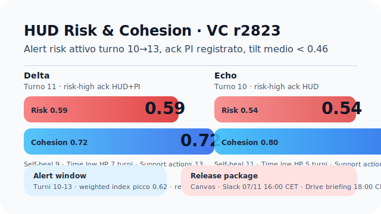
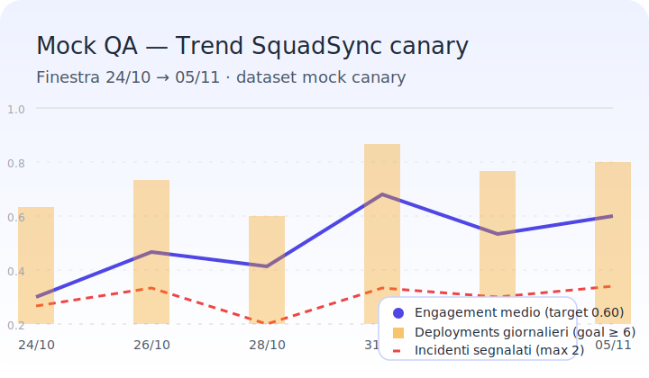

# Canvas — Aggiornamenti Rapidi

## Nuove feature

- **Flow QA logger & timeline JRPG** — Il Flow Shell registra automaticamente snapshot, fallback e validazioni nel nuovo logger client-side. Dalla vista **Quality Release → Log runtime** è possibile filtrare gli scope e usare il bottone **Esporta JSON QA** per scaricare il dump strutturato che alimenta i recap interni. In **Specie → Telemetry → Revisioni validate** la mini timeline adotta icone/gradienti stile JRPG con filtri per severità per individuare rapidamente gli avvisi dei validator.
- **Mission Control refresh** — Landing guidata, quick actions contestuali e timeline attività filtrabile mantengono il team allineato sui rollout giornalieri.
- **Dataset Hub & monitor YAML** — Dashboard automatica che valida i file `data/**/*.yaml`, evidenziando inconsistenze e stato import per Drive Sync.
- **Generatore VC** — Radar dinamico, confronto specie side-by-side, pin persistente e tooltips hazard/ruoli per condividere build rapidi in QA.
- **CLI Pack Rolling (TS/Python)** — Gli script `tools/ts/roll_pack` e `tools/py/roll_pack.py` permettono di simulare l'assegnazione dei pacchetti PI usando `data/packs.yaml`, mantenendo parità funzionale tra stack tecnologici.
- **Generatore Encounter Python** — `tools/py/generate_encounter.py` sfrutta `data/core/biomes.yaml` per derivare difficoltà, affissi dinamici e adattamenti VC, utile per playtest veloci.
- **Missione Skydock Siege** — Infiltrazione verticale con obiettivi multilivello, evacuazione cronometrata e coordinamento a quote diverse.【F:data/external/chatgpt/2025-10-23/snapshot-20251023T101500Z.json†L1-L6】
- **Reattori Aeon** — Risorsa leggendaria che abilita poteri temporali specifici per le Forme Armoniche.【F:data/external/chatgpt/2025-10-23/snapshot-20251023T101500Z.json†L1-L6】
- **Telemetry Risk Tuning 2025-10-24** — Nuovo metodo `ema_capped_minmax` con segnale `overcap_guard_events` e smoothing 0.2 per ridurre i falsi positivi nelle squadre Bravo/Delta.【F:data/core/telemetry.yaml†L2-L25】【F:logs/playtests/2025-10-24-vc/session-metrics.yaml†L1-L62】
- **HUD Smart Alerts Canary** — Layout `data/core/hud/layout.yaml` con tagging missione gestito da `public/hud/Overlay.tsx` e flag `hud.smart_alerts` per abilitare filtri di rischio parametrizzabili nel canale canary.【F:data/core/hud/layout.yaml†L1-L30】【F:public/hud/Overlay.tsx†L1-L151】【F:config/cli/hud.yaml†L1-L7】
- **HUD Smart Alerts metrics** — `tools/ts/hud_alerts.ts` registra ack, destinatari e drop dei filtri mentre `scripts/qa/hud_smart_alerts.py` aggrega i log canary schedulati via `config/jobs/hud_canary.yaml`, alimentando `logs/playtests/*/hud_alert_log.json` per dashboard QA.【F:tools/ts/hud_alerts.ts†L1-L360】【F:scripts/qa/hud_smart_alerts.py†L1-L171】【F:config/jobs/hud_canary.yaml†L1-L11】【F:logs/playtests/2025-11-05-vc/hud_alert_log.json†L1-L40】
- **Analytics SquadSync canary** — ETL `scripts/analytics/etl_squadsync.py`, schema/resolver GraphQL e pagina `/analytics/squadsync/` offrono trend engagement+deployments filtrabili con cron canary e flag dedicato.【F:scripts/analytics/etl_squadsync.py†L1-L220】【F:tools/graphql/resolvers/squadsync.ts†L1-L154】【F:public/analytics/squadsync/index.tsx†L1-L196】【F:config/jobs/etl.yaml†L1-L12】【F:config/feature_flags.yaml†L1-L16】

### Sync HUD · dicembre 2025

- **Overlay canary Smart Alerts** — Il layout aggiornato in `public/hud/Overlay.tsx` espone soglie risk/cohesion dinamiche, badge SquadSync e routing diretto al canale `#feedback-enhancements`. Il mock aggiornato (`../../assets/hud/overlay/mock-timeline.svg`) accompagna le nuove callout della timeline turni 08-12.【F:public/hud/Overlay.tsx†L1-L151】【F:config/cli/hud.yaml†L1-L7】【F:assets/hud/overlay/mock-timeline.svg†L1-L33】
- **Dashboard raccolta HUD canary** — `tools/feedback/hud_canary_dashboard.yaml` definisce i widget per ack rate, spike adaptive e follow-up aperti, collegando l'overlay al routing Slack. Il dataset è alimentato dal modulo canary in `tools/feedback/collection_pipeline.yaml` e dal canale `#feedback-enhancements` per triage rapido.【F:tools/feedback/hud_canary_dashboard.yaml†L1-L53】【F:tools/feedback/collection_pipeline.yaml†L1-L110】【F:tools/feedback/form_config.yaml†L1-L120】
- **SquadSync adaptive bridge** — La sezione adaptive di `public/analytics/squadsync/index.tsx` ora visualizza i picchi registrati dall'HUD con highlight Delta; il mock aggiornato (`../../assets/analytics/squadsync_mock.svg`) evidenzia il routing dashboard+Slack e i follow-up aperti.【F:public/analytics/squadsync/index.tsx†L1-L320】【F:assets/analytics/squadsync_mock.svg†L1-L58】

### Aggiornamento QA 2025-11-05

- **Metriche Canvas aggiornate** — Dashboard VC consolidata con risk medio 0.57 (Delta 0.59, Echo 0.54) e coesione 0.72/0.80; tilt mantenuto <0.46 dopo il retest client r2823. Dataset e note collegate direttamente ai log QA per pacchetto `v0.6.0-rc1`.【F:logs/playtests/2025-11-05-vc/session-metrics.yaml†L1-L83】
- **Visual HUD** — Screenshot aggiornato con alert risk (turni 10-13) e grafico coesione/support actions integrato in `../../assets/hud/v0.6.0-rc1-risk-cohesion.svg`; allegato al pacchetto `v0.6.0-rc1` per comunicazione Slack/Drive.【F:logs/playtests/2025-11-05-vc/session-metrics.yaml†L1-L83】
  
- **Azioni successive** — Allegati HUD/metriche pubblicati in Canvas e cartella Drive `release/v0.6.0-rc1`; annuncio Slack 2025-11-07 16:00 CET linkato al changelog RC e briefing Drive 18:00 CET con estratto metriche.【F:docs/changelog.md†L5-L18】【F:docs/piani/roadmap.md†L72-L85】【F:logs/playtests/2025-11-05-vc/session-metrics.yaml†L1-L88】 Coordinare il riepilogo PR quotidiano per mantenere Mission Control e Canvas sincronizzati.
  

### Allineamento 2025-11-07

- **HUD overlay telemetrico** — Richiesto nel playtest 2025-11-12 per esporre soglie risk/cohesion in tempo reale; mock in preparazione da UI Systems (F. Conti) con aggiornamento Canvas programmato al completamento dei nuovi asset.【F:docs/playtest/SESSION-2025-11-12.md†L36-L49】【F:docs/chatgpt_changes/daily-pr-summary-2025-11-07.md†L1-L15】
- **Progressione Cipher PROG-04** — Progression Design (L. Serra) analizza il gap XP -3.7% e produrrà patch bilanciamento e note telemetriche per il prossimo sync QA.【F:docs/playtest/SESSION-2025-11-12.md†L24-L34】【F:docs/checklist/milestones.md†L14-L15】
- **Contrasto EVT-03** — VFX/Lighting (G. Leone) ha finalizzato gamma dinamico e toggle glow (smoke test `logs/playtests/2025-11-08-vfx/contrast-smoke.yaml`) per chiudere il feedback contrasto basso ai minuti 2-3; snapshot Vitest aggiornata in `tests/vfx/dynamicShader.spec.ts`.【F:logs/playtests/2025-11-08-vfx/contrast-smoke.yaml†L1-L35】【F:tests/vfx/dynamicShader.spec.ts†L1-L96】
- **Tracking & comunicazione** — Follow-up registrati in `docs/tool_run_report.md` (blocco 2025-11-07) e nella roadmap per il checkpoint del 2025-11-09; smoke test CLI (`scripts/cli_smoke.sh`) completato per validare dataset/pack prima di condividere gli output nel canale `#qa-playtest` dopo verifica UI/VFX.【F:docs/tool_run_report.md†L9-L22】【F:docs/piani/roadmap.md†L72-L109】

## Riepilogo quotidiano PR

<!-- daily-pr-summary:start -->
- **2026-02-09** — Nessun merge registrato.
- **2026-02-08** — Nessun merge registrato.
- **2026-02-07** — Nessun merge registrato.
- **2026-02-06** — Nessun merge registrato.
- **2026-02-05** — Nessun merge registrato.
- **2026-02-04** — Nessun merge registrato.
- **2026-02-03** — Nessun merge registrato.
- **2026-02-02** — Nessun merge registrato.
- **2026-02-01** — Nessun merge registrato.
- **2026-01-31** — Nessun merge registrato.
- **2026-01-30** — Nessun merge registrato.
- **2026-01-29** — Nessun merge registrato.
- **2026-01-28** — Nessun merge registrato.
- **2026-01-27** — Nessun merge registrato.
<!-- daily-pr-summary:end -->

## Revisione playtest VC (Canvas)

- **Screenshot dashboard HUD** — Il nuovo pannello VC mostra risk band dinamiche e coesione aggregata per squadra, confermando le soglie di avviso sul client r2821.
- **Metriche chiave** — Il playtest 2025-10-24 mostra `risk.weighted_index` stabile a 0.57 per Delta (sotto soglia) e un picco controllato a 0.61 per Echo durante l'evento Aeon Overclock; coesione 0.76 conferma il tuning support Actions.【F:logs/playtests/2025-10-24-vc/session-metrics.yaml†L1-L73】
- **Cambiamenti strutturali** — Il bias `random_general_d20` ora reindirizza ai profili `bias_d12` delle Forme per bilanciare i pacchetti PI, mentre il filtro SquadSync è agganciato alla pipeline telemetrica per missioni verticali multi-fase; i log Delta/Echo alimentano le dashboard tramite Drive Sync.【F:data/packs.yaml†L1-L41】【F:logs/playtests/2025-10-24-vc/session-metrics.yaml†L1-L73】

## Regole di gioco evidenziate

- **Economia PI** — I costi e i massimali (`pi_shop.costs`/`caps`) definiscono la cadenza di progressione e i limiti per i pack iniziali.【F:data/packs.yaml†L1-L17】
- **Bias per Forma** — Le tabelle `bias_d12` forniscono controllo sullo skew dei pacchetti in base al MBTI scelto, abilitando tuning mirato delle build iniziali.【F:data/packs.yaml†L18-L88】
- **Adattamenti VC per Bioma** — I flag `vc_adapt` determinano come gli encounter scalano controlli, guardia, imboscate e burst secondo i segnali di telemetria della squadra.【F:data/core/biomes.yaml†L6-L13】
- **Regole Ibride di Mating** — Le combinazioni in `hybrid_rules` chiariscono le fusioni locomozione/sensi quando due forme condividono caratteristiche uniche.【F:data/core/mating.yaml†L25-L32】
- **Filtro SquadSync** — L'indice StressWave ora isola i picchi dovuti a mismatch di ruolo, supportando tuning mirato della difficoltà co-op.【F:data/external/chatgpt/2025-10-23/snapshot-20251023T101500Z.json†L1-L6】
- **Nidi itineranti con ancoraggi** — Gli spostamenti dei clan sabbiosi richiedono Resonance Shards per stabilizzare il trasferimento tra turni.【F:data/external/chatgpt/2025-10-23/snapshot-20251023T101500Z.json†L1-L6】
- **Protocollo di soccorso** — Nuove chiamate di rinforzo NPG basate su telemetria live per recuperare squadre in difficoltà.【F:data/external/chatgpt/2025-10-23/snapshot-20251023T101500Z.json†L1-L6】

## Dati YAML aggiornati

- **Biomi** — Ogni voce contiene difficoltà base, modificatori e affissi tematici (es. `savana`, `caverna`, `palude`).【F:data/core/biomes.yaml†L1-L5】
- **Telemetria VC** — Le finestre EMA, gli indici VC e le formule MBTI/Ennea supportano il nuovo layer di analytics live per sessioni co-op.【F:data/core/telemetry.yaml†L1-L25】
- **Standard di Nido** — I profili `dune_stalker` ed `echo_morph` specificano ambiente, struttura e risorse, fungendo da baseline per la progressione narrativa di clan.【F:data/core/mating.yaml†L13-L24】
