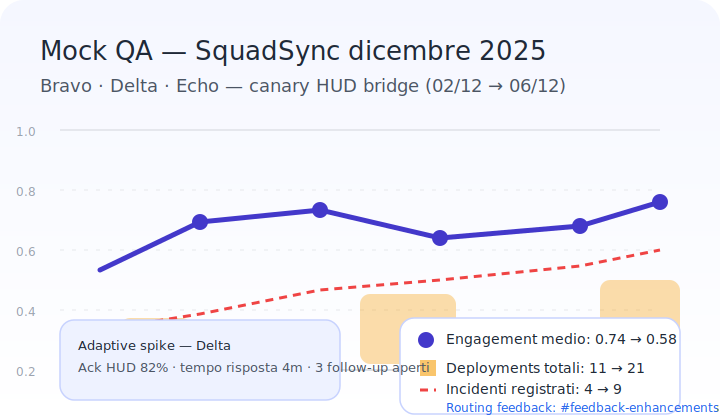

# Canvas — Aggiornamenti Rapidi

## Nuove feature

- **Flow QA logger & timeline JRPG** — Il Flow Shell registra automaticamente snapshot, fallback e validazioni nel nuovo logger client-side. Dalla vista **Quality Release → Log runtime** è possibile filtrare gli scope e usare il bottone **Esporta JSON QA** per scaricare il dump strutturato che alimenta i recap interni. In **Specie → Telemetry → Revisioni validate** la mini timeline adotta icone/gradienti stile JRPG con filtri per severità per individuare rapidamente gli avvisi dei validator.
- **Mission Control refresh** — Landing guidata, quick actions contestuali e timeline attività filtrabile mantengono il team allineato sui rollout giornalieri.
- **Dataset Hub & monitor YAML** — Dashboard automatica che valida i file `data/**/*.yaml`, evidenziando inconsistenze e stato import per Drive Sync.
- **Generatore VC** — Radar dinamico, confronto specie side-by-side, pin persistente e tooltips hazard/ruoli per condividere build rapidi in QA.
- **CLI Pack Rolling (TS/Python)** — Gli script `tools/ts/roll_pack` e `tools/py/roll_pack.py` permettono di simulare l'assegnazione dei pacchetti PI usando `data/packs.yaml`, mantenendo parità funzionale tra stack tecnologici.
- **Generatore Encounter Python** — `tools/py/generate_encounter.py` sfrutta `data/core/biomes.yaml` per derivare difficoltà, affissi dinamici e adattamenti VC, utile per playtest veloci.
- **Missione Skydock Siege** — Infiltrazione verticale con obiettivi multilivello, evacuazione cronometrata e coordinamento a quote diverse.【F:data/external/chatgpt/2025-10-23/snapshot-20251023T101500Z.json†L1-L6】
- **Reattori Aeon** — Risorsa leggendaria che abilita poteri temporali specifici per le Forme Armoniche.【F:data/external/chatgpt/2025-10-23/snapshot-20251023T101500Z.json†L1-L6】
- **Telemetry Risk Tuning 2025-10-24** — Nuovo metodo `ema_capped_minmax` con segnale `overcap_guard_events` e smoothing 0.2 per ridurre i falsi positivi nelle squadre Bravo/Delta.【F:data/core/telemetry.yaml†L2-L25】【F:logs/playtests/2025-10-24-vc/session-metrics.yaml†L1-L62】
- **HUD Smart Alerts Canary** — Layout `data/core/hud/layout.yaml` con tagging missione gestito da `public/hud/Overlay.tsx` e flag `hud.smart_alerts` per abilitare filtri di rischio parametrizzabili nel canale canary.【F:data/core/hud/layout.yaml†L1-L30】【F:public/hud/Overlay.tsx†L1-L151】【F:config/cli/hud.yaml†L1-L7】
- **HUD Smart Alerts metrics** — `tools/ts/hud_alerts.ts` registra ack, destinatari e drop dei filtri mentre `scripts/qa/hud_smart_alerts.py` aggrega i log canary schedulati via `config/jobs/hud_canary.yaml`, alimentando `logs/playtests/*/hud_alert_log.json` per dashboard QA.【F:tools/ts/hud_alerts.ts†L1-L360】【F:scripts/qa/hud_smart_alerts.py†L1-L171】【F:config/jobs/hud_canary.yaml†L1-L11】【F:logs/playtests/2025-11-05-vc/hud_alert_log.json†L1-L40】
- **Analytics SquadSync canary** — ETL `scripts/analytics/etl_squadsync.py`, schema/resolver GraphQL e pagina `/analytics/squadsync/` offrono trend engagement+deployments filtrabili con cron canary e flag dedicato.【F:scripts/analytics/etl_squadsync.py†L1-L220】【F:tools/graphql/resolvers/squadsync.ts†L1-L154】【F:public/analytics/squadsync/index.tsx†L1-L196】【F:config/jobs/etl.yaml†L1-L12】【F:config/feature_flags.yaml†L1-L16】

### Sync HUD · dicembre 2025

- **Overlay canary Smart Alerts** — Il layout aggiornato in `public/hud/Overlay.tsx` espone soglie risk/cohesion dinamiche, badge SquadSync e routing diretto al canale `#feedback-enhancements`. Il mock aggiornato (`../../assets/hud/overlay/mock-timeline.svg`) accompagna le nuove callout della timeline turni 08-12.【F:public/hud/Overlay.tsx†L1-L151】【F:config/cli/hud.yaml†L1-L7】【F:assets/hud/overlay/mock-timeline.svg†L1-L33】
- **Dashboard raccolta HUD canary** — `tools/feedback/hud_canary_dashboard.yaml` definisce i widget per ack rate, spike adaptive e follow-up aperti, collegando l'overlay al routing Slack. Il dataset è alimentato dal modulo canary in `tools/feedback/collection_pipeline.yaml` e dal canale `#feedback-enhancements` per triage rapido.【F:tools/feedback/hud_canary_dashboard.yaml†L1-L53】【F:tools/feedback/collection_pipeline.yaml†L1-L110】【F:tools/feedback/form_config.yaml†L1-L120】
- **SquadSync adaptive bridge** — La sezione adaptive di `public/analytics/squadsync/index.tsx` ora visualizza i picchi registrati dall'HUD con highlight Delta; il mock aggiornato (`../../assets/analytics/squadsync_mock.svg`) evidenzia il routing dashboard+Slack e i follow-up aperti.【F:public/analytics/squadsync/index.tsx†L1-L320】【F:assets/analytics/squadsync_mock.svg†L1-L58】

### Aggiornamento QA 2025-11-05

- **Metriche Canvas aggiornate** — Dashboard VC consolidata con risk medio 0.57 (Delta 0.59, Echo 0.54) e coesione 0.72/0.80; tilt mantenuto <0.46 dopo il retest client r2823. Dataset e note collegate direttamente ai log QA per pacchetto `v0.6.0-rc1`.【F:logs/playtests/2025-11-05-vc/session-metrics.yaml†L1-L83】
- **Visual HUD** — Screenshot aggiornato con alert risk (turni 10-13) e grafico coesione/support actions integrato in `../../assets/hud/v0.6.0-rc1-risk-cohesion.svg`; allegato al pacchetto `v0.6.0-rc1` per comunicazione Slack/Drive.【F:logs/playtests/2025-11-05-vc/session-metrics.yaml†L1-L83】
  
- **Azioni successive** — Allegati HUD/metriche pubblicati in Canvas e cartella Drive `release/v0.6.0-rc1`; annuncio Slack 2025-11-07 16:00 CET linkato al changelog RC e briefing Drive 18:00 CET con estratto metriche.【F:docs/changelog.md†L5-L18】【F:docs/piani/roadmap.md†L72-L85】【F:logs/playtests/2025-11-05-vc/session-metrics.yaml†L1-L88】 Coordinare il riepilogo PR quotidiano per mantenere Mission Control e Canvas sincronizzati.
  

### Allineamento 2025-11-07

- **HUD overlay telemetrico** — Richiesto nel playtest 2025-11-12 per esporre soglie risk/cohesion in tempo reale; mock in preparazione da UI Systems (F. Conti) con aggiornamento Canvas programmato al completamento dei nuovi asset.【F:docs/playtest/SESSION-2025-11-12.md†L36-L49】【F:docs/chatgpt_changes/daily-pr-summary-2025-11-07.md†L1-L15】
- **Progressione Cipher PROG-04** — Progression Design (L. Serra) analizza il gap XP -3.7% e produrrà patch bilanciamento e note telemetriche per il prossimo sync QA.【F:docs/playtest/SESSION-2025-11-12.md†L24-L34】【F:docs/checklist/milestones.md†L14-L15】
- **Contrasto EVT-03** — VFX/Lighting (G. Leone) ha finalizzato gamma dinamico e toggle glow (smoke test `logs/playtests/2025-11-08-vfx/contrast-smoke.yaml`) per chiudere il feedback contrasto basso ai minuti 2-3; snapshot Vitest aggiornata in `tests/vfx/dynamicShader.spec.ts`.【F:logs/playtests/2025-11-08-vfx/contrast-smoke.yaml†L1-L35】【F:tests/vfx/dynamicShader.spec.ts†L1-L96】
- **Tracking & comunicazione** — Follow-up registrati in `docs/tool_run_report.md` (blocco 2025-11-07) e nella roadmap per il checkpoint del 2025-11-09; smoke test CLI (`scripts/cli_smoke.sh`) completato per validare dataset/pack prima di condividere gli output nel canale `#qa-playtest` dopo verifica UI/VFX.【F:docs/tool_run_report.md†L9-L22】【F:docs/piani/roadmap.md†L72-L109】

## Riepilogo quotidiano PR

<!-- daily-pr-summary:start -->
- **2025-12-09** — [#1229](https://github.com/MasterDD-L34D/Game/pull/1229) Add light boot profile for low-risk tasks; [#1230](https://github.com/MasterDD-L34D/Game/pull/1230) Add severity-based workflow guidance; [#1231](https://github.com/MasterDD-L34D/Game/pull/1231) Document default-coordinator mode in router; [#1232](https://github.com/MasterDD-L34D/Game/pull/1232) Add boot cheat sheet prompts; [#1233](https://github.com/MasterDD-L34D/Game/pull/1233) Clarify patch confirmation guidance; [#1234](https://github.com/MasterDD-L34D/Game/pull/1234) Clarify confirmation flow for plans; [#1235](https://github.com/MasterDD-L34D/Game/pull/1235) Add quick start index for agent boot docs; [#1236](https://github.com/MasterDD-L34D/Game/pull/1236) Document fast path policy for command confirmations; [#1237](https://github.com/MasterDD-L34D/Game/pull/1237) Clarify routing escalation guidance; [#1238](https://github.com/MasterDD-L34D/Game/pull/1238) Add agent workflow telemetry logging and analysis; [#1239](https://github.com/MasterDD-L34D/Game/pull/1239) Add guidance for simple-task mini pipeline; [#1240](https://github.com/MasterDD-L34D/Game/pull/1240) Clarify strict-mode handling for info-only requests; [#1241](https://github.com/MasterDD-L34D/Game/pull/1241) Log pre-meeting 01A e ripristino branch report-only; [#1242](https://github.com/MasterDD-L34D/Game/pull/1242) Document QA suite runs and visual regression failure; [#1243](https://github.com/MasterDD-L34D/Game/pull/1243) Log sync agenda PATCHSET-00; [#1244](https://github.com/MasterDD-L34D/Game/pull/1244) Log checklist riapertura 48h e sync README incoming; [#1245](https://github.com/MasterDD-L34D/Game/pull/1245) Document readiness 01B/01C and CI inventory links; [#1246](https://github.com/MasterDD-L34D/Game/pull/1246) Log kickoff agenda sync for PATCHSET-00; [#1247](https://github.com/MasterDD-L34D/Game/pull/1247) Update RIAPERTURA gate closure and readiness notes; [#1248](https://github.com/MasterDD-L34D/Game/pull/1248) Add workflow_dispatch to data-quality workflow; [#1249](https://github.com/MasterDD-L34D/Game/pull/1249) Enable manual dispatch for validate_traits workflow; [#1250](https://github.com/MasterDD-L34D/Game/pull/1250) Add workflow_dispatch trigger to data-quality workflow; [#1251](https://github.com/MasterDD-L34D/Game/pull/1251) Enable manual dispatch for validate_traits workflow; [#1252](https://github.com/MasterDD-L34D/Game/pull/1252) Align ali_solari_fotoni label with i18n; [#1253](https://github.com/MasterDD-L34D/Game/pull/1253) Align ali_solari_fotoni trait with i18n refs; [#1254](https://github.com/MasterDD-L34D/Game/pull/1254) Add Italian localization for traits_aggregate; [#1255](https://github.com/MasterDD-L34D/Game/pull/1255) Remove unused update-evo-tracker workflow; [#1256](https://github.com/MasterDD-L34D/Game/pull/1256) Allinea i18n per traits_aggregate; [#1257](https://github.com/MasterDD-L34D/Game/pull/1257) Fix trait synergy reciprocity; [#1258](https://github.com/MasterDD-L34D/Game/pull/1258) Fix status report script imports; [#1259](https://github.com/MasterDD-L34D/Game/pull/1259) Fix MongoDB migration guard in deploy workflow; [#1260](https://github.com/MasterDD-L34D/Game/pull/1260) Stabilize squadsync adaptive filtering clock; [#1261](https://github.com/MasterDD-L34D/Game/pull/1261) Restore Evo Tactics species inventory resources; [#1262](https://github.com/MasterDD-L34D/Game/pull/1262) Add schema metadata defaults for evo tactics species; [#1263](https://github.com/MasterDD-L34D/Game/pull/1263) Use affinity map to fill missing trait coverage; [#1264](https://github.com/MasterDD-L34D/Game/pull/1264) Allow disabling orchestrator metrics when prom-client is absent; [#1265](https://github.com/MasterDD-L34D/Game/pull/1265) Handle lint-stack diff fallback; [#1266](https://github.com/MasterDD-L34D/Game/pull/1266) Handle missing Playwright console tests; [#1267](https://github.com/MasterDD-L34D/Game/pull/1267) Populate rollout report and fix trait baseline; [#1269](https://github.com/MasterDD-L34D/Game/pull/1269) Fix orchestrator worker path and refresh QA reports; [#1271](https://github.com/MasterDD-L34D/Game/pull/1271) Handle snapshot size mismatches gracefully; [#1272](https://github.com/MasterDD-L34D/Game/pull/1272) Improve test fallbacks for idea and trait APIs; [#1270](https://github.com/MasterDD-L34D/Game/pull/1270) Handle snapshot size mismatches gracefully; [#1268](https://github.com/MasterDD-L34D/Game/pull/1268) Fix orchestrator worker path and refresh QA reports; [#1273](https://github.com/MasterDD-L34D/Game/pull/1273) Add dashboard data source config and Vue plugin; [#1274](https://github.com/MasterDD-L34D/Game/pull/1274) Refresh visual regression baselines; [#1275](https://github.com/MasterDD-L34D/Game/pull/1275) Update CI inventory with latest successful reruns; [#1276](https://github.com/MasterDD-L34D/Game/pull/1276) Clarify GH CLI auth when GH_TOKEN is set. [Report](chatgpt_changes/daily-pr-summary-2025-12-09.md)
- **2025-12-08** — [#1202](https://github.com/MasterDD-L34D/Game/pull/1202) Document blocked QA and smoke workflow dispatches; [#1203](https://github.com/MasterDD-L34D/Game/pull/1203) Document October 2025 freeze status and sync incoming notes; [#1204](https://github.com/MasterDD-L34D/Game/pull/1204) Document freeze manifest verification; [#1205](https://github.com/MasterDD-L34D/Game/pull/1205) Improve CI log harvesting coverage and PAT handling; [#1206](https://github.com/MasterDD-L34D/Game/pull/1206) Add gh bootstrap and dry-run support for ci log harvest; [#1208](https://github.com/MasterDD-L34D/Game/pull/1208) Remove binary CI log zips and add rehydration instructions; [#1209](https://github.com/MasterDD-L34D/Game/pull/1209) Refresh CI inventory after authenticated GH sweep; [#1210](https://github.com/MasterDD-L34D/Game/pull/1210) Clarify GH_TOKEN requirement for CI dispatches; [#1211](https://github.com/MasterDD-L34D/Game/pull/1211) Record QA workflow rerun status; [#1212](https://github.com/MasterDD-L34D/Game/pull/1212) Add logs for workflow dispatch attempts; [#1213](https://github.com/MasterDD-L34D/Game/pull/1213) Archive evo-batch dry-run failure logs; [#1214](https://github.com/MasterDD-L34D/Game/pull/1214) Add post-unfreeze sync draft and gate log; [#1215](https://github.com/MasterDD-L34D/Game/pull/1215) Document RIAPERTURA-2025-02 checklist verification; [#1216](https://github.com/MasterDD-L34D/Game/pull/1216) Add RIAPERTURA-2025-02 follow-up notes; [#1217](https://github.com/MasterDD-L34D/Game/pull/1217) Add RIAPERTURA-2025-02 readiness check log; [#1218](https://github.com/MasterDD-L34D/Game/pull/1218) Update freeze manifest references to current checksums; [#1219](https://github.com/MasterDD-L34D/Game/pull/1219) Add PATCHSET-00 kickoff agenda and gate log; [#1220](https://github.com/MasterDD-L34D/Game/pull/1220) Document PATCHSET-00 sync reaffirmation; [#1221](https://github.com/MasterDD-L34D/Game/pull/1221) Add pipeline 01A pre-meeting checklist; [#1222](https://github.com/MasterDD-L34D/Game/pull/1222) Log unfreeze and branch decisions for PATCHSET-00/01A; [#1223](https://github.com/MasterDD-L34D/Game/pull/1223) Document freeze check for pipeline 01A gate; [#1224](https://github.com/MasterDD-L34D/Game/pull/1224) Document PATCHSET-00 branch recreation; [#1225](https://github.com/MasterDD-L34D/Game/pull/1225) Log freeze status and on-call confirmations; [#1226](https://github.com/MasterDD-L34D/Game/pull/1226) Aggiorna note di triage 01A e log di riapertura; [#1227](https://github.com/MasterDD-L34D/Game/pull/1227) Log incoming holding check; [#1228](https://github.com/MasterDD-L34D/Game/pull/1228) Update 01C CI inventory and log links. [Report](chatgpt_changes/daily-pr-summary-2025-12-08.md)
- **2025-12-07** — [#1196](https://github.com/MasterDD-L34D/Game/pull/1196) Add kickoff entry for PATCHSET-00 routing 01A–01C; [#1197](https://github.com/MasterDD-L34D/Game/pull/1197) Log verifica holding e finestra freeze; [#1198](https://github.com/MasterDD-L34D/Game/pull/1198) Add postponement note to incoming gap review; [#1199](https://github.com/MasterDD-L34D/Game/pull/1199) Add readiness log entry for 01B/01C; [#1200](https://github.com/MasterDD-L34D/Game/pull/1200) Log 03AB backup manifest links for 01C; [#1201](https://github.com/MasterDD-L34D/Game/pull/1201) Fix data validation workflows and trait coverage. [Report](chatgpt_changes/daily-pr-summary-2025-12-07.md)
- **2025-12-06** — [#1177](https://github.com/MasterDD-L34D/Game/pull/1177) Document esito RIAPERTURA-2025-02 in planning checklist; [#1178](https://github.com/MasterDD-L34D/Game/pull/1178) Aggiorna documentazione CI con run del 05/12/2025; [#1179](https://github.com/MasterDD-L34D/Game/pull/1179) Aggiorna inventario workflow CI; [#1180](https://github.com/MasterDD-L34D/Game/pull/1180) Document CI workflow follow-ups; [#1182](https://github.com/MasterDD-L34D/Game/pull/1182) Update validate naming latest run date; [#1183](https://github.com/MasterDD-L34D/Game/pull/1183) Allinea riferimenti CI ai run più recenti; [#1184](https://github.com/MasterDD-L34D/Game/pull/1184) Add CI log harvesting script and automation guide; [#1185](https://github.com/MasterDD-L34D/Game/pull/1185) Add GitHub CLI setup guidance and ci-log-harvest reminder; [#1186](https://github.com/MasterDD-L34D/Game/pull/1186) Update CI inventory status; [#1187](https://github.com/MasterDD-L34D/Game/pull/1187) Update CI inventory with latest workflow runs; [#1188](https://github.com/MasterDD-L34D/Game/pull/1188) Enhance CI log harvesting with PAT archive support; [#1189](https://github.com/MasterDD-L34D/Game/pull/1189) Improve artifact archive detection in ci_log_harvest; [#1190](https://github.com/MasterDD-L34D/Game/pull/1190) Fix gh run id extraction in ci log harvest; [#1191](https://github.com/MasterDD-L34D/Game/pull/1191) Add gh api output fallback for ci log harvest; [#1192](https://github.com/MasterDD-L34D/Game/pull/1192) Add log harvester workflow; [#1193](https://github.com/MasterDD-L34D/Game/pull/1193) Document log harvester workflow; [#1194](https://github.com/MasterDD-L34D/Game/pull/1194) Add log harvester artifact archive; [#1195](https://github.com/MasterDD-L34D/Game/pull/1195) Update CI inventory with remediation steps for failing workflows. [Report](chatgpt_changes/daily-pr-summary-2025-12-06.md)
- **2025-12-05** — [#1152](https://github.com/MasterDD-L34D/Game/pull/1152) Add validation checklist for migration phase 4; [#1153](https://github.com/MasterDD-L34D/Game/pull/1153) Add verification memo and log entry; [#1154](https://github.com/MasterDD-L34D/Game/pull/1154) Update staging redirect plan and smoke report; [#1155](https://github.com/MasterDD-L34D/Game/pull/1155) Add staging rollback runbook and log simulation; [#1156](https://github.com/MasterDD-L34D/Game/pull/1156) Record staging redirect smoke rerun; [#1157](https://github.com/MasterDD-L34D/Game/pull/1157) Align redirect backups to archive-less policy; [#1158](https://github.com/MasterDD-L34D/Game/pull/1158) Update validator audit and rerun engine scan; [#1159](https://github.com/MasterDD-L34D/Game/pull/1159) Log staging redirect smoke test pass; [#1160](https://github.com/MasterDD-L34D/Game/pull/1160) Record 2026-09-16 redirect smoke PASS; [#1161](https://github.com/MasterDD-L34D/Game/pull/1161) Add Evo-Tactics archive snapshots; [#1162](https://github.com/MasterDD-L34D/Game/pull/1162) Restore archived PTPF template content; [#1163](https://github.com/MasterDD-L34D/Game/pull/1163) Restore archived Security & Ops playbook content; [#1164](https://github.com/MasterDD-L34D/Game/pull/1164) Restore archived Visione & Struttura guide content; [#1165](https://github.com/MasterDD-L34D/Game/pull/1165) Fix Husky install script for ESM modules; [#1166](https://github.com/MasterDD-L34D/Game/pull/1166) Aggiorna inventario CI con tentativi manuali bloccati; [#1168](https://github.com/MasterDD-L34D/Game/pull/1168) Update GH CLI manual dispatch guide; [#1169](https://github.com/MasterDD-L34D/Game/pull/1169) Aggiorna guida per dispatch manuale con gh CLI; [#1170](https://github.com/MasterDD-L34D/Game/pull/1170) Update manual dispatch workflow guidance; [#1171](https://github.com/MasterDD-L34D/Game/pull/1171) Update GitHub CLI manual dispatch docs; [#1172](https://github.com/MasterDD-L34D/Game/pull/1172) Clarify manual dispatch guidance in CI inventory; [#1173](https://github.com/MasterDD-L34D/Game/pull/1173) Update gh CLI manual dispatch guide with correct scopes and workflows; [#1174](https://github.com/MasterDD-L34D/Game/pull/1174) Sincronizza ci-inventory con guida dispatch manuale; [#1175](https://github.com/MasterDD-L34D/Game/pull/1175) Log RIAPERTURA-2025-02 and sync incoming freeze notes; [#1176](https://github.com/MasterDD-L34D/Game/pull/1176) Update CI inventory with latest run status and retries. [Report](chatgpt_changes/daily-pr-summary-2025-12-05.md)
- **2025-12-04** — [#1130](https://github.com/MasterDD-L34D/Game/pull/1130) Add redirect server for staging data paths; [#1131](https://github.com/MasterDD-L34D/Game/pull/1131) Add helper server for redirect smoke tests; [#1132](https://github.com/MasterDD-L34D/Game/pull/1132) Log redirect smoke test and refresh ticket notes; [#1133](https://github.com/MasterDD-L34D/Game/pull/1133) Log latest staging redirect smoke failure; [#1134](https://github.com/MasterDD-L34D/Game/pull/1134) Log derived fixture verification for matrix 01B; [#1135](https://github.com/MasterDD-L34D/Game/pull/1135) Document freeze rollback status and 02A readiness; [#1136](https://github.com/MasterDD-L34D/Game/pull/1136) Update redirect staging backup manifest and rollback notes; [#1137](https://github.com/MasterDD-L34D/Game/pull/1137) Align pending/borderline notes and log review; [#1138](https://github.com/MasterDD-L34D/Game/pull/1138) Align redirect smoke references and #1206 status; [#1140](https://github.com/MasterDD-L34D/Game/pull/1140) Log 01B kickoff confirmation for core/derived; [#1141](https://github.com/MasterDD-L34D/Game/pull/1141) Add 01C report-only kickoff handoff log; [#1142](https://github.com/MasterDD-L34D/Game/pull/1142) Log closure fixes for 01B/01C and update planning docs; [#1143](https://github.com/MasterDD-L34D/Game/pull/1143) Clarify redirect readiness baselines in planning docs; [#1144](https://github.com/MasterDD-L34D/Game/pull/1144) Add redirect smoke follow-up note; [#1145](https://github.com/MasterDD-L34D/Game/pull/1145) Reconcile redirect smoke references with latest runs; [#1146](https://github.com/MasterDD-L34D/Game/pull/1146) Update fixture verification and audit notes; [#1147](https://github.com/MasterDD-L34D/Game/pull/1147) Document gate 02A verification and guidance for 03A/03B; [#1148](https://github.com/MasterDD-L34D/Game/pull/1148) Log freeze 03A/03B check and manifest verification; [#1149](https://github.com/MasterDD-L34D/Game/pull/1149) Log redirect smoke review and gate status; [#1150](https://github.com/MasterDD-L34D/Game/pull/1150) Add phase 4 validation sandbox log; [#1151](https://github.com/MasterDD-L34D/Game/pull/1151) Add migration phase 5-7 planning logs. [Report](chatgpt_changes/daily-pr-summary-2025-12-04.md)
- **2025-12-03** — [#1097](https://github.com/MasterDD-L34D/Game/pull/1097) Update Evo rollout status from latest gap reports; [#1098](https://github.com/MasterDD-L34D/Game/pull/1098) Fix trait gap summary counts and regenerate report; [#1099](https://github.com/MasterDD-L34D/Game/pull/1099) Refresh Evo rollout gap data and status; [#1100](https://github.com/MasterDD-L34D/Game/pull/1100) Backfill trait coverage and regenerate analysis reports; [#1101](https://github.com/MasterDD-L34D/Game/pull/1101) Restore trait coverage descriptions and sync derived artifacts; [#1102](https://github.com/MasterDD-L34D/Game/pull/1102) Fix trait gap summary to reflect coverage data; [#1103](https://github.com/MasterDD-L34D/Game/pull/1103) Complete trait species affinity coverage; [#1104](https://github.com/MasterDD-L34D/Game/pull/1104) Regenerate rollout status after archive sync; [#1105](https://github.com/MasterDD-L34D/Game/pull/1105) Update weekly roadmap status for on-track rollout; [#1106](https://github.com/MasterDD-L34D/Game/pull/1106) Finalize 03A/03B checklist logging; [#1107](https://github.com/MasterDD-L34D/Game/pull/1107) Log Frattura Abissale triade rerun 2025-12-03T0322Z; [#1108](https://github.com/MasterDD-L34D/Game/pull/1108) Log backup manifest verification and blocked restore; [#1109](https://github.com/MasterDD-L34D/Game/pull/1109) Aggiorna checklist 03A/03B e log agenti; [#1110](https://github.com/MasterDD-L34D/Game/pull/1110) Update freeze 03A03B backup verification log; [#1111](https://github.com/MasterDD-L34D/Game/pull/1111) Update checklist log references and handoff note; [#1112](https://github.com/MasterDD-L34D/Game/pull/1112) Add post-merge triade closure and backup handoff; [#1113](https://github.com/MasterDD-L34D/Game/pull/1113) Validate generation snapshots before persisting; [#1114](https://github.com/MasterDD-L34D/Game/pull/1114) Update backup manifest verification log; [#1115](https://github.com/MasterDD-L34D/Game/pull/1115) Update backup manifests to zip format; [#1116](https://github.com/MasterDD-L34D/Game/pull/1116) Restore 2025-11-29 freeze archive verification; [#1117](https://github.com/MasterDD-L34D/Game/pull/1117) Add reproducible rebuild for 2025-11-25 freeze backups; [#1118](https://github.com/MasterDD-L34D/Game/pull/1118) Record backup rebuild verification; [#1119](https://github.com/MasterDD-L34D/Game/pull/1119) Log backup verification rerun for 2025-11-25 freeze; [#1120](https://github.com/MasterDD-L34D/Game/pull/1120) Document tar backup checksums for 2025-11-25 freeze; [#1121](https://github.com/MasterDD-L34D/Game/pull/1121) Log backup dry-run and gate blockers; [#1122](https://github.com/MasterDD-L34D/Game/pull/1122) Log validate-naming rerun and update CI inventory; [#1123](https://github.com/MasterDD-L34D/Game/pull/1123) Update staging redirect mapping and smoke test; [#1124](https://github.com/MasterDD-L34D/Game/pull/1124) Assign owner for lavoro_da_classificare catalog items; [#1125](https://github.com/MasterDD-L34D/Game/pull/1125) Update redirect mapping and smoke test defaults; [#1126](https://github.com/MasterDD-L34D/Game/pull/1126) Add 01B triage artifacts and derived fixtures; [#1127](https://github.com/MasterDD-L34D/Game/pull/1127) Update incoming triage and readiness records; [#1128](https://github.com/MasterDD-L34D/Game/pull/1128) Update redirect staging mapping and smoke test; [#1129](https://github.com/MasterDD-L34D/Game/pull/1129) Add rollback runbook and staging rollback simulation. [Report](chatgpt_changes/daily-pr-summary-2025-12-03.md)
- **2025-12-02** — [#1060](https://github.com/MasterDD-L34D/Game/pull/1060) Add objectives for canyon fotosferico sandbox; [#1061](https://github.com/MasterDD-L34D/Game/pull/1061) Refine Synaptic Abyss fracture balance numbers; [#1062](https://github.com/MasterDD-L34D/Game/pull/1062) Add checklist for validator drafts; [#1063](https://github.com/MasterDD-L34D/Game/pull/1063) Add sandbox asset naming plan and draft sheets; [#1064](https://github.com/MasterDD-L34D/Game/pull/1064) Add sandbox appendix and update documentation links; [#1065](https://github.com/MasterDD-L34D/Game/pull/1065) Add operational checklist for patchset 03A and 03B; [#1066](https://github.com/MasterDD-L34D/Game/pull/1066) Log Frattura Abissale validators and backup snapshot; [#1067](https://github.com/MasterDD-L34D/Game/pull/1067) Align trait catalog with schema updates; [#1068](https://github.com/MasterDD-L34D/Game/pull/1068) Document Master DD approval for 03A remediation; [#1069](https://github.com/MasterDD-L34D/Game/pull/1069) Allinea gli slug specie Frattura Abissale allo schema; [#1070](https://github.com/MasterDD-L34D/Game/pull/1070) Log redirect smoke failure and enforce pipeline gate; [#1071](https://github.com/MasterDD-L34D/Game/pull/1071) Add 03A validator rerun and backup readiness; [#1072](https://github.com/MasterDD-L34D/Game/pull/1072) Add freeze 03A/03B log entries and sync CI inventory; [#1073](https://github.com/MasterDD-L34D/Game/pull/1073) Add ali_solari_fotoni trait entry and glossary update; [#1074](https://github.com/MasterDD-L34D/Game/pull/1074) Rerun validator 02A and Frattura Abissale; [#1075](https://github.com/MasterDD-L34D/Game/pull/1075) Log dry-run for 2025-11-25 backup manifest; [#1076](https://github.com/MasterDD-L34D/Game/pull/1076) Fix ali_solari_fotoni slot coverage and rerun validators; [#1077](https://github.com/MasterDD-L34D/Game/pull/1077) Document 03B rebase and redirect manifest verification; [#1078](https://github.com/MasterDD-L34D/Game/pull/1078) Document cleanup redirect and schema-only smoke; [#1079](https://github.com/MasterDD-L34D/Game/pull/1079) Rerun validators after 03A/03B alignment; [#1080](https://github.com/MasterDD-L34D/Game/pull/1080) Document freeze 03AB closure and ticket updates; [#1081](https://github.com/MasterDD-L34D/Game/pull/1081) Log 02A and Frattura Abissale report run for 03A/03B; [#1082](https://github.com/MasterDD-L34D/Game/pull/1082) Log backup restore dry run; [#1083](https://github.com/MasterDD-L34D/Game/pull/1083) Log triade gate pass and close freeze 03AB; [#1084](https://github.com/MasterDD-L34D/Game/pull/1084) Refresh ROL-03 rollout tracker metadata; [#1085](https://github.com/MasterDD-L34D/Game/pull/1085) Add trait aliases and refresh rollout status; [#1086](https://github.com/MasterDD-L34D/Game/pull/1086) Normalize Evo species trait codes and regenerate ecosystem reports; [#1087](https://github.com/MasterDD-L34D/Game/pull/1087) Archive Evo-Tactics playbooks and close ROL-03; [#1088](https://github.com/MasterDD-L34D/Game/pull/1088) Add external inventory entries for wing and antenna traits; [#1089](https://github.com/MasterDD-L34D/Game/pull/1089) Add aggregated Evo trait export and regenerate gap reports; [#1090](https://github.com/MasterDD-L34D/Game/pull/1090) Align Evo species with legacy ecosystems; [#1091](https://github.com/MasterDD-L34D/Game/pull/1091) Expand trait coverage mock snapshot and refresh rollout status; [#1093](https://github.com/MasterDD-L34D/Game/pull/1093) Fix trait gap report and rollout status export; [#1094](https://github.com/MasterDD-L34D/Game/pull/1094) Update evo rollout status metrics; [#1095](https://github.com/MasterDD-L34D/Game/pull/1095) Update trait coverage data to reflect full ETL mapping; [#1096](https://github.com/MasterDD-L34D/Game/pull/1096) Regenerate Evo traits gap report. [Report](chatgpt_changes/daily-pr-summary-2025-12-02.md)
- **2025-12-01** — [#1015](https://github.com/MasterDD-L34D/Game/pull/1015) Add 01B ownership mapping for lavoro_da_classificare catalog; [#1016](https://github.com/MasterDD-L34D/Game/pull/1016) Allinea REF_PLANNING_RIPRESA_2026 alla timeline 2025; [#1017](https://github.com/MasterDD-L34D/Game/pull/1017) Add remediation plan and validator rerun log stub; [#1018](https://github.com/MasterDD-L34D/Game/pull/1018) Document staging redirect smoke test and runbook; [#1019](https://github.com/MasterDD-L34D/Game/pull/1019) Align 02A-03AB runbook to 2025 schedule; [#1020](https://github.com/MasterDD-L34D/Game/pull/1020) Update staging redirect plan status and QA windows; [#1021](https://github.com/MasterDD-L34D/Game/pull/1021) Aggiorna ordine di abilitazione CI alla milestone 07/12/2025; [#1022](https://github.com/MasterDD-L34D/Game/pull/1022) Update backup rollback runbook for 2025 freeze; [#1023](https://github.com/MasterDD-L34D/Game/pull/1023) Allinea milestone e stati gate nei riferimenti di pianificazione; [#1024](https://github.com/MasterDD-L34D/Game/pull/1024) Add CI workflow status table; [#1025](https://github.com/MasterDD-L34D/Game/pull/1025) Update pack planning timeline and gates; [#1026](https://github.com/MasterDD-L34D/Game/pull/1026) Update REF_REPO sources of truth milestone; [#1027](https://github.com/MasterDD-L34D/Game/pull/1027) Aggiorna matrice 01B per finestra 2025; [#1028](https://github.com/MasterDD-L34D/Game/pull/1028) Update incoming catalog baseline and roadmap; [#1030](https://github.com/MasterDD-L34D/Game/pull/1030) Update incoming catalog freeze baseline; [#1031](https://github.com/MasterDD-L34D/Game/pull/1031) Aggiorna piano redirect staging per milestone 2025; [#1032](https://github.com/MasterDD-L34D/Game/pull/1032) Update migration plan baseline and next actions; [#1033](https://github.com/MasterDD-L34D/Game/pull/1033) Complete staging redirect mapping R-02; [#1034](https://github.com/MasterDD-L34D/Game/pull/1034) Update redirect QA window to December 2025; [#1035](https://github.com/MasterDD-L34D/Game/pull/1035) Update REF_REPO_SCOPE baseline and operational steps; [#1036](https://github.com/MasterDD-L34D/Game/pull/1036) Aggiorna stato CI e log rischi residui; [#1037](https://github.com/MasterDD-L34D/Game/pull/1037) Update PATCHSET-00 baseline status; [#1038](https://github.com/MasterDD-L34D/Game/pull/1038) Aggiorna inventario CI con run e manutenzione; [#1039](https://github.com/MasterDD-L34D/Game/pull/1039) Add 02A validator rerun logs; [#1040](https://github.com/MasterDD-L34D/Game/pull/1040) Finalize staging redirect mapping and smoke test; [#1041](https://github.com/MasterDD-L34D/Game/pull/1041) Document merge checkpoint for 03A/03B gating; [#1042](https://github.com/MasterDD-L34D/Game/pull/1042) Align redirect tracking to 2025 QA log; [#1043](https://github.com/MasterDD-L34D/Game/pull/1043) Record 02A validator rerun; [#1044](https://github.com/MasterDD-L34D/Game/pull/1044) Add 02A validator rerun log entry; [#1045](https://github.com/MasterDD-L34D/Game/pull/1045) Document staging redirect backup manifest; [#1046](https://github.com/MasterDD-L34D/Game/pull/1046) Add 2025-12-01 validator rerun artifacts for patches 03A/03B; [#1047](https://github.com/MasterDD-L34D/Game/pull/1047) Add 2025 remediation and redirect smoke log updates; [#1048](https://github.com/MasterDD-L34D/Game/pull/1048) Add abort signal support to matchmaking client; [#1049](https://github.com/MasterDD-L34D/Game/pull/1049) Add QA activation window checklist runbook; [#1050](https://github.com/MasterDD-L34D/Game/pull/1050) Remove tarball artifacts from 02A rerun logs; [#1051](https://github.com/MasterDD-L34D/Game/pull/1051) Log staging redirect smoke failure; [#1052](https://github.com/MasterDD-L34D/Game/pull/1052) Document backup manifest review and freeze status; [#1053](https://github.com/MasterDD-L34D/Game/pull/1053) Update PR template with validator and rollback gates; [#1054](https://github.com/MasterDD-L34D/Game/pull/1054) Add post-03A incoming backup and 03B mirror smoke; [#1055](https://github.com/MasterDD-L34D/Game/pull/1055) Log freeze closure after smoke tests; [#1056](https://github.com/MasterDD-L34D/Game/pull/1056) Document rollback readiness for core/derived and redirect restores; [#1057](https://github.com/MasterDD-L34D/Game/pull/1057) Update redirect checkpoints and logs; [#1058](https://github.com/MasterDD-L34D/Game/pull/1058) Log Golden Path feature kickoff planning; [#1059](https://github.com/MasterDD-L34D/Game/pull/1059) Add lore sandbox concepts for Evo Tactics. [Report](chatgpt_changes/daily-pr-summary-2025-12-01.md)
- **2025-11-30** — [#970](https://github.com/MasterDD-L34D/Game/pull/970) Align coverage trait references and refresh audit logs; [#971](https://github.com/MasterDD-L34D/Game/pull/971) Fix reciprocal trait synergies; [#972](https://github.com/MasterDD-L34D/Game/pull/972) Log latest trait audit execution; [#973](https://github.com/MasterDD-L34D/Game/pull/973) Refresh validation and audit logs; [#974](https://github.com/MasterDD-L34D/Game/pull/974) Normalize frattura abyss traits metadata; [#975](https://github.com/MasterDD-L34D/Game/pull/975) Update trait style reports for November 30, 2025 run; [#976](https://github.com/MasterDD-L34D/Game/pull/976) Run trait pipeline and archive QA logs; [#977](https://github.com/MasterDD-L34D/Game/pull/977) Update migration workplan status after completed gates; [#978](https://github.com/MasterDD-L34D/Game/pull/978) Update 02A rerun logs for 2025-11-30; [#979](https://github.com/MasterDD-L34D/Game/pull/979) Record validate_traits reruns for patch 01C; [#980](https://github.com/MasterDD-L34D/Game/pull/980) Rerun trait pipeline and refresh QA documentation; [#981](https://github.com/MasterDD-L34D/Game/pull/981) Align planning logs after 03B freeze closure; [#982](https://github.com/MasterDD-L34D/Game/pull/982) Close 02A gate and archive validator rerun logs; [#983](https://github.com/MasterDD-L34D/Game/pull/983) Enable PR gating for validate-naming workflow; [#984](https://github.com/MasterDD-L34D/Game/pull/984) Add Evo Tactics pipeline and derived generators; [#985](https://github.com/MasterDD-L34D/Game/pull/985) Log owner decisions for tickets 01B/01C; [#986](https://github.com/MasterDD-L34D/Game/pull/986) Enhance Evo pack pipeline and regenerate derived assets; [#987](https://github.com/MasterDD-L34D/Game/pull/987) Enhance Evo pack pipeline and derived generators; [#988](https://github.com/MasterDD-L34D/Game/pull/988) Add sync+validate pipeline mode with checksum manifest; [#989](https://github.com/MasterDD-L34D/Game/pull/989) Add catalog checksum manifest and operational checklist; [#990](https://github.com/MasterDD-L34D/Game/pull/990) Document derived data regeneration and manifests; [#991](https://github.com/MasterDD-L34D/Game/pull/991) Document pack consumer routing and CI impacts; [#992](https://github.com/MasterDD-L34D/Game/pull/992) Add report-only derived checksum audit workflow; [#993](https://github.com/MasterDD-L34D/Game/pull/993) Enable incoming smoke workflow on PRs; [#994](https://github.com/MasterDD-L34D/Game/pull/994) Update incoming ticket ownership and outcomes; [#995](https://github.com/MasterDD-L34D/Game/pull/995) Document incoming freeze window and parking instructions; [#996](https://github.com/MasterDD-L34D/Game/pull/996) Aggiorna log 01B/01C e readiness 02A; [#997](https://github.com/MasterDD-L34D/Game/pull/997) Sync TKT-01A ownership outcomes; [#998](https://github.com/MasterDD-L34D/Game/pull/998) Document incoming freeze window; [#999](https://github.com/MasterDD-L34D/Game/pull/999) Update RIAPERTURA-2026-01 readiness and freeze notes; [#1000](https://github.com/MasterDD-L34D/Game/pull/1000) Document unfreeze for incoming window 2026-07-15; [#1001](https://github.com/MasterDD-L34D/Game/pull/1001) Close 01A gap list and sync incoming docs; [#1002](https://github.com/MasterDD-L34D/Game/pull/1002) Add July 2026 freeze checkpoints to ripresa plan; [#1003](https://github.com/MasterDD-L34D/Game/pull/1003) Validate loadout recommendation inputs; [#1004](https://github.com/MasterDD-L34D/Game/pull/1004) Improve loadout request domain validation; [#1005](https://github.com/MasterDD-L34D/Game/pull/1005) Tune orchestrator pool and load testing; [#1006](https://github.com/MasterDD-L34D/Game/pull/1006) Improve backlog setup token validation and dry-run support; [#1007](https://github.com/MasterDD-L34D/Game/pull/1007) Update staging redirect plan mappings; [#1008](https://github.com/MasterDD-L34D/Game/pull/1008) Update staging redirect approval log with Master DD tickets; [#1009](https://github.com/MasterDD-L34D/Game/pull/1009) Add redirect smoke test automation for staging; [#1010](https://github.com/MasterDD-L34D/Game/pull/1010) Add Frattura Abissale step checkpoints; [#1011](https://github.com/MasterDD-L34D/Game/pull/1011) Aggiorna report pipeline Frattura Abissale; [#1012](https://github.com/MasterDD-L34D/Game/pull/1012) Add readiness 01B/01C freeze checkpoint; [#1013](https://github.com/MasterDD-L34D/Game/pull/1013) Rebaseline REF_REPO migration plan to 2025 milestone; [#1014](https://github.com/MasterDD-L34D/Game/pull/1014) Add redirect smoke test script. [Report](chatgpt_changes/daily-pr-summary-2025-11-30.md)
- **2025-11-29** — [#949](https://github.com/MasterDD-L34D/Game/pull/949) Update migration plan to latest 2026 status; [#950](https://github.com/MasterDD-L34D/Game/pull/950) Formalize 01A deadlines and add 02A operational row; [#951](https://github.com/MasterDD-L34D/Game/pull/951) Add targeted migration workplan; [#952](https://github.com/MasterDD-L34D/Game/pull/952) Record 02A rerun status with logs; [#953](https://github.com/MasterDD-L34D/Game/pull/953) Reorder biome metadata to root level; [#954](https://github.com/MasterDD-L34D/Game/pull/954) Add synergies and species affinities to trait dataset; [#955](https://github.com/MasterDD-L34D/Game/pull/955) Complete biome note metadata for trait style checks; [#956](https://github.com/MasterDD-L34D/Game/pull/956) Fix trait synergies and slot coverage; [#957](https://github.com/MasterDD-L34D/Game/pull/957) Update validator rerun log; [#958](https://github.com/MasterDD-L34D/Game/pull/958) Update 02A checklist log references; [#959](https://github.com/MasterDD-L34D/Game/pull/959) Add freeze phase procedure and log template; [#960](https://github.com/MasterDD-L34D/Game/pull/960) Add guardrails for applying patch 03A; [#961](https://github.com/MasterDD-L34D/Game/pull/961) Add 03B redirect checklist and log guidance; [#962](https://github.com/MasterDD-L34D/Game/pull/962) Add CI promotion tracking for patch 01C; [#963](https://github.com/MasterDD-L34D/Game/pull/963) Add post-migration checklist for trait/biome alignment; [#964](https://github.com/MasterDD-L34D/Game/pull/964) Document 2025-11-29 freeze backups for 03A/03B; [#965](https://github.com/MasterDD-L34D/Game/pull/965) Update 03A changelog with validation logs; [#966](https://github.com/MasterDD-L34D/Game/pull/966) Track CI runs and validate-naming decision; [#967](https://github.com/MasterDD-L34D/Game/pull/967) Normalize famiglia tipologia for abyss traits; [#968](https://github.com/MasterDD-L34D/Game/pull/968) Add Frattura Abissale Sinaptica trait files and rebuild index. [Report](chatgpt_changes/daily-pr-summary-2025-11-29.md)
- **2025-11-28** — [#907](https://github.com/MasterDD-L34D/Game/pull/907) Log Master DD approval for gate 01B handoff to 02A; [#908](https://github.com/MasterDD-L34D/Game/pull/908) Documenta attivazione CI approvata da Master DD; [#909](https://github.com/MasterDD-L34D/Game/pull/909) Confirm incoming freeze and log 02A rerun plan; [#910](https://github.com/MasterDD-L34D/Game/pull/910) Stop tracking audit bundle archive; [#911](https://github.com/MasterDD-L34D/Game/pull/911) Log 03A/03B alignment and kickoff; [#912](https://github.com/MasterDD-L34D/Game/pull/912) Add monitoring gates for CI enforcement order; [#913](https://github.com/MasterDD-L34D/Game/pull/913) Log rerun validation check; [#914](https://github.com/MasterDD-L34D/Game/pull/914) Log kickoff compliance for backup freeze; [#915](https://github.com/MasterDD-L34D/Game/pull/915) Add log entry for 01C CI workflow status check; [#916](https://github.com/MasterDD-L34D/Game/pull/916) Add rerun appendix for April 2026; [#917](https://github.com/MasterDD-L34D/Game/pull/917) Log 02A/03A/03B readiness review; [#918](https://github.com/MasterDD-L34D/Game/pull/918) Normalize backup manifests for rollback and log audit; [#919](https://github.com/MasterDD-L34D/Game/pull/919) Add unlock note for 03A/03B freeze; [#920](https://github.com/MasterDD-L34D/Game/pull/920) Add CI enforcement decision note; [#921](https://github.com/MasterDD-L34D/Game/pull/921) Log validate-naming workflow review; [#922](https://github.com/MasterDD-L34D/Game/pull/922) Adjust validate-naming workflow triggers and gating; [#923](https://github.com/MasterDD-L34D/Game/pull/923) Add freeze status checkpoint for 03A/03B; [#924](https://github.com/MasterDD-L34D/Game/pull/924) Document consultative validate-naming mode and limit workflow triggers; [#925](https://github.com/MasterDD-L34D/Game/pull/925) Add RIAPERTURA-2026-01 gate status log; [#926](https://github.com/MasterDD-L34D/Game/pull/926) Add Master DD 03A checkpoint log and refresh audit references; [#927](https://github.com/MasterDD-L34D/Game/pull/927) Confirm validate-naming remains consultative; [#928](https://github.com/MasterDD-L34D/Game/pull/928) Add freeze transition log for 03A/03B patch window; [#929](https://github.com/MasterDD-L34D/Game/pull/929) Clarify audit bundle tarball deprecation; [#930](https://github.com/MasterDD-L34D/Game/pull/930) Log 02A validator rerun for patch/03A; [#931](https://github.com/MasterDD-L34D/Game/pull/931) Normalize trait style metadata for patch 03A; [#932](https://github.com/MasterDD-L34D/Game/pull/932) Apply 03A fixes and rerun validator 02A; [#933](https://github.com/MasterDD-L34D/Game/pull/933) Update 03B cleanup logs and rerun smoke validators; [#934](https://github.com/MasterDD-L34D/Game/pull/934) Document 02A rerun and 03A/03B checkpoints; [#935](https://github.com/MasterDD-L34D/Game/pull/935) Add 2026-05-02 cleanup 03B smoke verification; [#936](https://github.com/MasterDD-L34D/Game/pull/936) Update lockfiles after dependency installs; [#937](https://github.com/MasterDD-L34D/Game/pull/937) Add validation logs and outputs; [#938](https://github.com/MasterDD-L34D/Game/pull/938) Add orchestrator tuning recommendations; [#939](https://github.com/MasterDD-L34D/Game/pull/939) Aggiorna recap riapertura incoming 2026; [#940](https://github.com/MasterDD-L34D/Game/pull/940) Add RIAPERTURA 2026 checkpoint entry to README; [#941](https://github.com/MasterDD-L34D/Game/pull/941) Document freeze window and enforce checklist; [#942](https://github.com/MasterDD-L34D/Game/pull/942) Document PATCHSET-00 01A approval and branch controls; [#943](https://github.com/MasterDD-L34D/Game/pull/943) Add incoming segmentation table and log entry; [#944](https://github.com/MasterDD-L34D/Game/pull/944) Document core canonical sources and derived generation; [#945](https://github.com/MasterDD-L34D/Game/pull/945) Update tooling CI reference for patchset smoke and checklist; [#946](https://github.com/MasterDD-L34D/Game/pull/946) Add gate criteria and audit trail to migration plan; [#947](https://github.com/MasterDD-L34D/Game/pull/947) Update migration plan with May 2026 approvals; [#948](https://github.com/MasterDD-L34D/Game/pull/948) Update migration plan with 01B approval. [Report](chatgpt_changes/daily-pr-summary-2025-11-28.md)
- **2025-11-27** — [#885](https://github.com/MasterDD-L34D/Game/pull/885) Update integration plan validation details; [#886](https://github.com/MasterDD-L34D/Game/pull/886) Deduplicate evo tactics traits package archive; [#887](https://github.com/MasterDD-L34D/Game/pull/887) Refactor Evo validation tooling paths; [#888](https://github.com/MasterDD-L34D/Game/pull/888) Track 03B smoke validation and backlog prep; [#889](https://github.com/MasterDD-L34D/Game/pull/889) Archive playbook snapshots for rollout ROL-03; [#890](https://github.com/MasterDD-L34D/Game/pull/890) Regenerate Evo trait rollout reports and fix build targets; [#891](https://github.com/MasterDD-L34D/Game/pull/891) Regenerate trait external export and rollout notes; [#892](https://github.com/MasterDD-L34D/Game/pull/892) Update ROL-07 backlog status; [#893](https://github.com/MasterDD-L34D/Game/pull/893) Normalize species ecosystem rollout data; [#894](https://github.com/MasterDD-L34D/Game/pull/894) Chiudi gap missing_in_index per ROL-04; [#895](https://github.com/MasterDD-L34D/Game/pull/895) Refresh trait rollout reports; [#896](https://github.com/MasterDD-L34D/Game/pull/896) Improve backlog setup validation and guidance; [#897](https://github.com/MasterDD-L34D/Game/pull/897) Add sentience index buckets to telemetry timelines; [#898](https://github.com/MasterDD-L34D/Game/pull/898) Align rollout rollout metrics with current trait gaps; [#899](https://github.com/MasterDD-L34D/Game/pull/899) Document GitHub token requirements for backlog setup; [#900](https://github.com/MasterDD-L34D/Game/pull/900) Correggi slug rollout duplicato e telemetria; [#901](https://github.com/MasterDD-L34D/Game/pull/901) Document setup_backlog failure due to missing token; [#902](https://github.com/MasterDD-L34D/Game/pull/902) Block main commits and log RIAPERTURA-2026-01 follow-up; [#903](https://github.com/MasterDD-L34D/Game/pull/903) Log kickoff closeout for RIAPERTURA-2026-01; [#904](https://github.com/MasterDD-L34D/Game/pull/904) Aggiorna triage incoming e log freeze 01A; [#905](https://github.com/MasterDD-L34D/Game/pull/905) Update 01B core-derived matrix and log gate exit; [#906](https://github.com/MasterDD-L34D/Game/pull/906) Document CI and script inventory for incoming/derived (report-only). [Report](chatgpt_changes/daily-pr-summary-2025-11-27.md)
- **2025-11-26** — [#852](https://github.com/MasterDD-L34D/Game/pull/852) Log freeze unfreeze and restart pipeline; [#853](https://github.com/MasterDD-L34D/Game/pull/853) Add audit bundle references for 02A-03B cycle; [#854](https://github.com/MasterDD-L34D/Game/pull/854) Add execution tracker and next-step guidance; [#855](https://github.com/MasterDD-L34D/Game/pull/855) Add restart checklist to pipeline runbook; [#856](https://github.com/MasterDD-L34D/Game/pull/856) Add runnable script for pipeline cycle; [#857](https://github.com/MasterDD-L34D/Game/pull/857) Add status-only view to pipeline runner; [#858](https://github.com/MasterDD-L34D/Game/pull/858) Remove validator pipeline artifacts from repository; [#859](https://github.com/MasterDD-L34D/Game/pull/859) Improve pipeline dependency check output; [#860](https://github.com/MasterDD-L34D/Game/pull/860) Log pipeline cycle 02A-03B and dependency fix; [#861](https://github.com/MasterDD-L34D/Game/pull/861) Update audit bundle readiness notes; [#862](https://github.com/MasterDD-L34D/Game/pull/862) Add audit bundle verification log entry; [#863](https://github.com/MasterDD-L34D/Game/pull/863) Restore audit bundle logs and deps; [#864](https://github.com/MasterDD-L34D/Game/pull/864) Clarify pipeline simulator trigger details; [#865](https://github.com/MasterDD-L34D/Game/pull/865) Log RIAPERTURA-2026-01 kickoff governance updates; [#866](https://github.com/MasterDD-L34D/Game/pull/866) Log PATCHSET-00 kickoff and readiness; [#867](https://github.com/MasterDD-L34D/Game/pull/867) Add 01A gap summary table and risks; [#868](https://github.com/MasterDD-L34D/Game/pull/868) Add readiness 01B gap list extraction; [#869](https://github.com/MasterDD-L34D/Game/pull/869) Add readiness 01C CI inventory report; [#870](https://github.com/MasterDD-L34D/Game/pull/870) Restore migration plan content and tracking table; [#871](https://github.com/MasterDD-L34D/Game/pull/871) Add freeze status memo for incoming freeze; [#872](https://github.com/MasterDD-L34D/Game/pull/872) Update 01A audit log details and links; [#873](https://github.com/MasterDD-L34D/Game/pull/873) Clarify 01A audit log references; [#874](https://github.com/MasterDD-L34D/Game/pull/874) Clarify Master DD approval freeze notes; [#875](https://github.com/MasterDD-L34D/Game/pull/875) Add synthetic log format and governance checkpoints; [#876](https://github.com/MasterDD-L34D/Game/pull/876) Update incoming freeze notes after RIAPERTURA-2026-01 recheck; [#877](https://github.com/MasterDD-L34D/Game/pull/877) Add ticket records for gap list 01A and kickoff shortlist; [#878](https://github.com/MasterDD-L34D/Game/pull/878) Log kickoff 01B and CI workflow inventory; [#879](https://github.com/MasterDD-L34D/Game/pull/879) Log follow-up verification and rerun docs-generator tests; [#880](https://github.com/MasterDD-L34D/Game/pull/880) Log kickoff RIAPERTURA 2026-01 meeting; [#881](https://github.com/MasterDD-L34D/Game/pull/881) Aggiorna log RIAPERTURA-2026-01 e stato holding; [#882](https://github.com/MasterDD-L34D/Game/pull/882) Add RIAPERTURA-2026-01 micro-step log; [#883](https://github.com/MasterDD-L34D/Game/pull/883) Align gap list and freeze notes for incoming documentation; [#884](https://github.com/MasterDD-L34D/Game/pull/884) Add RIAPERTURA-2026-01 availability note and README links. [Report](chatgpt_changes/daily-pr-summary-2025-11-26.md)
<!-- daily-pr-summary:end -->

## Revisione playtest VC (Canvas)

- **Screenshot dashboard HUD** — Il nuovo pannello VC mostra risk band dinamiche e coesione aggregata per squadra, confermando le soglie di avviso sul client r2821.
- **Metriche chiave** — Il playtest 2025-10-24 mostra `risk.weighted_index` stabile a 0.57 per Delta (sotto soglia) e un picco controllato a 0.61 per Echo durante l'evento Aeon Overclock; coesione 0.76 conferma il tuning support Actions.【F:logs/playtests/2025-10-24-vc/session-metrics.yaml†L1-L73】
- **Cambiamenti strutturali** — Il bias `random_general_d20` ora reindirizza ai profili `bias_d12` delle Forme per bilanciare i pacchetti PI, mentre il filtro SquadSync è agganciato alla pipeline telemetrica per missioni verticali multi-fase; i log Delta/Echo alimentano le dashboard tramite Drive Sync.【F:data/packs.yaml†L1-L41】【F:logs/playtests/2025-10-24-vc/session-metrics.yaml†L1-L73】

## Regole di gioco evidenziate

- **Economia PI** — I costi e i massimali (`pi_shop.costs`/`caps`) definiscono la cadenza di progressione e i limiti per i pack iniziali.【F:data/packs.yaml†L1-L17】
- **Bias per Forma** — Le tabelle `bias_d12` forniscono controllo sullo skew dei pacchetti in base al MBTI scelto, abilitando tuning mirato delle build iniziali.【F:data/packs.yaml†L18-L88】
- **Adattamenti VC per Bioma** — I flag `vc_adapt` determinano come gli encounter scalano controlli, guardia, imboscate e burst secondo i segnali di telemetria della squadra.【F:data/core/biomes.yaml†L6-L13】
- **Regole Ibride di Mating** — Le combinazioni in `hybrid_rules` chiariscono le fusioni locomozione/sensi quando due forme condividono caratteristiche uniche.【F:data/core/mating.yaml†L25-L32】
- **Filtro SquadSync** — L'indice StressWave ora isola i picchi dovuti a mismatch di ruolo, supportando tuning mirato della difficoltà co-op.【F:data/external/chatgpt/2025-10-23/snapshot-20251023T101500Z.json†L1-L6】
- **Nidi itineranti con ancoraggi** — Gli spostamenti dei clan sabbiosi richiedono Resonance Shards per stabilizzare il trasferimento tra turni.【F:data/external/chatgpt/2025-10-23/snapshot-20251023T101500Z.json†L1-L6】
- **Protocollo di soccorso** — Nuove chiamate di rinforzo NPG basate su telemetria live per recuperare squadre in difficoltà.【F:data/external/chatgpt/2025-10-23/snapshot-20251023T101500Z.json†L1-L6】

## Dati YAML aggiornati

- **Biomi** — Ogni voce contiene difficoltà base, modificatori e affissi tematici (es. `savana`, `caverna`, `palude`).【F:data/core/biomes.yaml†L1-L5】
- **Telemetria VC** — Le finestre EMA, gli indici VC e le formule MBTI/Ennea supportano il nuovo layer di analytics live per sessioni co-op.【F:data/core/telemetry.yaml†L1-L25】
- **Standard di Nido** — I profili `dune_stalker` ed `echo_morph` specificano ambiente, struttura e risorse, fungendo da baseline per la progressione narrativa di clan.【F:data/core/mating.yaml†L13-L24】
