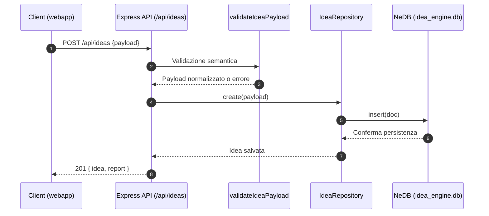

# Flusso delle richieste Idea Engine

Questo documento descrive in italiano il percorso completo seguito da una richiesta HTTP proveniente dal client fino alla persistenza nel database locale dell'Idea Engine. Il focus è sull'endpoint REST **POST `/api/ideas`**, responsabile della creazione di nuove idee, perché rappresenta il cammino più completo (controlli, orchestrazione applicativa e scrittura sul datastore).

## Panoramica dei componenti

- **Client web/applicazione**: il front-end (ad esempio la webapp Vue collocata in `webapp/`) invia richieste HTTP con payload JSON verso l'API.
- **Router Express** (`server/app.js`): espone gli endpoint REST e orchestra le dipendenze applicative, applicando middleware generici (CORS, parsing JSON) e delegando la logica specifica alle funzioni interne.【F:server/app.js†L330-L386】【F:server/app.js†L640-L719】
- **Validazione dominio** (`validateIdeaPayload` in `server/app.js`): normalizza slug e categorie, verificando che i campi obbligatori siano presenti e coerenti con i dataset di tassonomia.【F:server/app.js†L103-L206】
- **Servizio applicativo** (`IdeaRepository` in `server/storage.js`): incapsula la persistenza, normalizza i dati (tag, liste) e assegna identificativi incrementali prima di interagire con il database.【F:server/storage.js†L33-L156】
- **Database NeDB** (`data/idea_engine.db`): file datastore embedded (via `nedb-promises`) in cui vengono serializzate le idee; viene creato automaticamente se assente.【F:server/storage.js†L29-L45】

## Sequenza dettagliata della richiesta `POST /api/ideas`

1. **Invio dal client** – L'applicazione front-end costruisce il payload JSON (titolo, categoria, metadati opzionali) e lo invia con una richiesta `POST` verso `/api/ideas`.
2. **Ricezione e middleware** – Express applica CORS e il parser JSON (limite 1 MB) a livello di app prima di raggiungere l'handler dell'endpoint.【F:server/app.js†L323-L338】
3. **Validazione semantica** – L'handler invoca `validateIdeaPayload` che:
   - verifica presenza di titolo e categoria;
   - normalizza flag di override e liste di slug (biomi, specie, ecc.);
   - confronta gli slug con i dataset canonici (`docs/public/idea-taxonomy.json`), restituendo errori specifici se necessario.【F:server/app.js†L103-L206】
4. **Creazione dell'entità** – Se la validazione passa, l'handler chiama `repo.create(payload)`. All'interno del repository:
   - i campi stringa vengono trim-mati;
   - tag e liste vengono normalizzati in array;
   - viene assegnato un nuovo ID incrementale (`this.sequence += 1`);
   - viene creato il documento con timestamp `created_at`/`updated_at` e inserito nel datastore NeDB.【F:server/storage.js†L71-L139】
5. **Persistenza su NeDB** – `nedb-promises` scrive il documento nel file `idea_engine.db`, creando la cartella dati se non esiste.【F:server/storage.js†L29-L45】
6. **Arricchimento risposta** – Una volta ottenuta l'idea salvata, l'API genera anche il report Codex (`buildCodexReport`) e invia una risposta `201` con `{ idea, report }` al client.【F:server/app.js†L701-L719】

### Gestione errori principali

- **Validazione fallita** → risposta `400` con messaggio specifico (ad es. slug non riconosciuti o categoria mancante).【F:server/app.js†L701-L708】
- **Errore repository (ad es. titolo mancante, ID duplicato)** → risposta `400` generata da eccezioni nel repository.【F:server/app.js†L713-L719】【F:server/storage.js†L119-L135】
- **Eccezioni inattese** → risposta `500` generica.

## Diagramma del flusso (Mermaid)

## Note aggiuntive

- Gli endpoint `GET /api/ideas` e `GET /api/ideas/:id` riutilizzano lo stesso repository (`list`, `getById`) seguendo il medesimo percorso applicativo ma limitandosi alla lettura.【F:server/app.js†L640-L693】【F:server/storage.js†L83-L109】
- Il repository viene inizializzato all'avvio del server (`createApp`) caricando il database e sincronizzando la sequenza ID con l'ultimo documento presente.【F:server/app.js†L247-L252】【F:server/storage.js†L37-L69】
- Il database essendo file-based semplifica la distribuzione per ambienti di sviluppo/test, ma richiede backup manuali per ambienti produttivi.
