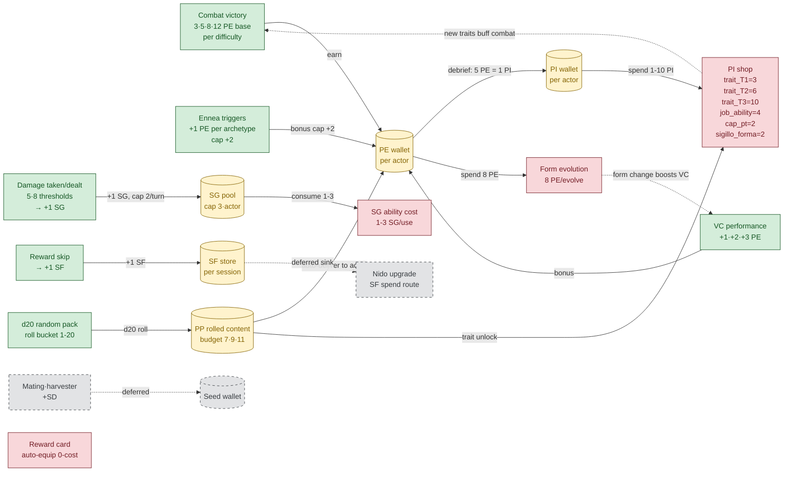

# Macro-Economy — flusso Source / Pool / Sink

> Artifact P0 prodotto da [`economy-design-illuminator`](.claude/agents/economy-design-illuminator.md).
> Pattern: Machinations.io visual sim (P0 #1 nel pattern library dell'agente).
> **Scope**: progression macro — campaign-level. **Complementare** (non duplicato) a [`MACHINATIONS_MODELS.md`](MACHINATIONS_MODELS.md), che modella combat micro (d20, PT pool, damage cap, status decay).

## Perché serve

L'economy di Evo-Tactics ha **5 valute attive + 1 deferred**, accumulatesi pezzo per pezzo lungo M10–M14 senza un modello formale di source/sink. Risultato: rischio di pinch points (currencies stockpilable senza spend route) e inflation loop non identificati prima del playtest.

Questo documento:

1. Mappa ogni currency: **chi la emette**, **dove si accumula**, **cosa la consuma**.
2. Disegna il flusso completo come grafo Mermaid (renders nativo su GitHub).
3. Identifica **5 gap di bilanciamento** che richiedono intervento prima di shipping economia full.
4. Fornisce baseline per future Monte Carlo simulations (Machinations.io o sim Python).

## Tassonomia delle currencies

| Currency         | Sigla | Persistence | Cap         | Status       | Owner                                                                              |
| ---------------- | :---: | ----------- | ----------- | ------------ | ---------------------------------------------------------------------------------- |
| Progression Exp  | `PE`  | per actor   | nessuno     | live         | [`rewardEconomy.js`](../../apps/backend/services/rewardEconomy.js)                 |
| Build Investment | `PI`  | per actor   | nessuno     | live         | conversione 5:1 da `PE` (debrief)                                                  |
| Surge Gauge      | `SG`  | per actor   | **3**       | live         | [`sgTracker.js`](../../apps/backend/services/combat/sgTracker.js)                  |
| Skip Fragment    | `SF`  | per session | nessuno     | live (earn)  | [`skipFragmentStore.js`](../../apps/backend/services/rewards/skipFragmentStore.js) |
| Pi-Pack content  | `PP`  | rolled      | budget 7-11 | live         | [`packRoller.js`](../../apps/backend/services/forms/packRoller.js)                 |
| Seed (mating)    | `SD`  | per nest    | n/a         | **deferred** | menzionato in `rewardEconomy.js` ma non emesso                                     |

## Diagramma di flusso

Legenda: 🟢 source · 🟡 pool · 🔴 sink · ⚪ deferred (tratteggiato).

## Source registry

| Source                  | Currency    | Rate                                                                    | File                                                                                              |
| ----------------------- | ----------- | ----------------------------------------------------------------------- | ------------------------------------------------------------------------------------------------- |
| Combat victory          | PE          | 3 (tutorial) · 5 (standard) · 8 (elite) · 12 (boss)                     | [rewardEconomy.js:11-17](../../apps/backend/services/rewardEconomy.js)                            |
| VC performance bonus    | PE          | +3 ≥0.7 · +2 ≥0.5 · +1 ≥0.3                                             | [rewardEconomy.js:19-24](../../apps/backend/services/rewardEconomy.js)                            |
| Ennea archetype bonus   | PE          | +1 per archetype, cap +2                                                | [rewardEconomy.js:58-60](../../apps/backend/services/rewardEconomy.js)                            |
| Damage taken/dealt      | SG          | 5 dmg taken OR 8 dmg dealt → +1 SG, cap 2/turn, pool max 3              | [combat/sgTracker.js](../../apps/backend/services/combat/sgTracker.js)                            |
| Reward skip             | SF          | +1 SF per skip (Tri-Sorgente offer)                                     | [rewardOffer.js:230-232](../../apps/backend/services/rewards/rewardOffer.js)                      |
| d20 universal pack      | PP (mixed)  | budget 7 (baseline) · 9 (veteran) · 11 (elite)                          | [data/packs.yaml:1-21](../../data/packs.yaml)                                                     |
| BIAS_FORMA pack (16-17) | PP (form)   | d12 sub-roll → 3 packs A/B/C per Forma MBTI                             | [data/packs.yaml:30-127](../../data/packs.yaml)                                                   |
| BIAS_JOB pack (18-19)   | PP (job)    | per-job table: Vang B/D, Skir C/E, Ward E/G, Art A/F, Inv A/J, Harv D/J | [data/packs.yaml:22-29](../../data/packs.yaml)                                                    |
| SCELTA pack (20)        | PP (choice) | player picks any pack from any column                                   | [data/packs.yaml:21](../../data/packs.yaml)                                                       |
| Mating / harvester      | SD          | n/a — emission deferred                                                 | menzione `seed_earned: 0` in [rewardEconomy.js:110](../../apps/backend/services/rewardEconomy.js) |

## Pool registry

| Pool              | Cap             | Reset                          | Persistence                                                                        |
| ----------------- | --------------- | ------------------------------ | ---------------------------------------------------------------------------------- |
| PE wallet         | none            | mai (campaign-persistent)      | `progressionStore.js` + Prisma write-through                                       |
| PI wallet         | none            | mai                            | derivata da PE in real-time                                                        |
| SG pool           | **3** per actor | a fine encounter               | in-session, non persistito                                                         |
| SF store          | none            | a fine session (M10+ persiste) | [`skipFragmentStore.js`](../../apps/backend/services/rewards/skipFragmentStore.js) |
| PP rolled content | 7/9/11 budget   | one-shot per pack roll         | non persistito (immediate apply)                                                   |
| Seed wallet       | n/a             | n/a                            | deferred                                                                           |

## Sink registry

| Sink                         | Currency | Cost                                | File                                                                         |
| ---------------------------- | -------- | ----------------------------------- | ---------------------------------------------------------------------------- |
| Form evolution               | PE       | **8 PE** per evolve (configurabile) | [formEvolution.js:33-42](../../apps/backend/services/forms/formEvolution.js) |
| PI shop — trait_T1           | PI       | **3 PI**                            | [data/packs.yaml:2](../../data/packs.yaml)                                   |
| PI shop — trait_T2           | PI       | **6 PI**                            | [data/packs.yaml:2](../../data/packs.yaml)                                   |
| PI shop — trait_T3           | PI       | **10 PI**                           | [data/packs.yaml:2](../../data/packs.yaml)                                   |
| PI shop — job_ability        | PI       | **4 PI**                            | [data/packs.yaml:2](../../data/packs.yaml)                                   |
| PI shop — ultimate_slot      | PI       | **6 PI**                            | [data/packs.yaml:2](../../data/packs.yaml)                                   |
| PI shop — cap_pt             | PI       | **2 PI** (max 1)                    | [data/packs.yaml:2-3](../../data/packs.yaml)                                 |
| PI shop — sigillo_forma      | PI       | **2 PI**                            | [data/packs.yaml:2](../../data/packs.yaml)                                   |
| PI shop — modulo_tattico     | PI       | **3 PI**                            | [data/packs.yaml:2](../../data/packs.yaml)                                   |
| PI shop — guardia_situazion. | PI       | **2 PI**                            | [data/packs.yaml:2](../../data/packs.yaml)                                   |
| PI shop — starter_bioma      | PI       | **1 PI** (max 1)                    | [data/packs.yaml:2-3](../../data/packs.yaml)                                 |
| SG ability cost              | SG       | 1-3 SG per ultimate                 | abilities con `sg_cost` in `data/core/abilities/`                            |
| Reward card auto-equip       | (none)   | 0-cost; max_copies enforced         | [rewardOffer.js:107-114](../../apps/backend/services/rewards/rewardOffer.js) |
| Nido upgrade (SF)            | SF       | deferred                            | M10+ nest integration pending                                                |

## Imbalance gap analysis

Identificati **5 gap** tramite cross-walk source ↔ sink. Severity: 🔴 = pinch, 🟡 = monitor, 🟢 = informational.

### 🔴 Gap 1 — `SF` orphan currency

- **Source attivo**: skip card +1 SF a uso (live).
- **Sink esistente**: nessuno (M10+ nest deferred).
- **Effetto**: stockpiling pure, valore percepito = 0 per il player. Anti-pattern Hades/StS evitato in design ma presente in M14 corrente.
- **Mitigazione**:
  - **A**: gate Phase 1 — emission disabled finché sink esiste.
  - **B**: stub temporaneo — 5 SF = re-roll a una offer corrente.
  - **C**: priorità M10 nest implementation accelerata.
- **Pattern di riferimento**: Hades 7-currency design — ogni currency ha sink o NON viene emessa.

### 🔴 Gap 2 — `PE` excess past Form evolution

- **Source rate** (single-actor average): combat ~5 PE + VC bonus ~2 + ennea ~1 = **~8 PE/encounter**.
- **Sink rate**: solo Form evolve costa PE (8 PE one-time per form change).
- **Effetto**: dopo 1-2 evolve, eccesso PE accumulato. PE → PI (5:1 floor) drena ma rimane residuo. Inflation latente.
- **Mitigazione**:
  - **A**: aumenta PE→PI conversion rate (es. 3:1 invece di 5:1) per drain rapido.
  - **B**: aggiungi PE-only sink (es. ability respec, trait re-roll) a campaign mid-game.
  - **C**: cap PE wallet (es. 50 PE) con auto-conversion forced.
- **Pattern di riferimento**: Slay the Spire gold — uniform sink rate (shop/healer) garantisce no overflow.

### 🟡 Gap 3 — `SG` underflow risk in low-damage encounters

- **Source rate**: 5 dmg taken OR 8 dmg dealt → +1 SG, cap 2/turn. Encounter tutorial avg ~10-15 dmg total → ~1-2 SG ciclo.
- **Sink rate**: SG ability ultimate consume 1-3.
- **Effetto**: in scenari low-damage (early tutorial), SG mai accumulato fino a 3 → ultimate mai triggerable. Ridotta varietà tattica.
- **Mitigazione**:
  - **A**: alternative source (turno start +0.5 SG passivo).
  - **B**: lower threshold tutorial-specific (3 dmg taken / 5 dmg dealt).
  - **C**: stub SG starter pack (+1 SG initial in tutorial).
- **Severity 🟡**: only impatta first 1-2 encounter; salta a 🟢 in late game.

### 🟢 Gap 4 — `PI shop` budget vs cost-curve **(closed via N=1000 sim)**

- **Budget**: 7 (baseline) · 9 (veteran) · 11 (elite). Costi: 1-10 PI.
- **Combinazione 7-PI baseline**: max 2-3 item (es. trait_T1=3 + cap_pt=2 + starter_bioma=1 = 6 PI; trait_T2=6 + starter_bioma=1 = 7 PI).
- **Verdict da Monte Carlo N=1000** ([report](2026-04-25-pi-shop-monte-carlo.md)):
  - `cheapest`: 4.38 items avg, **0% stockpile** (sempre full-spend)
  - `power`: 2.0 items avg, **0% stockpile** (big-ticket trait_T2/T3 priority)
  - `random`: 2.96 items avg, **1.59% stockpile** (residual minimo)
  - **Spread**: 4.38 vs 2.0 = 2.2× item-count range tra strategy estremi → strategy choice **MATTERS** (no boring optimum).
  - Stockpile 0-1.6% trascurabile → no economy issue lato PI shop.
- **Severity declassata 🟡 → 🟢**: cost-curve confirmed sano. Tuning post-playtest opzionale.
- **Follow-up consigliato**: telemetry hook in `packRoller.js` per validare strategy distribution real-player vs sim (M14+).

### 🟢 Gap 5 — `SD` orphan placeholder

- **Source**: nessuno wired (`seed_earned: 0` hardcoded).
- **Sink**: nessuno.
- **Effetto**: presence in API response solo. Confusione per consumer (frontend, telemetry).
- **Mitigazione**: rimuovere dal payload finché V3 mating/nido non shipped, OR documentare esplicitamente come reserved-for-future.

## Feedback loop annotations

Per [pattern P0 #2 dell'agente](.claude/agents/economy-design-illuminator.md):

- **Positive loop** `K2 → S1` (PI shop → trait unlock → combat win): runaway risk se trait T2/T3 boost > +30% damage. Counterforce: pressure tier scaling (V7 biome bias) + mission timer (M13 P6).
- **Positive loop** `K1 → S2` (Form evolve → VC bonus): runaway risk se Form-of-the-month dominante. Counterforce: confidence threshold 0.55 evita evolve verso form lontane (auto-balance).
- **Negative loop esistente**: Tri-Sorgente `R/A/P` (Recovery quando low / Advance quando ottimi) — implementa Mario Kart style rubber-banding sui card offers.
- **Negative loop mancante**: nessuno per PE accumulation. Gap 2 risolverebbe.

## Recommended next steps

| #   | Action                                                             | Effort | Owner       |
| --- | ------------------------------------------------------------------ | :----: | ----------- |
| 1   | Decisione su Gap 1 (SF orphan): A/B/C                              |  ~1h   | master-dd   |
| 2   | Decisione su Gap 2 (PE excess): A/B/C                              |  ~1h   | balancer    |
| 3   | Implementa stub Gap 3 (SG starter +1 in tutorial)                  |  ~2h   | claude-code |
| 4   | Hook telemetry packRoller per Gap 4 (count purchases per pack)     |  ~3h   | claude-code |
| 5   | Cleanup Gap 5 (rimuovi `seed_earned: 0` dal payload)               |  ~30m  | claude-code |
| 6   | Monte Carlo PI shop sim N=1000 (Python stdlib, riusa SPRT pattern) |  ~4h   | claude-code |
| 7   | (Opzionale) Replicare flow in Machinations.io free tier            |  ~3h   | balancer    |

Step 6 può riusare l'infrastructure pattern di [`tools/py/sprt_calibrate.py`](../../tools/py/sprt_calibrate.py): stdlib-only, deterministic seed, JSON+markdown output.

## Rollback plan

Documento informativo. Nessun rollback necessario — non modifica runtime. Per revisioni:

1. Update `last_verified` field nel frontmatter.
2. Re-run governance check: `python tools/check_docs_governance.py --strict`.

## Sources

- Pattern: [Machinations.io — Balancing Solved](https://machinations.io/articles/balancing-solved)
- Feedback loops: [Machinations — Game Systems Feedback Loops](https://machinations.io/articles/game-systems-feedback-loops-and-how-they-help-craft-player-experiences)
- Tradeoff curves: [Slay the Spire — gold + relic + potion](https://slay-the-spire.fandom.com/wiki/Gold)
- Multi-currency design: [Hades — Resources Design GDC 2021](https://www.gdcvault.com/play/1027466)
- Reward matrix: [Into the Breach — reward + island choice](https://subsetgames.com/itb.html)
- Agent: [`economy-design-illuminator`](../../.claude/agents/economy-design-illuminator.md)
- Companion micro doc: [`MACHINATIONS_MODELS.md`](MACHINATIONS_MODELS.md) (combat-side d20/PT/dmg)
