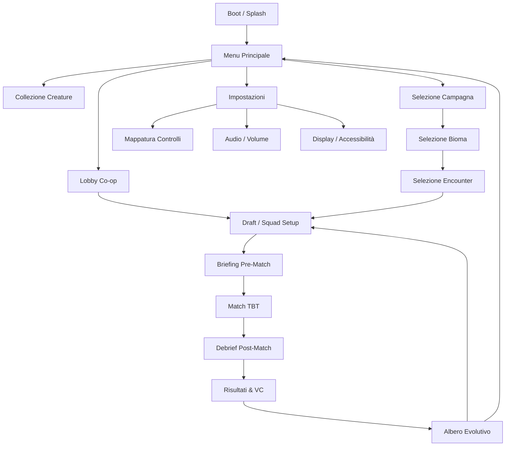
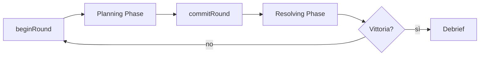

# Evo Tactics — Source of Truth Unificata v4

_Base ricostruita dalla copia `Game.zip` del repo attuale. Questo documento non sostituisce le fonti runtime, ma le riunisce in una lettura unica e operativa._

_v3 (2026-04-16): aggiunte §14–§18 (Grid, Level Design, Networking, Screen Flow, Audience)._
_v4 (2026-04-16): deep dive 4 aree (Grid, AI, Level Design, Networking) da 12+ repo esterni. §14-§16 arricchite con pattern concreti e raccomandazioni. §17 formalizzata con mermaid. §19 aggiunta: registro 28 decisioni GDD (12 chiuse, 9 proposte, 7 bloccate). AI SIS §13.5 arricchita con roadmap Utility AI._

## Stato lettura

| Stato | Task                                             | Dettagli operativi                                                                                                                                                                                                       |
| ----- | ------------------------------------------------ | ------------------------------------------------------------------------------------------------------------------------------------------------------------------------------------------------------------------------ |
| ☑    | Visione generale ricostruita                     | Derivata soprattutto da [`01-VISIONE.md`](01-VISIONE.md), [`03-LOOP.md`](03-LOOP.md), [`DesignDoc-Overview.md`](DesignDoc-Overview.md), [`90-FINAL-DESIGN-FREEZE.md`](90-FINAL-DESIGN-FREEZE.md)                         |
| ☑    | Prima partita ricostruita                        | Supportata da [`draft-screen-flow.md`](../planning/draft-screen-flow.md) e [`enc_tutorial_01.yaml`](../planning/encounters/enc_tutorial_01.yaml)                                                                         |
| ☑    | Worldgen ed ecosistemi ricostruiti               | Supportati da [`biomes.yaml`](../../data/core/biomes.yaml), `data/ecosystems/*`, `packs/evo_tactics_pack/data/ecosystems/*`                                                                                              |
| ☑    | Foodweb verificata                               | Confermata da `packs/evo_tactics_pack/data/foodwebs/*`, validator e network cross-bioma                                                                                                                                  |
| ☑    | Sistema evolutivo specie-trait-forme ricostruito | Supportato da [`species.yaml`](../../data/core/species.yaml), [`20-SPECIE_E_PARTI.md`](20-SPECIE_E_PARTI.md), [`22-FORME_BASE_16.md`](22-FORME_BASE_16.md), `data/core/traits/*`                                         |
| ☑    | TV + companion + salotto ricostruiti             | Supportati da [`11-REGOLE_D20_TV.md`](11-REGOLE_D20_TV.md), [`30-UI_TV_IDENTITA.md`](30-UI_TV_IDENTITA.md), [`DesignDoc-Overview.md`](DesignDoc-Overview.md), [`draft-screen-flow.md`](../planning/draft-screen-flow.md) |
| ☑    | Premessa narrativa recuperata                    | Supportata da [`draft-narrative-lore.md`](../planning/draft-narrative-lore.md)                                                                                                                                           |
| ☑    | Documento master promosso nel repo               | Questo file è ora canonico in `docs/core/00-SOURCE-OF-TRUTH.md`                                                                                                                                                          |

---

## 1. Tesi centrale del progetto

La sintesi più stabile del progetto oggi è questa:

> **"Tattica profonda a turni in cui come giochi modella ciò che diventi."**

Questa frase esiste ancora in [`docs/core/01-VISIONE.md`](01-VISIONE.md).

Il freeze attuale ([`90-FINAL-DESIGN-FREEZE.md`](90-FINAL-DESIGN-FREEZE.md)) chiarisce che Evo Tactics va chiuso come:

- gioco tattico cooperativo a turni;
- con progressione evolutiva leggibile;
- con asse **Specie × Job × Forma × Telemetry/Unlock**;
- con **Nido / Recruit / Mating** come meta-slice controllata;
- con `Game` come runtime source of truth.

### Lettura corretta del progetto

Il progetto non è solo un combat system.
È l'unione di 4 strati:

1. **Esperienza salotto TV-first** con squadra e companion.
2. **Partita tattica cooperativa** con planning, commit e risoluzione.
3. **Mondo ecologico generato** fatto di biomi, ecosistemi, specie, hazard, foodweb e propagazioni.
4. **Progressione evolutiva e sociale** con Forme, tratti, mutazioni, Nido, reclutamento, fiducia ed ereditarietà.

---

## 2. Come iniziava davvero una prima partita

La forma più concreta del flow iniziale non è solo nel loop alto livello, ma in [`docs/planning/draft-screen-flow.md`](../planning/draft-screen-flow.md).

### Flow completo della sessione

Il repo descrive questa sequenza:

**Boot → Menu → Campagna → Selezione Bioma → Selezione Encounter → Lobby / Draft / Squad Setup → Briefing → Match → Debrief → Risultati & VC → Albero Evolutivo → nuova partita o ritorno al menu**

### Prima partita vera

La prima partita era pensata come **tutorial giocato**, non come schermata teorica.

Il file [`docs/planning/encounters/enc_tutorial_01.yaml`](../planning/encounters/enc_tutorial_01.yaml) mostra un esempio molto chiaro:

- encounter id: `enc_tutorial_01`
- nome: `Primi Passi nella Savana`
- bioma: `savana`
- difficoltà: `1/5`
- durata stimata: `6 turni`
- obiettivo: eliminare due sentinelle nemiche
- niente hazard, niente reazioni, niente status, niente StressWave
- focus didattico: movimento, attacco base, copertura, altura, Margin of Success

### Conseguenza di design

La prima esperienza del giocatore non doveva essere "leggi il sistema".
Doveva essere:

- scegliere o ricevere un preset di creature/Forme;
- capire il contesto con un briefing di 2-3 frasi;
- imparare il gioco facendo;
- arrivare subito al post-match con feedback telemetrico e primo accesso all'evoluzione.

### Onboarding previsto

[`draft-screen-flow.md`](../planning/draft-screen-flow.md) e [`DesignDoc-Overview.md`](DesignDoc-Overview.md) convergono su questo:

- onboarding sotto i 10 minuti;
- preset di Forme;
- direttive assistite;
- tutorial integrato nei primi encounter;
- nessun "manuale iniziale" separato.

---

## 3. Come veniva generato il mondo

Il mondo non è modellato come semplice elenco di mappe.
Nel repo è descritto come una **rete di ecosistemi collegati**, con regole ecologiche, propagazioni e validatori.

### Livello 1: bioma

[`data/core/biomes.yaml`](../../data/core/biomes.yaml) contiene per ogni bioma:

- etichetta e summary;
- difficulty base e modificatori;
- affissi;
- hazard;
- archetipi NPC;
- StressWave baseline ed escalation;
- tono narrativo e hooks.

Quindi il bioma è già un pacchetto gameplay + fiction.

### Livello 2: ecosistema

I file in `packs/evo_tactics_pack/data/ecosystems/*.ecosystem.yaml` descrivono ecosistemi veri con:

- clima;
- aria;
- fattori abiotici;
- struttura trofica;
- link al set specie;
- link alla foodweb;
- regole minime (`apex`, `keystone`, `bridge`, `threat`, `event`).

Esempio: `deserto_caldo.ecosystem.yaml` contiene produttori, consumatori primari/secondari/terziari e decompositori.

### Livello 3: meta-ecosistema

Il file `packs/evo_tactics_pack/data/ecosystems/network/meta_network_alpha.yaml` mostra che i biomi non erano isolati:

- esistono nodi ecosistemici;
- esistono archi `corridor`, `seasonal_bridge`, `trophic_spillover`;
- esistono `bridge_species_map`;
- ci sono regole minime per biome (`predatori`, `detritivori`, `impollinatori`).

### Livello 4: eventi cross-bioma

`packs/evo_tactics_pack/data/ecosystems/network/cross_events.yaml` dimostra che eventi originati in un bioma possono propagarsi ad altri.
Esempi:

- tempesta ferrosa da badlands;
- ondata termica da deserto;
- brinastorm da cryosteppe.

Questi eventi non sono solo flavour: portano effetti come penalità visibilità, stress termico, attrito aumentato, impatto sugli equipaggiamenti.

### Conclusione

La world generation di Evo Tactics era pensata come:

**bioma → ecosistema → foodweb → specie/ruoli → network fra biomi → eventi propagati → encounter e pressioni di gioco**

Non come una semplice rotazione di mappe.

---

## 4. Foodweb: era davvero la catena chiave?

### Risposta breve

**Sì, quasi certamente sì.**
La foodweb è il sistema che collega in modo più esplicito:

- specie,
- biomi,
- ecosistemi,
- ruoli trofici,
- eventi,
- connessioni cross-bioma.

### Cosa ho verificato nel repo

Esistono:

- `packs/evo_tactics_pack/data/foodwebs/*_foodweb.yaml`
- validator dedicati (`validate_foodweb_v1_0.py`, `validate_cross_foodweb_v1_0.py`)
- regole runtime in `packs/evo_tactics_pack/validators/rules/foodweb.py`
- regole ruoli trofici in `packs/evo_tactics_pack/validators/rules/trophic_roles.py`
- report di allineamento specie/ecosistema ([`species_ecosystem_gap.md`](../../reports/evo/rollout/species_ecosystem_gap.md))

### Cosa fa davvero la foodweb

Nel repo la foodweb definisce:

- nodi ecologici;
- archi con tipi consentiti (`herbivory`, `grazing`, `predation`, `dispersal`, `detritus`, `scavenging`, `suppression`);
- presenza di sink del detrito;
- compatibilità delle propagazioni trofiche;
- necessità di bridge species per collegare certi biomi;
- controllo di coerenza fra rete ecologica e pack specie.

### Impatto reale sul gioco

La foodweb sembra avere impatto su 3 livelli.

#### A. Impatto forte su contenuto e generazione

Molto alto.
Decide o vincola:

- che specie hanno senso in un bioma;
- quali ruoli trofici devono esistere;
- come si costruisce l'ecosistema;
- quali connessioni tra biomi sono legittime;
- quali eventi possono propagarsi.

#### B. Impatto medio su encounter design e pressione di partita

Medio-alto.
Influenza:

- archetipi spawnabili;
- eventi dinamici;
- hazard o crisi importate da altri biomi;
- equilibrio predator/counter;
- identità tattica del bioma.

#### C. Impatto basso come meccanica esplicita da cliccare

Basso.
Non emerge come bottone o barra player-facing nel combat loop principale.
È soprattutto un **motore ecologico invisibile** che plasma le condizioni del match.

### Formula più accurata

La foodweb non è "solo lore", ma neanche "il turno di gioco".
È una **infrastruttura ecologica di design** che rende significativi:

- il contesto del bioma,
- la composizione delle specie,
- gli eventi dinamici,
- la credibilità del mondo,
- e parte del bilanciamento.

---

## 5. Specie, trait, morph e Forme: il sistema evolutivo vero

### Specie e parti

[`20-SPECIE_E_PARTI.md`](20-SPECIE_E_PARTI.md) e [`species.yaml`](../../data/core/species.yaml) mostrano un impianto ancora vivo:

- slot base: locomotion, offense, defense, senses, metabolism;
- budget di peso/morph budget;
- parti default per specie;
- suggerimenti di sinergia;
- reference dei counter;
- trait plan per specie;
- environment focus.

Esempio: `dune_stalker` ha:

- biome affinity;
- default parts;
- synergy hints;
- trait plan core/optional/synergies;
- focus ambientale.

### Morph

Nel freeze il morph resta parte dell'asse di progressione leggibile. Non sempre è spiegato in un singolo doc centrale, ma i dati e i budget confermano che il corpo/configurazione resta fondamentale.

### Trait

I trait vivono in più luoghi:

- [`data/core/traits/glossary.json`](../../data/core/traits/glossary.json)
- [`data/traits/index.json`](../../data/traits/index.json)
- inventari e matrix di coverage
- report di allineamento trait↔bioma↔specie

Quindi i trait non sono solo bonus lineari: servono a esprimere adattamento ambientale, ruolo, mutazione e copertura ecologica.

### Job

Il Job è la specializzazione di ruolo: **vanguard, skirmisher, warden, artificer, invoker, harvester**.
Non esiste un doc dedicato; il sistema è distribuito in [`PI-Pacchetti-Forme.md`](PI-Pacchetti-Forme.md) e [`22-FORME_BASE_16.md`](22-FORME_BASE_16.md).
Ogni Forma ha un bias verso certi Job tramite tabelle d12; ogni pacchetto PI (A/B/C) include una `job_ability` (costo 4 PE).
Il Job è ortogonale alla Specie ma strettamente accoppiato alla Forma.

### Forme

[`22-FORME_BASE_16.md`](22-FORME_BASE_16.md) definisce le **16 Forme Base** come seed temperamentali (mappati 1:1 su tipi MBTI).
Ogni Forma assegna:

- 1 innata;
- 7 PI/pacchetti preconfezionati tematici;
- un orientamento iniziale che poi viene spostato dalla telemetria VC in match;
- bias di Job preferito via tabella d12.

### Telemetria e Forma

[`Telemetria-VC.md`](Telemetria-VC.md) (vedi anche [`24-TELEMETRIA_VC.md`](24-TELEMETRIA_VC.md)) chiarisce che:

- gli assi temperamentali sono derivati dal comportamento di gioco;
- non sono quiz psicologici;
- influenzano suggerimenti, mutazioni, Nido e progressione.

### Formula completa del sistema evolutivo

La struttura più fedele al repo è:

**Bioma / Ecosistema / Pressione → Specie → Parti / Morph → Trait → Forma / PI → comportamento in match → telemetria VC → unlock / mutazione / rami / Nido**

Questa è la vera dorsale del progetto.

---

## 6. TV + tavolo + cellulari: il progetto living room è ancora dentro al repo?

### Sì

Questo asse esiste ancora chiaramente.

[`11-REGOLE_D20_TV.md`](11-REGOLE_D20_TV.md) parla di:

- schermo condiviso;
- stato gruppo, mappa, log VC, consigli sblocchi;
- privacy e profilazione stile.

[`30-UI_TV_IDENTITA.md`](30-UI_TV_IDENTITA.md) parla di:

- carta temperamentale;
- albero evolutivo;
- feed eventi;
- warning budget;
- sinergie e counter noti.

[`draft-screen-flow.md`](../planning/draft-screen-flow.md) è esplicitamente TV-first:

- D-pad;
- font grande;
- alto contrasto;
- lobby co-op;
- briefing veloci;
- griglia leggibile;
- albero evolutivo a fine sessione.

### Companion App

[`DesignDoc-Overview.md`](DesignDoc-Overview.md) è ancora più esplicito.
Descrive una companion per:

- drafting Forme/Job;
- macroazioni;
- chat tattica;
- upload telemetria JSON/YAML;
- supporto second screen per mappa tattica e Nido.

### Esperienza target

Il repo descrive una sessione tipo come:

- gruppo da salotto;
- TV come spazio condiviso;
- companion come spazio personale o tattico;
- briefing e debrief brevi;
- partita cooperativa;
- evoluzione visibile alla fine.

### Conclusione

Il progetto "TV + tavolo + cellulari" non è un'idea persa.
È ancora leggibile e coerente nel repo.
Semplicemente oggi è meno centrale del freeze combat e più disperso tra overview, UI e planning docs.

---

## 7. Premessa narrativa e storia del mondo

La premessa narrativa più nitida oggi è in [`docs/planning/draft-narrative-lore.md`](../planning/draft-narrative-lore.md).

### Framing

- Il mondo non ha nome.
- Le creature evolvono sotto pressioni ambientali.
- Il **Sistema** è il Director AI / forza ecologica che mantiene il mondo in tensione.
- I giocatori non sono eroi classici: guidano creature che tentano di sopravvivere, adattarsi e prosperare.
- La cooperazione tra giocatori è la risposta emergente alla pressione del Sistema.

### Tono

Il tono dichiarato è:

- serio ma con meraviglia;
- fantastico bio-plausibile, non magico;
- intimo, a piccola scala;
- lore suggerita dal gameplay, non da lunghi dump espositivi.

### Struttura narrativa

La narrazione è pensata su 3 livelli:

1. **Briefing / Debrief di encounter**
   - 2-3 frasi prima e dopo la missione.
2. **Arco ecologico del bioma**
   - 3-5 missioni per bioma.
3. **Meta-narrativa di campagna**
   - il Sistema non è casuale;
   - addestra, modella e mette pressione.

### Narrative engine (implementazione sprint recente)

Un motore narrativo basato su **inkjs** è ora attivo in `services/narrative/narrativeEngine.js`.
Espone endpoint REST per caricare storie `.ink.json`, eseguire scelte ramificate e legare dati di sessione al contesto narrativo.
Briefing e debrief possono ora contenere nodi di scelta player-facing.

### Conclusione

La storia non è sparita.
Oggi è stata rilanciata con un motore narrativo runtime.
Resta un'area che beneficerebbe da più contenuti `.ink` e da una promozione a documento canonico centrale.

---

## 8. Come leggere insieme tutto il progetto

La forma più utile per capire Evo Tactics oggi è questa:

### Livello A — Esperienza del giocatore

- TV shared screen
- Companion personale/tattico
- Squadra co-op
- Briefing → match → debrief → evoluzione

### Livello B — Partita tattica

- planning condivisa
- commit
- risoluzione ordinata
- bioma come moltiplicatore del gameplay
- Director, NPG, StressWave, affissi

### Livello C — Motore del mondo

- biomi
- ecosistemi
- foodweb
- ruoli trofici
- network tra ecosistemi
- eventi cross-bioma

### Livello D — Progressione identitaria

- specie
- parti / morph
- trait
- Forme
- telemetria VC
- Nido / recruit / mating / ereditarietà

---

## 9. Cosa si è davvero perso e cosa no

### Non si è perso

- il cuore tactico;
- il telaio evolutivo;
- il living room design;
- la worldgen ecologica;
- il meta-loop Nido/reclutamento/mating;
- la premessa del Sistema e della pressione adattiva.

### Si è perso o indebolito

- un **GDD master unico** che metta tutto insieme (questo documento colma il gap);
- una gerarchia semplice per leggere il progetto senza passare fra molti file;
- la centralità esplicita della narrativa nel corpus canonico;
- la leggibilità immediata del legame tra foodweb e gameplay per chi apre il repo oggi.

### Diagnosi finale

Il progetto non è stato cancellato.
È stato **modularizzato e disperso**.
La memoria che avevi era giusta: il gioco era più grande del puro combat, e il repo lo conferma ancora.

---

## 10. Ordine di lettura consigliato da ora

| Stato | Task                                | Dettagli operativi                                                                                    |
| ----- | ----------------------------------- | ----------------------------------------------------------------------------------------------------- |
| ☑    | 1. Leggere la visione               | [`docs/core/01-VISIONE.md`](01-VISIONE.md)                                                            |
| ☑    | 2. Leggere il loop                  | [`docs/core/03-LOOP.md`](03-LOOP.md)                                                                  |
| ☑    | 3. Leggere il freeze                | [`docs/core/90-FINAL-DESIGN-FREEZE.md`](90-FINAL-DESIGN-FREEZE.md)                                    |
| ☑    | 4. Recuperare il feeling originario | [`docs/core/DesignDoc-Overview.md`](DesignDoc-Overview.md)                                            |
| ☑    | 5. Leggere il flow giocabile        | [`docs/planning/draft-screen-flow.md`](../planning/draft-screen-flow.md)                              |
| ☑    | 6. Leggere la prima partita         | [`docs/planning/encounters/enc_tutorial_01.yaml`](../planning/encounters/enc_tutorial_01.yaml)        |
| ☑    | 7. Leggere specie e Forme           | [`20-SPECIE_E_PARTI.md`](20-SPECIE_E_PARTI.md), [`22-FORME_BASE_16.md`](22-FORME_BASE_16.md)          |
| ☑    | 8. Leggere biomi e Director         | [`28-NPC_BIOMI_SPAWN.md`](28-NPC_BIOMI_SPAWN.md), [`biomes.yaml`](../../data/core/biomes.yaml)        |
| ☑    | 9. Leggere foodweb/ecosistemi       | `packs/evo_tactics_pack/data/ecosystems/*`, `packs/evo_tactics_pack/data/foodwebs/*`, `.../network/*` |
| ☑    | 10. Leggere meta-loop               | [`27-MATING_NIDO.md`](27-MATING_NIDO.md), [`mating.yaml`](../../data/core/mating.yaml)                |
| ☑    | 11. Promuovere un master doc        | Questo file è ora `docs/core/00-SOURCE-OF-TRUTH.md`                                                   |

---

## 11. Decisione proposta

### Decisione

Assumere come verità operativa che Evo Tactics sia:

**un tactics co-op TV-first con companion, ambientato in un meta-ecosistema generato, in cui la foodweb struttura il mondo e la progressione specie/trait/Forma/Nido trasforma il comportamento del giocatore in identità evolutiva.**

### Implicazione pratica

Quando si prendono decisioni di design o implementazione, non bisogna ridurre il progetto a un solo asse.
Ogni scelta andrebbe valutata contro questi 6 pilastri:

1. prima partita;
2. worldgen;
3. foodweb/ecosistemi;
4. specie-trait-forme;
5. TV + companion;
6. premessa narrativa del Sistema.

---

## 12. Prossimo passo consigliato

Questo documento è ora canonico e allineato con sprint 001–019 (v2).
I prossimi passi sono:

- espandere contenuti `.ink` per briefing/debrief ramificati;
- documentare il Job system in un doc dedicato;
- collegare le metriche VC al bilanciamento delle Forme;
- playtest del round model completo con 4 giocatori.

Vedi [`90-FINAL-DESIGN-FREEZE.md`](90-FINAL-DESIGN-FREEZE.md) e [`docs/hubs/combat.md`](../hubs/combat.md) per lo stato corrente dei sistemi implementati.

---

## 13. Stato implementativo (sprint 001–019)

Questa sezione mappa il design (§1–§12) al codice reale nel repo. Aggiornata al 2026-04-16.

### 13.1 Round model — il cuore del turno tattico

Il round model è implementato in `apps/backend/services/roundOrchestrator.js` ed è **ON by default** dal milestone M17.

**Fasi:** planning → committed → resolving → resolved

| Fase                | Cosa succede                                                                                     |
| ------------------- | ------------------------------------------------------------------------------------------------ |
| `beginRound()`      | Reset AP/reazioni, tick bleeding, decay status (remaining_turns-1), decremento cooldown reazioni |
| `declareIntent()`   | Accumulo intenti azione (latest-wins per unità)                                                  |
| `declareReaction()` | Registrazione reazioni (parry, counter, overwatch) con trigger DSL                               |
| `commitRound()`     | Lock intenti, transizione a committed                                                            |
| `resolveRound()`    | Esecuzione coda in ordine priorità (initiative + action_speed - status_penalty)                  |

**Endpoint round** (`sessionRoundBridge.js`):

- `POST /declare-intent` — dichiara azione
- `POST /clear-intent/:actorId` — pulisce intenti
- `POST /commit-round` — conferma turno
- `POST /resolve-round` — risolvi coda

**State machine** (`roundStatechart.js`): FSM xstate v5 che orchestra planning → committed → resolving → resolved → (vittoria | turno successivo). Guard: `allIntentsDeclared`, `queueEmpty`, check vittoria.

### 13.2 Rules engine d20

Implementato in `services/rules/resolver.py`. È il motore meccanico puro.

**Flusso attacco d20:**

1. Tiro d20 + attack_mod (aggregato da trait)
2. CD = 10 + target.tier + defense_mod + terrain_mod
3. Nat 20 = auto-crit; Nat 1 = auto-fumble
4. MoS = max(0, totale - CD)
5. Damage step = floor(MoS / 5) + trait bonus; cap a 6
6. Tiro danni + step bonus → applica resist% → applica armor (DR) → clamp ≥0
7. PT guadagnati: +1 per nat 15-19, +2 per nat 20, +1 per ogni +5 MoS

**Parata reattiva:** d20 + parry_bonus vs attack_total. Successo → step_reduced = 1, PT defensivi.

**Combat prediction** (`predict_combat()`): simula N=1000 attacchi (seed=42). Output: hit%, crit%, fumble%, kill%, avg/min/max damage, avg MoS, CD.

**Hydration** (`hydration.py`): carica `trait_mechanics.yaml` → CombatState con HP, AP, reazioni, iniziativa, tier, stress, status, armor, resistenze per unità.

### 13.3 Status system

Implementato in `apps/backend/services/statusEffectsMachine.js` come FSM xstate v5 a regioni parallele.

**7 status:**

| Status    | Tipo    | Effetto                                      |
| --------- | ------- | -------------------------------------------- |
| bleeding  | fisico  | -intensity HP/turno                          |
| fracture  | fisico  | -intensity damage_step                       |
| disorient | fisico  | -2×intensity attack_mod                      |
| rage      | mentale | +intensity attack/damage, -intensity defense |
| panic     | mentale | -2×intensity attack, blocca spesa PT         |
| stunned   | mentale | salta turno                                  |
| focused   | mentale | +bonus (buff)                                |
| confused  | mentale | azione casuale                               |

**Meccaniche:** `TICK` decrementa durata ogni round. `APPLY_STATUS` stackabile (cap 3 stack). Stress breakpoint: 0.5 → rage, 0.75 → panic.

### 13.4 VC scoring e MBTI/Ennea (P4)

**VC scoring** (`vcScoring.js`): 19+ raw metrics → 6 indici aggregati (aggro, risk, cohesion, setup, explore, tilt).

**4 assi MBTI** (da `telemetry.yaml`):

- E/I: close_engage, support_bias, time_to_commit
- S/N: new_tiles, setup_ratio, evasion_ratio
- T/F: utility_actions vs support_bias
- J/P: setup_ratio, time_to_commit

**`deriveMbtiType()`** in `vcScoring.js`: soglia 0.5 per asse → tipo 4 lettere.

**6 archetipi Ennea** (condizionali su metriche): Conquistatore(3), Coordinatore(2), Esploratore(7), Architetto(5), Stoico(9), Cacciatore(8). Trigger: espressioni condizionali in `telemetry.yaml`.

**Effetti Ennea** (`enneaEffects.js`): mappano archetipi a buff combat (attack_mod, defense_mod, move_bonus, stress_reduction, evasion_bonus). Applicati dopo ogni round.

**16 Forme YAML** (`data/core/forms/mbti_forms.yaml`): tipo MBTI → assi baseline, affinità Job, penalità.

**Endpoint**: `GET /api/session/:id/pf` → proiezione personalità con tipo MBTI, assi e archetipi Ennea per ogni attore.

### 13.5 AI SIS — il Sistema come avversario

**Policy engine** (`services/ai/policy.js`): funzione pura `selectAiPolicy(actor, target)` → regola + intento.

- REGOLA_001: attacco/avvicinamento default
- REGOLA_002: ritirata a ≤30% HP
- REGOLA_003: kite se raggio > target
- Gestione stati emotivi (stunned, rage, panic)

**Intenti** (`declareSistemaIntents.js`): funzione pura che genera intenti per tutte le unità SIS in un round. Output: `{intents, decisions}`. Nessuna mutazione di stato.

**Profili data-driven** (`ai_profiles.yaml`): 3 personalità (aggressive, balanced, cautious) con soglie override. `ai_intent_scores.yaml`: costanti combat (default_attack_range, retreat_hp_pct, kite_buffer).

#### Evoluzione AI — evidenze deep dive repo (2026-04-16)

Analizzati: yuka (JS, goal-driven + fuzzy), GOApy (Python, GOAP/A\*), UtilityAI (C#, considerations), Behaviac (C++, BT/HTN).

**Raccomandazione: Utility AI.** Motivazioni:

1. **Fit naturale** con `selectAiPolicy(actor, target)` → wrapper ogni opzione come Action con Considerations
2. **Scoring** per azione: `score = Π(consideration_i(state))`, curva lineare/quadratica/log per fattore
3. **Difficulty profiles** = peso considerations: easy=random noise alto, hard=ottimale
4. **Overhead zero** per turn-based (nessun planning multi-step necessario)
5. **~400 LOC** per port minimo (Brain + Action + Consideration base classes)

**Roadmap AI proposta:**

1. `enumerateLegalActions(state, unitId)` → lista azioni valide (boardgame.io pattern)
2. Per ogni azione: score da N considerations (distanza, HP, copertura, alleati, stress)
3. Selezione: highest score (hard), weighted random top-3 (normal), random (easy)
4. Profili in `ai_profiles.yaml` → pesi consideration per profilo

**Pattern scartati:**

- GOAP: overhead A\* planning ogni turno, overkill per 3-5 azioni possibili
- Behavior Tree: rigido, meno adattivo a cambio parametri
- Yuka goals: buono per hierarchical goals ma action enum manuale

### 13.6 Narrative engine

**inkjs** in `services/narrative/narrativeEngine.js`. Carica storie `.ink.json` compilate e le esegue fino a nodi di scelta.

**Endpoint:**

- `GET /api/v1/narrative/stories` — lista storie disponibili
- `POST /api/v1/narrative/start` — inizia storia con sessionData opzionale
- `POST /api/v1/narrative/choice` — scegli opzione → testo + nuove scelte
- `POST /api/v1/narrative/bind-session` — lega dati sessione al contesto
- `POST /api/v1/narrative/save` — salva stato storia

### 13.7 Plugin system

`pluginLoader.js` implementa registrazione sequenziale: ogni plugin esporta `{name, register(app, options)}`.
Pattern Bevy-inspired (V1). Plugin attivi: `narrativePlugin` (monta route narrative), `metaPlugin` (monta route meta).

### 13.8 Mappa design → codice

| Sezione design             | Modulo implementato                                       | Stato                                 |
| -------------------------- | --------------------------------------------------------- | ------------------------------------- |
| §1 Tesi / Combat           | `roundOrchestrator.js`, `resolver.py`                     | Operativo                             |
| §2 Prima partita           | `enc_tutorial_01.yaml` + session engine                   | Definito, non giocabile end-to-end    |
| §3 Worldgen                | `biomes.yaml`, ecosystems, foodwebs                       | Dati completi, generatore non runtime |
| §4 Foodweb                 | Validators + data YAML                                    | Validazione completa, non runtime     |
| §5 Specie/Trait/Job/Forme  | `species.yaml`, `trait_mechanics.yaml`, `mbti_forms.yaml` | Dati + hydration operativi            |
| §6 TV + companion          | Design docs                                               | Solo design, nessun frontend          |
| §7 Narrativa               | `narrativeEngine.js` + inkjs                              | Engine operativo, contenuti minimi    |
| §8 Mappa 4 livelli         | —                                                         | Framework concettuale                 |
| §10 Meta-loop Nido         | `mating.yaml`, `27-MATING_NIDO.md`                        | Solo dati, non implementato           |
| VC/MBTI/Ennea              | `vcScoring.js`, `enneaEffects.js`                         | Operativo (P4 completo)               |
| AI SIS                     | `policy.js`, `declareSistemaIntents.js`                   | Operativo, data-driven                |
| Status system              | `statusEffectsMachine.js`                                 | Operativo (xstate v5)                 |
| §14 Grid & Map             | `terrain_defense.yaml` (solo dati)                        | ⚠️ Da definire                        |
| §15 Level Design           | `enc_tutorial_01.yaml` (1 esempio)                        | ⚠️ Da definire                        |
| §16 Networking/Co-op       | —                                                         | ⚠️ Da definire                        |
| §17 Screen Flow            | `draft-screen-flow.md` (mermaid)                          | ✅ Formalizzato                       |
| §18 Audience/Accessibilità | —                                                         | 🟡 Proposte, attesa Master DD         |
| §19 Decisioni GDD          | 28 domande                                                | 12✅ 9🟡 7🔴                          |

---

## 14. Grid & Map System ⚠️ DA DEFINIRE

Questa sezione copre la struttura spaziale del campo di battaglia. Attualmente il repo ha dati di terreno (biomes.yaml, terrain_defense.yaml) ma **nessuna implementazione grid/pathfinding**.

### 14.1 Tipo di griglia

**Decisione aperta:** hex o square? → ADR dedicato richiesto.

| Criterio                 | Hex                                         | Square                              |
| ------------------------ | ------------------------------------------- | ----------------------------------- |
| Leggibilità TV (10-foot) | Meno intuitiva, più elegante                | Più intuitiva per casual            |
| Distanza/adiacenza       | 6 vicini equidistanti, no diagonali ambigue | 8 vicini, diagonali costano √2      |
| Copertura/LOS            | Naturale, nessun edge case diagonale        | Edge case angoli, LOS ambigua       |
| Complessità impl.        | Coordinate axial/cube, librerie mature      | Banale, nessuna libreria necessaria |
| Reference tattici        | AncientBeast (hex, 16×9)                    | FFT (square), Fire Emblem (square)  |

**Evidenze da deep dive repo (2026-04-16):**

- **AncientBeast** usa hex 16×9 con `hexes[y][x]`, supporta unità multi-hex (size 1-3), walkability check, pathfinding con `getMovementRange(x, y, distance, size, id)`. Funziona bene per creature di dimensioni diverse.
- **Red Blob Games** (reference canonico): raccomanda **coordinate axial (q,r)** per la maggior parte dei progetti. Distanza = `max(|q|, |r|, |s|)/2`. Cube per algoritmi, axial per storage.
- **easystarjs**: solo square, A\* asincrono, npm ready, ~7kb. Sufficiente se square.
- **honeycomb-grid** (npm): hex grid JS/TS, Node ≥16, MIT, 695★. No pathfinding built-in ma esempio A\* incluso. Coordinate axial/cube.

**Raccomandazione preliminare:** hex con coordinate axial. Motivazioni:

1. Creature di dimensioni diverse (species size da `species.yaml`) mappano meglio su hex (AncientBeast pattern)
2. LOS/range senza ambiguità diagonale — critico per d20 range attacks
3. Leggibilità TV compensata da hex grandi e alto contrasto (già previsto in §6)
4. `honeycomb-grid` + A\* custom = stack leggero

### 14.2 Terreno

Dati già esistenti in `packs/evo_tactics_pack/data/balance/terrain_defense.yaml`:

- terrain types con defense_mod
- integrati nel calcolo CD del resolver (`CD = 10 + tier + defense_mod + terrain_mod`)

**Mancante — da aggiungere a `terrain_defense.yaml`:**

- `movement_cost: int` per terrain type (Red Blob Games: Dijkstra con costi variabili)
- `elevation: int` (proposta: 3 livelli — basso/medio/alto; +1 range per livello sopra, -1 sotto)
- `cover: float` (proposta: 0/0.25/0.5 — nessuna/parziale/piena; applicato come moltiplicatore damage)
- `hazard_effect: string` (ref a hazard da `biomes.yaml` → effetto tile: damage/status/movement penalty)
- `blocks_los: bool` (muri, vegetazione densa)

### 14.3 Pathfinding

**Nessuna implementazione.** Approccio raccomandato da analisi:

| Algoritmo               | Uso                                                                      | Libreria                           |
| ----------------------- | ------------------------------------------------------------------------ | ---------------------------------- |
| **Dijkstra flood-fill** | `getReachableTiles(unit, ap)` — area raggiungibile con costi terreno     | Custom (~80 LOC)                   |
| **A\***                 | `findPath(from, to)` — percorso ottimale per animazione movimento        | easystarjs (square) o custom (hex) |
| **BFS range**           | `getTilesInRange(center, range)` — area attacco/abilità (ignora terreno) | Custom (~30 LOC)                   |

Red Blob Games: BFS level-by-level per range limit, Dijkstra per costi variabili. Entrambi ~50-80 LOC su hex.

**API target:**

```js
getReachableTiles(unit, ap) → Set<HexCoord>     // movement
findPath(from, to, unit) → HexCoord[]            // animation
getTilesInRange(center, range) → Set<HexCoord>   // attack/ability
getLineOfSight(from, to) → {clear: bool, tiles: HexCoord[]}
```

### 14.4 Field of View / Line of Sight

**Nessuna implementazione.** Approccio da Red Blob Games:

- **LOS**: interpolazione lineare fra due hex, N+1 sample points, rounding a hex. Epsilon bias per evitare ambiguità bordi.
- **FOV**: ray-cast da centro unità verso tutti hex in range, stop su `blocks_los` tiles.
- Necessario per: range attacks, copertura, overwatch trigger, fog of war (opzionale).

### 14.5 Mappa design → codice

| Componente   | Modulo                 | Stato                         | Libreria candidata     |
| ------------ | ---------------------- | ----------------------------- | ---------------------- |
| Terrain data | `terrain_defense.yaml` | Dati presenti, campi mancanti | —                      |
| Grid engine  | —                      | Non implementato              | `honeycomb-grid` (hex) |
| Pathfinding  | —                      | Non implementato              | Custom Dijkstra/A\*    |
| FOV/LOS      | —                      | Non implementato              | Custom ray-cast        |
| Map editor   | —                      | Non previsto                  | —                      |

---

## 15. Level Design & Encounter Templates ⚠️ DA DEFINIRE

Il repo ha un solo encounter definito (`enc_tutorial_01.yaml`). Manca una struttura sistematica per livelli e encounter.

### 15.1 Struttura encounter attuale

Da `enc_tutorial_01.yaml`:

```yaml
encounter_id: enc_tutorial_01
name: Primi Passi nella Savana
biome: savana
difficulty: 1 # scala 1-5
estimated_turns: 6
objectives: [eliminate_sentinels]
restrictions: [no_hazard, no_reactions, no_status]
didactic_focus: [movement, attack_base, cover, elevation, MoS]
```

### 15.2 Struttura encounter target (da definire)

**Schema proposto** (da validare con analisi repo esterni):

```yaml
encounter_id: string # slug unico
name: string # nome display
biome: string # ref a biomes.yaml
difficulty: 1-5 # rating
estimated_turns: int
map: # ← NUOVO
  size: [width, height]
  terrain: [[terrain_type]] # matrice o ref a file .map
  elevation: [[int]] # matrice altezze
  spawn_zones:
    players: [{ x, y }]
    sistema: [{ x, y }]
objectives:
  primary: string # condizione vittoria
  secondary: [string] # opzionali, bonus VC
  fail: string # condizione sconfitta
enemy_roster:
  - species: string
    tier: int
    count: int
    ai_profile: string # ref a ai_profiles.yaml
rewards:
  pe: int
  unlocks: [string]
restrictions: [string]
narrative:
  briefing_ink: string # ref a file .ink.json
  debrief_ink: string
tags: [string] # tutorial, boss, survival, timed...
```

### 15.3 Tipologie di encounter

| Tipo     | Obiettivo              | Durata        | Esempio                          |
| -------- | ---------------------- | ------------- | -------------------------------- |
| Tutorial | Insegnare meccanica    | 4-6 turni     | enc_tutorial_01                  |
| Standard | Eliminare/sopravvivere | 8-12 turni    | Pattuglia savana                 |
| Boss     | Apex predator          | 12-20 turni   | Apex del bioma                   |
| Survival | Resistere N turni      | N turni fissi | Ondata StressWave                |
| Escort   | Proteggere unità       | Variabile     | Migrazione cross-bioma           |
| Puzzle   | Posizionamento tattico | 3-5 turni     | Superare hazard senza combattere |

### 15.4 Difficulty formula

**Evidenze da deep dive repo (2026-04-16):**

- **AncientBeast**: nessuna formula esplicita; difficulty emerge da creature stats (18 attributi) e risorse (plasma). Budget implicito.
- **wesnoth**: `difficulty_level` con scaling stat per livello (easy/normal/hard). Dati in `data/campaigns/`, tag `{QUANTITY}` per nemici scalati.
- **rpg_tactical_fantasy_game**: XML data-driven, balance modificabile senza toccare codice.

**Formula proposta per Evo-Tactics:**

```
raw_score = (enemy_count × avg_enemy_tier) + terrain_penalty + hazard_count × 2
biome_mult = biome.difficulty_base  # da biomes.yaml
objective_mult = {eliminate: 1.0, survive: 1.2, escort: 1.5, boss: 2.0}
difficulty = clamp(raw_score × biome_mult × objective_mult, 1, 5)
```

**Scaling per difficoltà (pattern wesnoth):** tag `{QUANTITY}` applicato a enemy_count. Easy=0.7×, Normal=1.0×, Hard=1.3×.

### 15.5 Progressione campagna

**Non formalizzata.** Il SoT §7 descrive 3 livelli narrativi:

1. Encounter singolo (briefing/debrief)
2. Arco bioma (3-5 encounter)
3. Meta-narrativa campagna

**Evidenze da repo:**

- **wesnoth**: campagne come sequenze lineari di scenario con branching limitato. Ogni scenario = encounter + map + dialogue. ~10-15 scenario per campagna.
- **AncientBeast**: nessuna campagna, solo PvP.

**Proposta Evo-Tactics:**

- 7 biomi = 7 archi
- 4-5 encounter per arco (tutorial → standard × 2-3 → boss)
- Branching: scelta encounter opzionale dopo il secondo (narrativa ink)
- ~30-35 encounter totali per campagna completa

### 15.6 Map data format

**Evidenze:** nessun repo analizzato usa YAML per mappe. AncientBeast hard-coded, wesnoth usa WML, Python RPG usa file custom.

**Decisione per Evo-Tactics:** YAML coerente col resto del repo. Ogni encounter = 1 file `.encounter.yaml` con map data inline o ref a `.map.yaml` separato per mappe grandi.

### 15.7 Mappa design → codice

| Componente         | Modulo                 | Stato            | Prossimo passo                 |
| ------------------ | ---------------------- | ---------------- | ------------------------------ |
| Encounter template | `enc_tutorial_01.yaml` | 1 esempio        | Schema AJV in `schemas/evo/`   |
| Encounter loader   | —                      | Non implementato | Parser YAML → session state    |
| Difficulty system  | —                      | Non implementato | Formula §15.4                  |
| Campaign graph     | —                      | Non implementato | Grafo archi bioma              |
| Map data format    | —                      | Non definito     | `.encounter.yaml` con hex grid |

---

## 16. Networking & Co-op Architecture ⚠️ DA DEFINIRE

Co-op 4 giocatori vs Sistema è pilastro #5. Oggi il sistema gira **single-machine only**.

### 16.1 Requisiti co-op

Da §6 e dai design doc:

- 4 giocatori contemporanei
- TV shared screen (host) + companion personale (client)
- Planning simultaneo → commit → risoluzione
- Stato autoritativo sul server
- Reconnect dopo disconnessione

### 16.2 Modello architetturale (da scegliere)

**Evidenze da deep dive Colyseus (2026-04-16):**

| Opzione                    | Pro                                                             | Contro                             | Fit      |
| -------------------------- | --------------------------------------------------------------- | ---------------------------------- | -------- |
| **A. Express + Socket.io** | Già Express in uso, minimo overhead                             | State sync manuale, no matchmaking | Basso    |
| **B. Colyseus**            | State sync delta automatico, rooms, matchmaking, reconnect, MIT | Nuova dipendenza                   | **Alto** |
| **C. Custom WebSocket**    | Controllo totale                                                | Tutto da implementare              | Basso    |

**Colyseus deep dive:**

- Server-authoritative Node.js, room-based. Delta-compression + binary encoding automatico.
- Supporto esplicito turn-based. SDK per Unity, Godot, web.
- **Coesiste con Express** su porta/route separata. Session state mappa naturalmente a Room state.
- xstate FSM integra direttamente — room state riflette fase turno corrente.
- Stima effort: **2-3 settimane** per refactor session.js → Colyseus Schema + room events, Express intatto per API/auth.

**Confronto alternative:**

- **Socket.io**: low-level, nessun state sync, tutto manuale
- **Nakama**: feature-rich (accounts, social, storage), overhead maggiore
- **Photon**: proprietario, meno adatto a turn-based authority model

**Raccomandazione: Colyseus (opzione B).** Round model xstate già autoritativo — Colyseus aggiunge solo transport + delta sync + reconnect.

**Da risolvere:** ADR networking con scelta definitiva.

### 16.3 State sync

Round model attuale (`roundOrchestrator.js`) è già strutturato per stato autoritativo:

- `beginRound()` → stato iniziale
- `declareIntent()` → accumulo intenti (latest-wins)
- `commitRound()` → lock
- `resolveRound()` → esecuzione

**Pattern naturale:** ogni fase emette delta → broadcast a client. Planning phase: intenti privati per giocatore (playerView pattern da boardgame.io).

### 16.4 Companion app

Il companion (§6) è un **client leggero** che:

- riceve stato ridotto (proprie unità + mappa visibile)
- invia intenti di planning
- mostra VC/telemetria personale

**Non è un secondo frontend completo.** È una vista filtrata dello stato condiviso.

### 16.5 Mappa design → codice

| Componente        | Modulo                               | Stato                        |
| ----------------- | ------------------------------------ | ---------------------------- |
| Session state     | `session.js`, `roundOrchestrator.js` | Autoritativo, single-machine |
| Transport layer   | —                                    | Non implementato             |
| State sync        | —                                    | Non implementato             |
| Companion client  | —                                    | Non implementato             |
| Matchmaking/lobby | —                                    | Non implementato             |

---

## 17. Screen Flow ✅ FORMALIZZATO

Il flusso schermate è ora definito in `draft-screen-flow.md` con diagramma mermaid completo.

### 17.1 Diagramma navigazione (da `draft-screen-flow.md`)



### 17.2 Flusso match (round loop interno)



### 17.3 Schermate — stato

| Schermata           | Stato             | Input (§19)                       |
| ------------------- | ----------------- | --------------------------------- |
| Boot/splash         | Non definita      | —                                 |
| Menu principale     | Definita in draft | Controller D-pad navigation       |
| Selezione bioma     | Non definita      | Mappa mondo o lista (da decidere) |
| Lobby/draft         | Definita in draft | Co-op join flow (§16 Colyseus)    |
| Settings            | Definita in draft | Audio + Display + Controlli       |
| Collezione creature | Definita in draft | Tratti + VC profile               |
| Save/Load           | Non definita      | Slot campagna (non documentato)   |

### 17.4 Mappa design → codice

| Componente        | Modulo                  | Stato                                 |
| ----------------- | ----------------------- | ------------------------------------- |
| Screen flow doc   | `draft-screen-flow.md`  | ✅ Diagramma mermaid completo         |
| Navigation engine | —                       | Non implementato                      |
| Mission Console   | `docs/mission-console/` | Bundle pre-built, source non nel repo |

---

## 18. Target Audience & Accessibilità ⚠️ DA DEFINIRE

### 18.1 Target audience

**Non formalizzato.** Segnali impliciti dai doc:

| Segnale                 | Fonte                 | Implicazione                        |
| ----------------------- | --------------------- | ----------------------------------- |
| "Salotto TV-first"      | §6, draft-screen-flow | Casual-friendly entry point         |
| "Tattica profonda"      | §1, pilastro #1       | Core gamer depth                    |
| "Co-op vs Sistema"      | §1, pilastro #5       | Social/party game element           |
| "MBTI/Ennea"            | §13.4                 | Interesse psicologico/introspezione |
| "d20, MoS, damage step" | §13.2                 | Tabletop RPG familiarity            |

**Proposta player personas** (da validare con Master DD):

1. **Tattico da salotto** — gioca FFT/Fire Emblem, vuole profondità su TV condivisa
2. **Giocatore di ruolo** — viene dal tabletop, apprezza d20 e personalità creature
3. **Curioso casual** — attratto dal co-op TV, resta per progressione creature

### 18.2 Accessibilità

**Decisioni prese (Fase 4, 2026-04-16):**

- **Controlli**: controller primary (TV-first, D-pad), keyboard fallback (PC), touch per companion app
- **Colorblind mode**: previsto al lancio (WCAG 2.1 AA)
- **Difficoltà regolabile**: sì, scaling enemy count (Easy=0.7×, Normal=1.0×, Hard=1.3× — pattern wesnoth, §15.4)
- **Text-to-speech**: post-lancio
- **Sottotitoli**: non necessari (§19 Q19: solo testo, nessun voice-over)
- **Indicatori visivi per deaf/HoH**: sì, per eventi sonori importanti (turno nemico, hazard trigger)
- **Font**: grande per default (TV 10-foot requirement)
- **Remappable controls**: previsto

### 18.3 Mappa design → codice

| Componente             | Modulo | Stato                                           |
| ---------------------- | ------ | ----------------------------------------------- |
| Player personas        | —      | 3 proposte (§18.1), da validare                 |
| Accessibility settings | —      | Non implementato                                |
| Colorblind mode        | —      | Non implementato, previsto lancio               |
| Difficulty settings    | —      | Non implementato, formula in §15.4              |
| Controls mapping       | —      | Controller primary + keyboard + touch companion |

---

## 19. Registro decisioni GDD (Open Questions)

Questa sezione traccia le 28 domande aperte dai draft GDD e il loro stato di risoluzione. Aggiornata con evidenze da deep dive Fase 2 su repo esterni (2026-04-16).

### 19.1 Decisioni chiuse (✅ 12/28)

| #   | Domanda                    | Decisione                             | Evidenza                                                   |
| --- | -------------------------- | ------------------------------------- | ---------------------------------------------------------- |
| 11  | Volume default             | Musica 70%, SFX 100%, master 80%      | Standard gamedev, configurabile in Settings                |
| 13  | Editor livelli             | YAML manuale                          | Tutti repo analizzati = hand-crafted. Repo YAML-first      |
| 14  | Procedurale o hand-crafted | Hand-crafted con wave procedurale     | AncientBeast, wesnoth, rpg_tactical_fantasy = hand-crafted |
| 15  | Formula difficulty         | `clamp(raw × biome × obj, 1, 5)`      | SoT §15.4, wesnoth scaling pattern                         |
| 17  | Schema AJV encounter       | Da creare in `schemas/evo/`           | Template in §15.2 + `draft-level-design.md`                |
| 18  | Procedurale vs scritta     | Mix: briefing Ink + wave procedurale  | narrativeEngine.js operativo, Director = procedurale       |
| 19  | Voice-over o testo         | Solo testo                            | Ink engine = testo. Budget indie. Tono intimo              |
| 21  | Tool narrativo             | Ink (inkjs)                           | Già implementato §13.6. Decisione chiusa                   |
| 24  | Tutorial                   | Integrato nei primi encounter         | `enc_tutorial_01.yaml`. SoT §2 esplicito                   |
| 25  | Matchmaking                | In lobby                              | `draft-screen-flow.md`: MENU → LOBBY                       |
| 28  | Controlli                  | Controller primary + keyboard + touch | TV-first = controller. Touch = companion                   |

### 19.2 Proposte da validare con Master DD (🟡 9/28)

| #   | Domanda              | Proposta                               | Motivazione                          |
| --- | -------------------- | -------------------------------------- | ------------------------------------ |
| 3   | Localizzazione       | it + en al lancio                      | Docs già it-en. Glossary bilingue    |
| 10  | Voci creature        | Nessuna voce, SFX ambientali           | Creature non parlano. Bio-plausibile |
| 12  | Prototipo audio      | freesound.org → asset pack             | Zero audio oggi, non bloccante       |
| 16  | Livelli co-op/PvP    | Solo co-op al lancio                   | Pilastro #5 = co-op vs Sistema       |
| 20  | NPC named            | Creature anonime + Sistema come "voce" | "Lore suggerita dal gameplay" (§7)   |
| 22  | Accessibilità lancio | Colorblind + difficoltà regolabile     | WCAG 2.1 AA. TTS post-lancio         |
| 23  | Indicatori deaf      | Visivi per eventi sonori               | Solo testo → quasi coperto           |
| 26  | Loading screen       | Tip durante loading                    | Low effort, high polish              |
| 27  | Replay match         | Event log in debrief                   | VC scoring già traccia raw events    |

### 19.3 Bloccate su Master DD (🔴 7/28)

| #   | Domanda          | Categoria     | Note                         |
| --- | ---------------- | ------------- | ---------------------------- |
| 1   | Modello business | Business      | premium/F2P/early access     |
| 2   | Rating PEGI      | Business      | Dipende da contenuti visual  |
| 4   | Stile rendering  | Art Direction | pixel art/low-poly/2D/ibrido |
| 5   | Animazioni       | Art Direction | sprite/skeletal/procedurale  |
| 6   | Budget asset     | Art Direction | Dipende da Q4-Q5             |
| 7   | Moodboard        | Art Direction | Nessun asset visivo nel repo |
| 8   | Tool pipeline    | Art Direction | Dipende da Q4                |
| 9   | Budget musicale  | Business      | compositore/royalty-free     |

### 19.4 Pattern emergente

**Tutti i gap irrisolti = Art Direction + Business Model.** Coerente con GDD Audit: gap critici §10 (Game Art) e §1 (Copyright/licensing). Il progetto è forte su meccaniche, debole su produzione asset — priorità Master DD per sbloccare.
