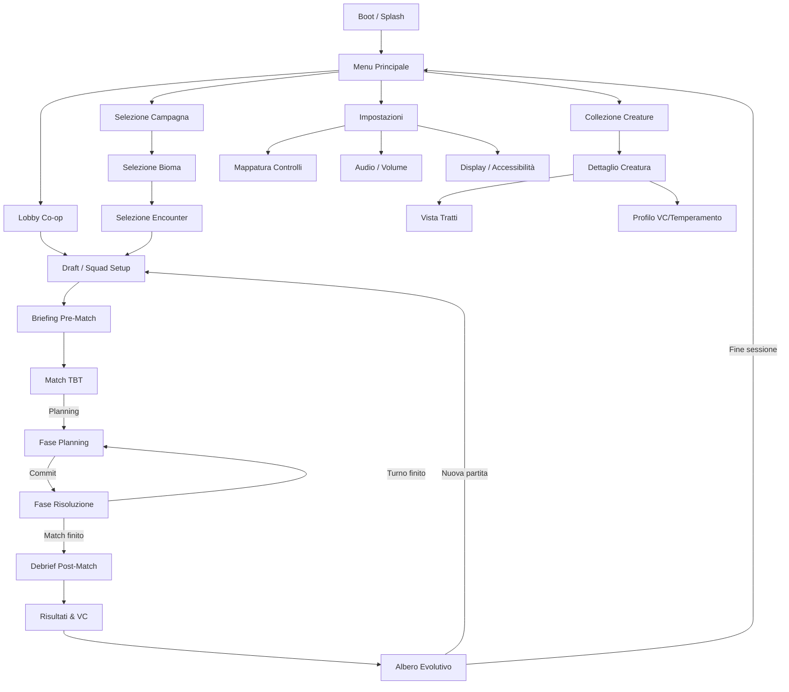

# Screen Flow

> Promosso da docs/planning/draft-screen-flow.md (2026-04-16). Diagramma mermaid incluso in SoT §17.

## Scopo

Mappare il flusso di navigazione tra schermate di Evo-Tactics. Ogni nodo = una schermata; ogni arco = un'azione utente o evento di sistema.

## Flowchart (Mermaid)

## Descrizione schermate

### Menu Principale

- Logo + statement visione.
- Opzioni: Campagna, Lobby Co-op, Collezione, Impostazioni.
- TV-first: navigazione con D-pad, font grande, contrasto alto.

### Lobby Co-op

- Lista giocatori connessi (locale o online).
- Host seleziona campagna/encounter, invita giocatori.
- Stato pronto/non pronto per ogni giocatore.

### Selezione Campagna → Bioma → Encounter

- Mappa mondo con biomi sbloccati.
- Per bioma: lista encounter disponibili con difficulty rating (1-5 stelle).
- Encounter locked/unlocked basato su progressione.

### Draft / Squad Setup

- Griglia creature disponibili (pool giocatore).
- Slot squadra (3-5 creature per giocatore, dipende da modalità).
- Vista rapida: stats, tratti attivi, sinergie con squadra.
- Budget morfologico visibile (fairness cap).

### Briefing Pre-Match

- Overlay su mappa: 2-3 frasi contestuali (vedi `draft-narrative-lore.md`).
- Mostra obiettivo, condizioni speciali, wave attese.
- Durata: 5-10 secondi, skippabile.

### Match TBT (schermata principale)

- Griglia isometrica/top-down con unità, terreno, coperture.
- HUD: HP bar, AP, PT, status icone, turno corrente, timer (opzionale).
- **Fase Planning**: giocatori dichiarano intents simultaneamente. UI mostra path preview, range attacco, zone AoE.
- **Fase Risoluzione**: animazioni in sequenza (priorità). Camera segue azione. Log testuale laterale.
- Minimap (opzionale su schermi grandi).

### Debrief Post-Match

- Riepilogo: turni, danni inflitti/subiti, creature perse, obiettivo raggiunto/fallito.
- Testo narrativo: conseguenza sull'arco del bioma.

### Risultati & VC

- Dashboard VC: 6 assi aggregati, shift rispetto a partita precedente.
- MBTI-like profile update: mostra come il playstyle ha influenzato il profilo.
- PE guadagnati, tratti sbloccabili.

### Albero Evolutivo

- Vedi `docs/core/30-UI_TV_IDENTITA.md`: nodi che pulsano, feed eventi, sinergie.
- Giocatore sceglie rami/mutazioni con PE accumulati.
- Warning se over-budget.

### Collezione Creature

- Catalogo tutte le creature scoperte/possedute.
- Filtri: specie, bioma, job, tier.
- Dettaglio: stats, tratti, storia evolutiva, VC storico.

### Impostazioni

- Controlli (remap tastiera/controller), Audio (volume master/SFX/musica), Display (risoluzione, colorblind mode, font size), Accessibilità.

## Transizioni chiave

| Da → A            | Trigger                           | Note                              |
| ----------------- | --------------------------------- | --------------------------------- |
| Menu → Lobby      | Click "Co-op"                     | Auto-matchmaking o invito diretto |
| Draft → Briefing  | "Pronti" da tutti i giocatori     | Transizione automatica            |
| Briefing → Match  | Timer 5s o skip                   |                                   |
| Match → Debrief   | Obiettivo raggiunto/fallito o TPK |                                   |
| Evolution → Draft | "Nuova partita"                   | Mantiene squad aggiornata         |
| Evolution → Menu  | "Fine sessione"                   | Salvataggio automatico            |

## Decisioni confermate (da doc esistenti)

- **Tutorial**: integrato nei primi encounter, <10 minuti. Preset Forme + direttive assistite. "Learn by doing", no schermata tutorial separata. (Fonte: `docs/core/DesignDoc-Overview.md`)
- **Replay**: infrastruttura completa — deterministic RNG seed, turn log serializzato, what-if preview senza mutare state. UI integration (debrief vs dedicata) da decidere. (Fonte: `docs/combat/determinism.md`)
- **Loading**: infrastruttura `setStatus()` esiste nel generator. UI (tip screen vs seamless) da decidere. (Fonte: `generator.js`)

## Gap aperti residui

- [ ] Matchmaking online: separata o integrata in lobby? (rilevante solo post-MVP, vedi ADR networking)
- [ ] Loading: preferire tip screen (utile per onboarding) o seamless (immersione)?
- [ ] Replay UI: bottone in debrief "Rivedi partita" o schermata dedicata nel menu?

## Riferimenti

- `docs/core/30-UI_TV_IDENTITA.md` — dettagli carte temperamentali e albero
- `docs/core/03-LOOP.md` — game loop alto livello
- `draft-narrative-lore.md` — briefing/debrief format
- `draft-target-audience.md` — TV-first, couch co-op come contesto primario
