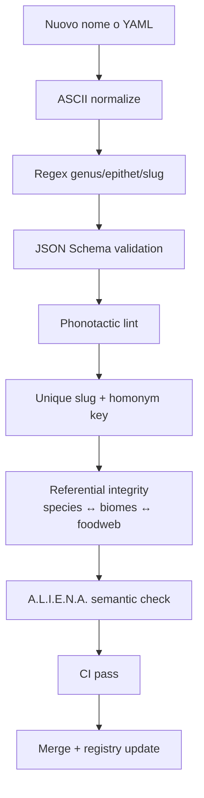

# Naming Validation Pipeline

Pipeline operativa per validare il naming di specie e biomi secondo [`docs/core/00E-NAMING_STYLEGUIDE.md`](../core/00E-NAMING_STYLEGUIDE.md).

## Pipeline completa



## 1. Regex consigliati

```javascript
// Genus: 4-18 char, capitalized, ASCII only
const GENUS_REGEX = /^[A-Z][a-z]{3,17}$/;

// Epithet: 3-30 char, lowercase, optional hyphen
const EPITHET_REGEX = /^[a-z][a-z-]{2,29}$/;

// Slug specie: kebab-case
const SPECIES_SLUG_REGEX = /^[a-z0-9]+(?:-[a-z0-9]+)*$/;

// ID specie: sp_ + snake_case
const SPECIES_ID_REGEX = /^sp_[a-z0-9]+(?:_[a-z0-9]+)*$/;

// Slug bioma: kebab-case
const BIOME_SLUG_REGEX = /^[a-z0-9]+(?:-[a-z0-9]+)*$/;

// Display name: 2-3 parole Title Case (it/en)
const DISPLAY_NAME_REGEX = /^[A-ZÀ-Ÿ][A-Za-zÀ-ÿ']+(?: [A-Za-zÀ-ÿ'][A-Za-zÀ-ÿ']*){0,2}$/;
```

## 2. JSON Schema species

Vedi `schemas/evo/species.schema.json` (vincolo `additionalProperties: true` per compat).

```json
{
  "$id": "https://evotactics.local/schema/species.schema.json",
  "type": "object",
  "required": ["id", "genus", "epithet", "clade_tag", "display_name_it", "display_name_en"],
  "additionalProperties": true,
  "properties": {
    "id": { "type": "string", "pattern": "^[a-z0-9]+(?:_[a-z0-9]+)*$" },
    "slug": { "type": "string", "pattern": "^[a-z0-9]+(?:-[a-z0-9]+)*$" },
    "legacy_slug": { "type": "string" },
    "genus": { "type": "string", "pattern": "^[A-Z][a-z]{3,17}$" },
    "epithet": { "type": "string", "pattern": "^[a-z][a-z-]{2,29}$" },
    "clade_tag": {
      "type": "string",
      "enum": ["Apex", "Keystone", "Bridge", "Threat", "Playable", "Support"]
    },
    "display_name_it": { "type": "string", "minLength": 2, "maxLength": 64 },
    "display_name_en": { "type": "string", "minLength": 2, "maxLength": 64 }
  }
}
```

## 3. JSON Schema biome

```json
{
  "$id": "https://evotactics.local/schema/biome.schema.json",
  "type": "object",
  "required": ["id", "biome_class", "display_name_it", "display_name_en"],
  "additionalProperties": true,
  "properties": {
    "id": { "type": "string", "pattern": "^[a-z0-9]+(?:_[a-z0-9]+)*$" },
    "slug": { "type": "string", "pattern": "^[a-z0-9]+(?:-[a-z0-9]+)*$" },
    "legacy_slug": { "type": "string" },
    "biome_class": {
      "type": "string",
      "enum": [
        "arid",
        "subterranean",
        "wetland",
        "upland",
        "canopy",
        "littoral",
        "geothermal",
        "salt",
        "deltaic",
        "clastic"
      ]
    },
    "display_name_it": { "type": "string", "minLength": 2, "maxLength": 64 },
    "display_name_en": { "type": "string", "minLength": 2, "maxLength": 64 }
  }
}
```

## 4. Phonotactic lint (warning, non hard fail)

Check probabilistico via Hayes-Wilson MaxEnt grammar (futuro). Per ora regole euristiche:

- Genus con >3 consonanti consecutive → warning
- Genus che inizia con vocale isolata + plosiva → warning
- Cluster non standard (es. `xv`, `qz`) → warning

## 5. Unique slug + homonym key

Algoritmo di normalizzazione collision detection:

```javascript
function normalizeForCollision(slug) {
  return slug
    .toLowerCase()
    .replace(/ae|oe/g, 'e')
    .replace(/[ijy]/g, 'i')
    .replace(/[uv]/g, 'u')
    .replace(/[ck]/g, 'k')
    .replace(/ph/g, 'f')
    .replace(/(.)\1+/g, '$1'); // dedupe consonanti
}

// Due specie collidono se: same genus + normalized epithet match
// Es: "Genus aequatus" vs "Genus equatus" → collision
```

## 6. Referential integrity

- Ogni `preferred_biomes` di specie deve esistere in `biomes.yaml` o `biomes_expansion.yaml` (slug o legacy_slug)
- Ogni `species_slug` in foodweb deve esistere in species catalog
- Ogni `biome_slug` in ecosystem deve esistere in biomes catalog

## 7. A.L.I.E.N.A. semantic check

Per ogni nuova specie/bioma il PR deve rispondere:

- **A**mbiente: il bioma referenziato esiste e ha caratteristiche compatibili?
- **L**inee evolutive: trait/morph_slots coerenti con il clade_tag?
- **I**mpianto morfo-fisiologico: i 5 morph_slots sono compilati?
- **E**cologia: ruolo trofico (role_tags) coerente con preferred_biomes?
- **N**orme socioculturali: sentience_index appropriato (T0-T6)?
- **A**ncoraggio narrativo: display_name e' descrittivo, non proper noun?

## 8. CI integration

Comando proposto (futuro):

```bash
node scripts/lint-naming.js --strict
```

Esegue:

1. Regex validation su tutti i file YAML in `data/core/` e `data/core/*_expansion.yaml`
2. JSON Schema check
3. Collision detection (homonym key)
4. Referential integrity check

## Esempi di nomi validi/invalidi

### Specie

| Genus               | Epithet      | OK? | Motivo                                    |
| ------------------- | ------------ | :-: | ----------------------------------------- |
| `Arenavolux`        | `sagittalis` | ✅  | Latinizing, suggerisce sand-walker        |
| `dune-stalker`      | —            | ❌  | Lowercase, hyphen, no epithet             |
| `Xqz`               | `a`          | ❌  | Cluster impossibile, epithet troppo corto |
| `Ferriscroba`       | `detrita`    | ✅  | Iron + scrub + scavenger meaning          |
| `VeryLongGenusName` | `epithet`    | ❌  | >18 caratteri                             |

### Biomi

| Slug                | OK? | Motivo                                                     |
| ------------------- | :-: | ---------------------------------------------------------- |
| `ferrous-badlands`  | ✅  | Material + landform, kebab-case                            |
| `Foresta_Temperata` | ❌  | Mixed case, snake (legacy ammesso solo come `legacy_slug`) |
| `bermuda-triangle`  | ❌  | Proper noun, non descrittivo                               |
| `cold-mirror-fen`   | ✅  | Clima + fenomeno + landform                                |

## Riferimenti

- [`00E-NAMING_STYLEGUIDE.md`](../core/00E-NAMING_STYLEGUIDE.md)
- ICZN: International Code of Zoological Nomenclature
- IAPT Madrid Code 2025
- Hayes & Wilson, "A Maximum Entropy Model of Phonotactics and Phonotactic Learning"
