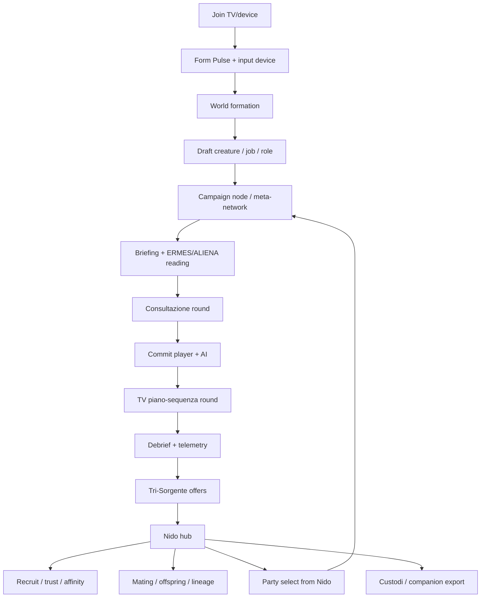

# Evo-Tactics complete game systems reconstruction

> Documento professionale di recupero e riconciliazione.
> Non sostituisce il Source of Truth: raccoglie i sistemi gia' progettati,
> verifica dove vivono oggi in documenti/dati/codice, e chiarisce come devono
> entrare nel flusso completo del gioco.

## 0. Uso corretto di questo documento

Questo file serve a rispondere a tre domande:

1. Quali sistemi del "gioco completo" erano gia' stati identificati?
2. Quali di questi sono live, partial, solo design, o ancora da authorare?
3. Come li rimettiamo in un unico flow coerente, senza perdere pezzi?

Il documento precedente:

```text
docs/planning/2026-06-05-evo-tactics-tv-device-campaign-flow-reconstruction.md
```

ricostruisce il flow TV/device/campagna. Questo file e' il layer superiore:
la mappa completa dei sistemi e del loro stato tecnico.

## 1. Regola di autorita'

Per non promuovere vecchi appunti come se fossero canon, uso la gerarchia gia'
definita in `docs/core/00C-WHERE_TO_USE_WHAT.md`:

```text
runtime/schema/validators
> final freeze/core
> architecture active
> planning/research
> archive/historical snapshots
```

Quindi ogni sistema sotto e' classificato cosi':

| Stato      | Significato                                                          |
| ---------- | -------------------------------------------------------------------- |
| LIVE       | esiste un runtime/code path o una surface player-facing verificabile |
| PARTIAL    | dati/engine/code esistono, ma surface o loop non e' completo         |
| DESIGN     | design attivo, non ancora runtime completo                           |
| RESEARCH   | ricerca utile, da trasformare in spec prima di implementare          |
| HISTORICAL | idea storica da estrarre, non da copiare intera                      |

## 2. Tesi finale recuperata

Evo-Tactics non e' solo un tactical combat. E' un gioco co-op device-driven /
TV-mirrored in cui:

- la TV e' tavolo, mirror, regia, recap e memoria del mondo;
- la TV non e' un player e non prende decisioni di gameplay;
- i device sono controller privati, superfici di voto, drafting, commit,
  conferma e identita';
- i player non controllano un personaggio singolo, ma un sotto-branco assegnato;
- l'MVP parte da una creatura per player, ma il branco cresce tramite recruit, Nido,
  mating, offspring, eredita', morte, ferite e mutazioni;
- la campagna e' una discesa/navigazione a nodi alla Descent, ma con routing
  ecologico e meta-network;
- il Sistema osserva, ricorda e reagisce;
- ERMES misura la pressione ecologica;
- ALIENA fa enforcement della coerenza autoriale/ecologica e del tono
  bio-plausibile;
- Tri-Sorgente traduce contesto, personalita', azioni recenti e scelte
  narrative/dottrinali in evoluzione e sedimentazione;
- Forme, Ennea, VC, Thought Cabinet e Conviction trasformano il comportamento in identita';
- Specie, parti del corpo, trait, job e ferite rendono ogni creatura leggibile e
  differente;
- il Nido e' il cuore meta: recruit, relazioni, breeding, risorse, successione,
  lineage e nascita della tribu';
- i Custodi sono entita' companion assegnabili alla campagna; Skiv e' una forma
  concreta e prototipale di quel pattern, esportabile/portabile in futuro.

## 3. Diagramma di insieme



## 4. Flow completo integrato

| Fase                  | Esperienza player                                                                                             | Sistemi coinvolti                                              | Stato tecnico                               |
| --------------------- | ------------------------------------------------------------------------------------------------------------- | -------------------------------------------------------------- | ------------------------------------------- |
| 1 Join                | TV mostra room code/QR; device entrano come controller e identita' player                                     | Jackbox flow, phone lobby, lobby TV                            | LIVE/PARTIAL in Godot                       |
| 2 Form Pulse          | device fanno micro-scelte; TV mostra aggregato                                                                | VC, MBTI, companion/world seed                                 | PARTIAL: surface ridotta, design piu' ricco |
| 3 World formation     | la TV mostra la nascita dell'ecosistema unico generato dalle scelte device                                    | ERMES, ALIENA, biomi, foodweb, Custode                         | PARTIAL/LIVE                                |
| 4 Draft iniziale      | player scelgono creatura/ruolo con timer e sostituzione                                                       | creature draft, role gap, job, starter roster                  | PARTIAL                                     |
| 5 Campagna            | nodi alla Descent, route, voting e conseguenze                                                                | meta-network, campaign driver, SistemaState                    | LIVE in sim, PARTIAL in product             |
| 6 Briefing            | forecast ecologico e narrativo                                                                                | ERMES exporter, ALIENA summary, Custode voice                  | PARTIAL                                     |
| 7 Round consultazione | i device pianificano, provano, vedono preview non committed                                                   | WEGO, round model, private planning                            | DESIGN/PARTIAL                              |
| 8 Commit              | player e AI bloccano scelte dai device / policy Sistema                                                       | commit window, server authority, Sistema AI                    | PARTIAL                                     |
| 9 Piano-sequenza TV   | il round corrente si risolve come piano-sequenza, poi il combat torna al planning successivo se non e' finito | round bridge, combat resolver, cinematic surface               | PARTIAL                                     |
| 10 Debrief            | il gioco spiega effetti, combo, ferite, identita'                                                             | Atlas/VC, Ennea, wounds, mutation triggers                     | LIVE/PARTIAL                                |
| 11 Tri-Sorgente       | reward, scelte narrative/dottrinali, scambio carte e sedimentazione                                           | rewardOffer, personality/action scoring, future doctrine layer | LIVE web-v1, bridge legacy + DESIGN         |
| 12 Nido               | hub tra missioni                                                                                              | Nido, recruit, trust, mating, economy                          | LIVE in backend/sim, PARTIAL Godot          |
| 13 Continuazione      | il branco fonda comunita'/tribu', crea lineage, affronta nuove route                                          | lineage, offspring, meta-network, Custodi                      | PARTIAL/DESIGN                              |

## 5. Sistemi recuperati e stato

### 5.1 TV/device loop

**Promessa player**

Evo-Tactics deve sembrare un gioco da salotto co-op: TV comune come tavolo,
device privati come unica superficie di input, join immediato, scelte personali
e risultato condiviso.

**Componenti**

- Join via room code/QR/deep link.
- Device come controller, non solo companion passive.
- Device come superficie privata per scelte di draft, consultazione, commit,
  voti Nido, mating, recruit, relazione e identita'.
- TV come mirror/regia: world reveal, missione, round, debrief, Nido. La TV
  mostra e teatralizza l'intersezione pubblica delle scelte device; non decide.

**Dove vive**

| Tipo              | Path                                                                             |
| ----------------- | -------------------------------------------------------------------------------- |
| Flow ricostruito  | `docs/planning/2026-06-05-evo-tactics-tv-device-campaign-flow-reconstruction.md` |
| ADR Jackbox       | `docs/adr/ADR-2026-04-20-m11-jackbox-phase-a.md`                                 |
| Godot phone lobby | `C:/dev/Game-Godot-v2/scripts/phone/phone_lobby_join_view.gd`                    |
| Godot TV lobby    | `C:/dev/Game-Godot-v2/scripts/ui/lobby_view.gd`                                  |

**Stato**

PARTIAL. Il join e' presente come architettura e surface Godot, ma il flow
completo "device come sotto-branco/companion/commit surface" va ancora chiuso in
una spec unica.

**Controllo cross-repo 2026-06-06**

Godot v2 contiene gia' molte surface TV/phone, ma non tutte rispettano ancora la
decisione device-driven:

| Area        | Stato attuale verificato                                              | Riconciliazione richiesta                                               |
| ----------- | --------------------------------------------------------------------- | ----------------------------------------------------------------------- |
| Nido phone  | `phone_nido_view.gd` e' read-only e commenta che il phone e' observer | trasformare in surface di azione device per recruit/mating/party select |
| Nido TV     | `nido_hub_view.gd` e' mirror/hub TV                                   | mantenerlo mirror/recap, non autorita' input                            |
| World setup | `world_setup_host_view.gd` ha conferme host/offline                   | distinguere dev/offline fallback da prodotto co-op device-driven        |
| Mating TV   | `tv_mating_panel.gd` e' mirror read-only del voto phone               | questo e' coerente col target                                           |

Quindi la regola non e' "tutto quello che oggi e' host-driven e' canon": alcune
surface Godot sono bridge temporanei o fallback offline. Il target canonico resta:
TV mirror, device input.

### 5.2 Round model e resa TV

**Promessa player**

Il round non deve sembrare una sequenza di click risolti a caso. I player prima
consultano e provano, poi tutti committano; la TV mostra il risultato come un
piano-sequenza leggibile, con azioni, reazioni, combo, ferite, status e conseguenze.

**Modello corretto**

```text
consultazione privata/squadra
-> commit simultaneo player + Sistema
-> ordinamento deterministico
-> risoluzione completa
-> replay TV compatto
-> nuovo planning se il combat non e' concluso
-> debrief tecnico/narrativo solo a fine combat
```

**Sfumatura recuperata: Round del Branco**

Il punto non e' solo "avere un round simultaneo". Quello esiste gia' nella
famiglia WEGO: Combat Mission, Frozen Synapse, Laser Squad Nemesis, Frozen
Cortex, Phantom Brigade. La parte specifica di Evo-Tactics e' la fusione tra:

- WEGO tattico: tutti pianificano, poi il sistema risolve;
- preview/telegraph leggibile: il player deve intuire effetti, rischi e
  reazioni prima del commit;
- living-room / TV-mirrored: la verita' canonica vive nello state/event-log, mentre
  la TV la rende visibile come tavolo comune;
- device privato stile Jackbox/RoJ: informazioni, prove, commit e ruoli restano
  personali o semi-segreti;
- branco: ogni scelta non e' solo input tattico, ma modifica relazione,
  identita', ferita, memoria e traiettoria evolutiva.

Quindi il round ha due tempi distinti:

```text
tempo della decisione
-> preview non canonica, consultazione, bluff, coordinamento, tentativi

tempo della verita' del sistema
-> commit congelato, risoluzione deterministica, piano-sequenza TV, ritorno al planning o debrief
```

Durante la consultazione il gioco puo' mostrare effetti attesi, linee di tiro,
zone di rischio, possibili reazioni e probabilita' narrative, ma non deve
consumare AP, modificare HP, applicare status, rollare d20 o scrivere log
canonico. Questa garanzia e' gia' scritta in `docs/combat/round-loop.md`.

Il piano-sequenza TV non deve essere una lista di eventi. Deve essere la
traduzione audiovisiva della scelta collettiva: mosse simultanee, collisioni,
interruzioni, reazioni, bravado, morale, ferite localizzate, status decay,
combo, conseguenze ambientali e segnali VC/Form Pulse letti come un unico
momento di branco.

Nota: il combat non e' un singolo round. Planning, commit e piano-sequenza TV
si ripetono finche' non si esauriscono condizioni di vittoria, sconfitta,
ritirata, timeout o obiettivo.

**Nodi tecnici da riconciliare**

- Intent per creatura: working decision = micro-sequenza per creatura entro
  budget AP, committata dal device. `latest-wins` resta comportamento
  compatibile per MVP/prototipo o per sostituire il piano prima del lock.
- Fairness AI: non va intesa come simmetria perfetta. Il design AI War dice che
  il Sistema puo' essere asimmetrico; la fairness e' leggibilita' delle regole,
  non parita' di risorse.
- Commitment del Sistema: il guard `commit_window` anti-flip rende l'AI piu'
  leggibile, forzando continuita' quando l'AI tenderebbe a invertire direzione
  troppo rapidamente.

**Sistemi coinvolti**

- WEGO/shared planning.
- d20 resolver.
- AP/PP/PT/SG economy.
- reactions, interrupt, bravado, morale.
- status decay.
- woundSystem.
- cumulativeStateTracker.
- VC snapshot.

**Dove vive**

| Tipo               | Path                                                     |
| ------------------ | -------------------------------------------------------- |
| Freeze combat      | `docs/core/90-FINAL-DESIGN-FREEZE.md`                    |
| Round bridge       | `apps/backend/routes/sessionRoundBridge.js`              |
| Session engine     | `apps/backend/routes/session.js`                         |
| Combat services    | `apps/backend/services/combat/`                          |
| Godot local combat | `C:/dev/Game-Godot-v2/scripts/session/combat_session.gd` |

**Stato**

PARTIAL. Il backend ha molta logica reale; Godot ha un engine locale deliberatamente
diverso per slice/tutorial. La resa "piano-sequenza" e' ancora principalmente
design/surface da completare.

### 5.3 Campagna alla Descent e meta-network

**Promessa player**

Il gioco non finisce dopo una missione. La campagna avanza per nodi, scelte,
route e conseguenze. I player costruiscono un branco che attraversa storia,
biomi, nodi, fallimenti, reclutamenti e ritorni al Nido.

**Cosa e' stato recuperato**

- Campaign loop canonico:

```text
brief/setup
-> build setup
-> tactical mission
-> telemetry/debrief
-> rewards/unlock
-> recruit/nido/mating
-> next build iteration
```

- Meta-network ora ha routing live in test-context e route graph.
- Le ultime PR Game hanno portato il full-loop AI runner a:

```text
campaign -> real combat -> Nido recruit -> economy + breeding -> routing -> band metrics
```

**Dove vive**

| Tipo                   | Path                                                  |
| ---------------------- | ----------------------------------------------------- |
| Full-loop handoff      | `docs/planning/2026-06-02-full-loop-fase2-handoff.md` |
| Band report ratificato | `docs/playtest/2026-06-02-full-loop-band-report.md`   |
| Sim runner             | `tools/sim/full-loop-batch.js`                        |
| Campaign driver        | `tools/sim/campaign-driver.js`                        |
| Meta-network driver    | `tools/sim/meta-network-driver.js`                    |
| Campaign backend       | `apps/backend/services/campaign/`                     |

**Stato**

LIVE in simulation/AI-playtest; PARTIAL nel prodotto Godot. Questa e' una delle
prove piu' importanti: il loop completo e' misurabile, non solo narrato.

**Gap**

- Portare la route alla surface TV/device.
- Decidere quando `META_NETWORK_ROUTING` diventa production.
- Collegare offspring -> combat in modo player-facing completo.

### 5.4 ERMES

**Promessa player**

ERMES non deve comparire come nome tecnico al player. Deve apparire come lettura
diegetica della pressione ecosistemica: instabilita', predatori, scarsita',
role gap, bioma che spinge o resiste.

**Definizione recuperata**

ERMES = Ecosystem Research, Measurement & Evolution System.

Regola guida aggiornata:

```text
ERMES misura la pressione ecologica.
Il gioco la traduce in bande, telegraph e modificatori bounded.
Il player non vede ERMES come tool, vede il bioma che reagisce.
```

**Funzioni**

- Eco pressure per bioma.
- Bias encounter/mutation/debrief.
- Role gap del party rispetto alle richieste del bioma.
- Bucket low/med/high per effetti di combat o surface.
- Cap runtime per evitare numeri opachi o snowball; target Fase 3 = delta
  combinato +/-2 per stat di origine bioma/ERMES.
- Export JSON da lab/prototype.

**Dove vive**

| Tipo              | Path                                                        |
| ----------------- | ----------------------------------------------------------- |
| Piano originario  | `docs/planning/2026-04-29-ermes-integration-plan.md`        |
| Lab               | `prototypes/ermes_lab/`                                     |
| Backend exporter  | `apps/backend/services/coop/ermesExporter.js`               |
| Trait costs       | `apps/backend/services/ai/applyErmesBiomeTraitCosts.js`     |
| Eco effects       | `apps/backend/services/combat/applyBiomeEcoEffects.js`      |
| Godot role gap    | `C:/dev/Game-Godot-v2/scripts/session/ermes_role_gap.gd`    |
| Godot world setup | `C:/dev/Game-Godot-v2/scripts/session/world_setup_state.gd` |
| Godot reveal      | `C:/dev/Game-Godot-v2/scripts/ui/world_seed_reveal_view.gd` |

**Stato**

LIVE/PARTIAL. Non e' piu' solo prototipo: exporter, static fallback, bucket,
role gap e surface diegetiche esistono. Direzione working: ERMES deve arrivare
a runtime production in modo pilotato, con bande discrete, cap, telegraph
diegetico e playtest prima di generalizzare.

### 5.5 ALIENA

**Promessa player**

ALIENA protegge la coerenza: una creatura, un bioma o un evento non devono
entrare perche' "servono al bilanciamento" se rompono ecologia, plausibilita'
o ancoraggio narrativo.

**Schema recuperato**

A.L.I.E.N.A. e' anche il modello del Codex:

| Lettera | Dimensione                 |
| ------- | -------------------------- |
| A       | Ambiente                   |
| L       | Linee evolutive            |
| I       | Impianto morfo-fisiologico |
| E       | Ecologia                   |
| N       | Norme socio                |
| A       | Ancoraggio narrativo       |

**Runtime attuale**

Il design 2026-05-29 diceva diagnostic first, enforcement soft later. La review
2026-06-05 promuove ALIENA a enforcement di coerenza: deve custodire il patto
del lore (`fantastico bio-plausibile`, non magia), l'ancoraggio ecologico e il
tono suggerito/emergente. Il codice mostra che l'enforcement soft e' gia' stato
portato piu' avanti:

- `scoreAlienaCoherence(entry, biomeConfig, opts)`
- sub-score plausibilita', coerenza eco, ancoraggio narrativo;
- hook in `biomeSpawnBias`;
- endpoint `GET /api/session/:id/aliena-telemetry`;
- enforcement via weight modulation:

```text
factor = 1 - strength * (1 - aggregate)
```

con default off.

**Dove vive**

| Tipo               | Path                                                                          |
| ------------------ | ----------------------------------------------------------------------------- |
| Diagnostic plan    | `docs/superpowers/plans/2026-05-28-aliena-coherence-diagnostic-plan.md`       |
| Enforcement design | `docs/superpowers/specs/2026-05-29-aliena-enforcement-design.md`              |
| Scorer             | `apps/backend/services/authorial/alienaCoherence.js`                          |
| Biome hook         | `apps/backend/services/combat/biomeSpawnBias.js`                              |
| Spawner hook       | `apps/backend/services/combat/reinforcementSpawner.js`                        |
| Telemetry route    | `apps/backend/routes/session.js`                                              |
| Tests              | `tests/api/alienaCoherence.test.js`, `tests/services/combat/*Aliena*.test.js` |

**Stato**

LIVE backend, PARTIAL surface. Il player non deve vedere "ALIENA" come tool;
deve vedere risultati coerenti, creature plausibili, eventi nel tono del mondo e
Codex leggibile. Working direction: enforcement ON per campagne/authoring
curati, con surface player-facing diegetica e senza label tecnica.

### 5.6 Ecosistemi, biomi e foodweb

**Promessa player**

Il bioma non e' sfondo. Determina spawn, pressioni, risorse, mutazioni,
route, rischi e lettura del mondo.

**Dati recuperati**

Secondo Design-Data Atlas:

- 20 biomi top-level.
- 5 ecosystem YAML trofici.
- 5 foodweb YAML.
- Meta-network originariamente 5 nodi/11 archi, poi espanso con Atollo Obsidiana
  e routing graph.
- 1211 creature Pathfinder importate ma non integrate nei foodweb.

**Runtime**

- foodwebFilter.
- ecosystemResolver.
- crossEventEngine.
- biomeResonance.
- biomeSpawnBias.
- reinforcementSpawner.
- meta-network routing traversal harness.

**Dove vive**

| Tipo              | Path                                                               |
| ----------------- | ------------------------------------------------------------------ |
| Atlas             | `docs/guide/DESIGN-DATA-ATLAS.md`                                  |
| Biomi             | `data/core/biomes.yaml`                                            |
| Ecosystems        | `packs/evo_tactics_pack/data/ecosystems/`                          |
| Foodwebs          | `packs/evo_tactics_pack/data/foodwebs/`                            |
| Meta-network      | `packs/evo_tactics_pack/ecosystems/network/`                       |
| Worldgen services | `apps/backend/services/worldgen/`, `apps/backend/services/combat/` |

**Stato**

PARTIAL/LIVE. La struttura runtime esiste, ma molti biomi restano data-thin.

**Gap**

- Estendere ecosystem.yaml ai biomi mancanti.
- Integrare creature Pathfinder nei foodweb canonici.
- Portare route/eco change nella surface campagna.

### 5.7 Specie

**Promessa player**

Ogni creatura deve avere identita' di specie leggibile, ruolo ecologico,
corpo, sentience, traiettoria di crescita e possibilita' di diventare membro
del branco.

**Dati recuperati**

- 75 specie nel catalogo canonico v0.4.3.
- Provenienza catalogo: 10 `pack-v2-full-plus`, 5 `game-canonical-stub`,
  38 `legacy-yaml-merge`, 22 `gameplay-promote`.
- Distribuzione sentience attuale: T0=1, T1=42, T2=16, T3=8, T4=5, T5=3,
  T6=0.
- `biome_affinity` e' compilato sul catalogo corrente.
- `default_parts` manca ancora su 55/75 entries.
- `lifecycle_yaml` manca ancora su 44/75 entries.
- Clade: Threat, Keystone, Bridge, Apex, Playable, Support.

**Dove vive**

| Tipo               | Path                                            |
| ------------------ | ----------------------------------------------- |
| Species catalog    | `data/core/species/species_catalog.json`        |
| Lifecycle YAML     | `data/core/species/*_lifecycle.yaml`            |
| Lifecycle Skiv     | `data/core/species/dune_stalker_lifecycle.yaml` |
| Sentience guide    | `docs/guide/README_SENTIENCE.md`                |
| Species/parts core | `docs/core/20-SPECIE_E_PARTI.md`                |

**Stato**

LIVE data, PARTIAL lifecycle/parts completeness. `data/core/species.yaml` non e'
piu' fonte viva: la migrazione al catalogo unico ha spostato il SoT runtime su
`data/core/species/species_catalog.json`.

### 5.8 Parti del corpo, Morph e ferite

**Promessa player**

Le creature non sono schede astratte. Hanno parti del corpo, slot, mutazioni
visibili e ferite localizzate. Il player deve capire dove ha colpito, cosa si
e' rotto e come questo cambia tattica e storia.

**Parti e morph**

Il core doc definisce slot di ruolo:

```text
locomotion / offense / defense / senses / metabolism
```

L'ADR Spore part-pack definisce anche slot anatomici runtime per mutazioni:

```text
mouth / appendage / sense / tegument / back
```

Questi due layer non sono identici:

- i primi sono ruoli funzionali della specie;
- i secondi sono slot di mutazione/parte attiva.

**Ferite a locazione**

Il sistema ferite recuperato e' oggi concreto:

| Locazione       | Effetto                 |
| --------------- | ----------------------- |
| testa           | accuracy; grave = -1 AP |
| torso           | defense_mod             |
| arti_anteriori  | attack_mod              |
| arti_posteriori | mobility                |

Severita':

```text
lieve / media / grave
```

Solo le ferite `grave` persistono cross-encounter come cicatrici.

**Dove vive**

| Tipo               | Path                                                       |
| ------------------ | ---------------------------------------------------------- |
| Core parts         | `docs/core/20-SPECIE_E_PARTI.md`                           |
| Spore ADR          | `docs/adr/ADR-2026-04-26-spore-part-pack-slots.md`         |
| Engine feature doc | `docs/core/00D-ENGINES_AS_GAME_FEATURES.md`                |
| Wound engine       | `apps/backend/services/combat/woundSystem.js`              |
| Wound tests        | `tests/services/woundSystem.test.js`                       |
| Godot lethality    | `C:/dev/Game-Godot-v2/scripts/session/lethality_engine.gd` |
| Godot attrition    | `C:/dev/Game-Godot-v2/scripts/session/attrition_engine.gd` |
| Godot wound state  | `C:/dev/Game-Godot-v2/scripts/combat/wound_state.gd`       |

**Stato**

LIVE engine, PARTIAL cutover/surface. `woundSystem.js` dice esplicitamente che
depreca il vecchio woundedPerma HP-penalty, ma il cutover totale e' follow-up.

### 5.9 Trait

**Promessa player**

I trait sono il linguaggio biologico della creatura: non solo flavor, ma
trigger, effetti, abilita', mutation paths, biome costs e identita' ereditabile.

**Stato aggiornato**

Il vecchio numero "104 senza meccanica" e' superato da un audit piu' preciso:

| Artefatto              | Conteggio | Significato              |
| ---------------------- | --------: | ------------------------ |
| `glossary.json`        |       604 | flavor/label/descrizione |
| `active_effects.yaml`  |       502 | meccanica runtime        |
| meccanica e glossary   |       498 | allineati                |
| meccanica senza flavor |         4 | orphan-mechanic          |
| flavor senza meccanica |       106 | backlog design           |

Il namespace legacy `TR-####` e' stato risolto/remappato, con guard CI.

**Dove vive**

| Tipo             | Path                                                |
| ---------------- | --------------------------------------------------- |
| Reconcile audit  | `docs/planning/2026-05-31-trait-reconcile-audit.md` |
| Glossary         | `data/core/traits/glossary.json`                    |
| Active effects   | `data/core/traits/active_effects.yaml`              |
| Trait effects    | `apps/backend/services/traitEffects.js`             |
| Full metadata    | `data/traits/index.json`                            |
| Mutation catalog | `data/core/mutations/mutation_catalog.yaml`         |

**Stato**

LIVE/PARTIAL. I trait sono uno dei sistemi piu' ricchi ma con debito di
riconciliazione e surface.

### 5.10 Job

**Promessa player**

Il job definisce il ruolo tattico e sociale della creatura nel sotto-branco:
non solo classe, ma modo di contribuire al branco, alla campagna e alla futura
tribu'.

**Roster recuperato**

Base + expansion:

```text
skirmisher, vanguard, warden, artificer, invoker, ranger, harvester,
stalker, symbiont, beastmaster, aberrant
```

Il planning expansion identifica:

- Stalker = glass cannon stealth/alpha.
- Symbiont = linked-pair support.
- Beastmaster = pet/minion controller.
- Aberrant = chaos/mutation burst.

**Dove vive**

| Tipo               | Path                                                     |
| ------------------ | -------------------------------------------------------- |
| Expansion design   | `docs/planning/2026-04-25-jobs-expansion-design.md`      |
| Base jobs          | `data/core/jobs.yaml`                                    |
| Expansion jobs     | `data/core/jobs_expansion.yaml`                          |
| Perks              | `data/core/progression/perks.yaml`                       |
| Progression engine | `apps/backend/services/progression/progressionEngine.js` |
| Ability executor   | `apps/backend/services/combat/abilityExecutor.js`        |

**Stato**

LIVE/PARTIAL. Base jobs e molte ability sono runtime; expansion ha dati e parte
del wiring, ma Atlas segnala ancora passive tag/handler e UI expansion come gap.

**Gap**

- Mappare `species -> job affinity`.
- Chiudere i passive handler expansion.
- Collegare job alla nascita di tribu'/affiliazione.

### 5.11 Forme, MBTI, Ennea e input continuo

**Promessa player**

Il gioco non chiede "che personalita' sei". Osserva come giochi e fa emergere
Forma, inclinazioni, voci interiori, thought, conviction e stile di branco.

**Chiarimento Forme**

Esistono due dimensioni da non confondere:

| Dimensione       | Termine corretto | Esempio                           |
| ---------------- | ---------------- | --------------------------------- |
| chi sei          | Forma MBTI       | Forma Analista, Stratega, Custode |
| a che stadio sei | Stadio lifecycle | Stadio III - Maturo               |

Quindi:

```text
Forma = 16 MBTI forms
Stadio = lifecycle/anatomia I-V
Sentience = capacita' cognitiva per-specie T0-T6
```

**MBTI/Ennea**

Atlas ricostruisce il sistema come spina dorsale:

```text
VC axes -> MBTI form -> job affinity / pack / biome / innata trait
MBTI + Ennea -> mutation alignment / mating compatibility / narrative voice
```

**Input continuo**

Il punto mancante richiesto da Eduardo e' corretto: il Form Pulse iniziale non
basta. Serve formalizzare:

```text
device input event
-> scoring signal
-> MBTI/Ennea/VC/Conviction delta
-> campaign/nido/combat/narrative effect
```

Esempi input:

- scelta rapida/lenta;
- consultazione/undo;
- voto route;
- scelta Tri-Sorgente;
- scelta di mating/recruit;
- target in combat;
- rischio preso o evitato;
- supporto o isolamento del sotto-branco.

**Dove vive**

| Tipo               | Path                                                      |
| ------------------ | --------------------------------------------------------- |
| Forme core         | `docs/core/22-FORME_BASE_16.md`                           |
| Naming audit       | `docs/reports/2026-04-26-forme-naming-integration.md`     |
| MBTI forms         | `data/core/forms/mbti_forms.yaml`                         |
| VC scoring backend | `apps/backend/services/vcScoring.js`                      |
| VC scoring Godot   | `C:/dev/Game-Godot-v2/scripts/scoring/vc_scoring.gd`      |
| MBTI Godot         | `C:/dev/Game-Godot-v2/scripts/scoring/vc_scoring_mbti.gd` |
| Ennea data         | `packs/evo_tactics_pack/tools/py/ennea/`                  |

**Stato**

LIVE/PARTIAL. Backend e dati sono forti; device-led continuous ledger e surface
unificata restano da authorare.

### 5.12 Tri-Sorgente

**Promessa player**

Dopo un evento/missione, il gioco propone opzioni coerenti con mondo, personalita'
e azioni. Il player sente che la campagna lo ha osservato e che le decisioni si
sedimentano in identita', dottrina e memoria del branco.

**Formula recuperata**

```text
score(c) =
base(c)
+ roll/context compatibility
+ personality compatibility
+ recent action compatibility
+ synergy
- duplicate penalty
- exclusion penalty
```

**Interpretazione corretta**

Tri-Sorgente non e' solo "reward". E' l'interfaccia giocabile del motore di
proposta evolutiva:

- Roll/Contesto = mondo e bioma;
- Personalita' = Forma/Ennea/MBTI;
- Azioni recenti = comportamento osservato;
- Skip = conversione/risorsa quando non vuoi fissare una scelta.

Review 2026-06-05: la Tri-Sorgente va estesa oltre le carte reward. Deve
includere:

- scelte narrative/dottrinali;
- sedimentazione delle decisioni del branco;
- carte/visioni/prestiti da altri player come meccanica di informazione e
  fiducia;
- effetti sul Nido, sui gruppi sociali e sulla relazione con il Sistema.

La meccanica "carte di un altro" appartiene qui: non e' solo possessione o
hazard, ma una forma di scambio prospettico/dottrinale che puo' diventare
temporaneamente controllo, suggerimento, memoria condivisa o vincolo narrativo a
seconda del contesto.

**Dove vive**

| Tipo                 | Path                                                                |
| -------------------- | ------------------------------------------------------------------- |
| Architecture         | `docs/architecture/tri-sorgente/overview.md`                        |
| Node bridge design   | `docs/architecture/tri-sorgente-node-bridge.md`                     |
| Node-native reward   | `apps/backend/services/rewards/rewardOffer.js`                      |
| Python legacy worker | `engine/tri_sorgente_worker.py`                                     |
| Config               | `engine/tri_sorgente/`                                              |
| Debrief UI web       | `apps/play/src/debriefPanel.js`                                     |
| Tests                | `tests/api/rewardOffer.test.js`, `tests/triSorgente/bridge.test.js` |

**Stato**

LIVE in web-v1/backend reward flow, PARTIAL in Godot/campaign surface. Il layer
esteso dottrina/scambio/sedimentazione e' DESIGN da specificare.

### 5.13 Mutazioni

**Promessa player**

Le creature cambiano per quello che fanno, non solo per XP. Una mutazione deve
avere trigger, slot/corpo, costo, effetto, aspetto e memoria.

**Sistemi recuperati**

- MP separato da PE/PI.
- body_slot e derived_ability.
- trigger_conditions machine-readable.
- mutation unlock runtime.
- auto-trigger evaluator 12/12 kinds complete secondo ADR.
- tier 1 auto-applied / tier 2-3 pending pattern da ratificare/surface.
- visual/aspect token ancora incompleto.

**Dove vive**

| Tipo              | Path                                                         |
| ----------------- | ------------------------------------------------------------ |
| Spore ADR         | `docs/adr/ADR-2026-04-26-spore-part-pack-slots.md`           |
| Auto-trigger ADR  | `docs/adr/ADR-2026-05-10-mutation-auto-trigger-evaluator.md` |
| Mutation catalog  | `data/core/mutations/mutation_catalog.yaml`                  |
| Mutation engine   | `apps/backend/services/mutationEngine.js`                    |
| Trigger evaluator | `apps/backend/services/combat/mutationTriggerEvaluator.js`   |
| Round wire        | `apps/backend/routes/sessionRoundBridge.js`                  |

**Stato**

LIVE/PARTIAL. L'engine e' reale; mancano ancora surface completa e visual change
ricco per tutte le mutation.

### 5.14 Nido, recruit, trust, mating e offspring

**Promessa player**

Il Nido e' il posto in cui il branco smette di essere "party" e diventa una
comunita'. Qui si reclutano ex-nemici, si costruisce fiducia, si generano
offspring, si ereditano ferite/mutazioni e si decide chi parte nella prossima
missione.

Review 2026-06-05: fuori combat ogni player possiede un gruppo sociale. Questo
gruppo contiene la creatura principale iniziale, eventuali nuove creature
principali selezionabili, amici, compagni, reclute, creature legate da mating,
offspring e rami di breeding. La creatura principale puo' invecchiare, morire,
uscire dal roster o essere sostituita da una creatura libera del gruppo sociale.

**Regole canoniche**

```text
Affinity: -2..+2
Trust: 0..5
Recruit: Affinity >= 0 AND Trust >= 2
Mating: Trust >= 3 + nest requirements
```

**Funzioni**

- Reclutamento ex-nemici.
- Trust trial.
- Mating eligibility.
- Offspring ritual.
- Lineage chain.
- Nido resources.
- Party select from Nido.
- Successione/fallback su morte per NPC/boss o casi speciali.
- Gruppi sociali per-player e selezione della creatura principale.

**Dove vive**

| Tipo                     | Path                                                                                               |
| ------------------------ | -------------------------------------------------------------------------------------------------- |
| Core index               | `docs/core/27-MATING_NIDO.md`                                                                      |
| Canvas D                 | `docs/core/Mating-Reclutamento-Nido.md`                                                            |
| Loop map                 | `C:/dev/Game-Godot-v2/docs/godot-v2/2026-05-25-loop-systems-integration-map.md`                    |
| Backend meta progression | `apps/backend/services/metaProgression.js`                                                         |
| Offspring route          | `apps/backend/routes/lineage.js`                                                                   |
| Godot Nido specs         | `C:/dev/Game-Godot-v2/docs/superpowers/specs/2026-05-30-nido-hub-n1-design.md`                     |
| Offspring Godot plan     | `C:/dev/Game-Godot-v2/docs/superpowers/plans/2026-05-30-n3-offspring-ritual-nido.md`               |
| Facade live consumer     | `C:/dev/Game-Godot-v2/docs/superpowers/specs/2026-06-04-facade-phone-offspring-consumer-design.md` |

**Stato**

LIVE backend/sim; PARTIAL Godot surface. Gli ultimi PR Godot hanno portato
MatingGeneticsFacade e phone offspring ritual, ma il Nido come hub completo
resta da consolidare.

### 5.15 Tribu', clan e comunita'

**Promessa player**

Il branco iniziale, passando attraverso storia, nodi, scelte, recruit, mating e
combat, puo' diventare una comunita'/tribu'. Non e' un menu astratto: emerge
dal lignaggio e dalla memoria.

**Chiarimento recuperato**

Il loop map 2026-05-25 dice una cosa molto importante:

```text
Clan/Tribe non era nel freeze canonico.
Era il concept incompiuto della prima vertical slice.
```

La forma corretta, emersa poi, e':

```text
tribe = lineage emergent
```

Cioe':

- la scelta di job all'origine puo' generare affiliazione/ruolo culturale;
- il gruppo iniziale forma comunita' attraverso le missioni;
- offspring e lineage_id creano famiglie/rami;
- il Nido diventa memoria sociale;
- la tribu' e' il risultato, non un layer indipendente da incollare sopra.

**Dove vive**

| Tipo                      | Path                                                                            |
| ------------------------- | ------------------------------------------------------------------------------- |
| Loop map                  | `C:/dev/Game-Godot-v2/docs/godot-v2/2026-05-25-loop-systems-integration-map.md` |
| Vertical-slice status     | `docs/reports/2026-04-27-stato-arte-completo-vertical-slice.md`                 |
| Lineage/offspring reports | `docs/reports/2026-05-10-session-review-completionist-optimizer.md`             |

**Stato**

DESIGN/PARTIAL. La base tecnica del lineage esiste; il layer culturale/narrativo
"tribu'" va authorato come spec.

### 5.16 Custodi, Skiv e companion esportabili

**Promessa player**

Un Custode non e' solo narratore. E' un'entita' che puo' custodire memoria,
voce, diario, lineage, Forma e storia della campagna. Puo' esistere anche fuori
dal gioco come companion/card/saga esportabile.

**Correzione importante**

```text
Custode = pattern generico di companion/campagna.
Skiv = una forma concreta e prototipale di quel pattern.
```

Skiv non esaurisce i Custodi. Dimostra una possibile forma: creatura concreta,
con specie, diario, MBTI, mutazioni, lineage, voce, export e possibilita' futura
di crossbreeding async.

**Modello recuperato**

Non Tamagotchi puro.

Pattern target:

- Pokemon HOME: identita' persistente cross-campagna/device.
- Sporepedia: creature recipe/share.
- CK3 DNA: lignaggio trasmissibile.
- Wildermyth legacy: cicatrici/storia che seguono il personaggio.
- Pikmin/Animal Crossing solo come ispirazioni di continuita', non care loop.

Quindi il companion fuori campagna:

- non cresce liberamente fuori dal gioco senza eventi verificati;
- non muore se non lo nutri;
- mostra storia, diary, lineage, Forma, mutazioni;
- puo' essere esportato in JSON/card/QR;
- puo' diventare ambassador async;
- puo' incontrare altri Custodi/Nidi e poi risincronizzarsi con la campagna
  portando informazioni o memoria nuova, in un pattern vicino alle pedine di
  Dragon's Dogma.

**Dove vive**

| Tipo                  | Path                                                                               |
| --------------------- | ---------------------------------------------------------------------------------- |
| Research companion    | `docs/reports/2026-04-27-stat-hybrid-tamagotchi-companion-research.md`             |
| Summary crossbreeding | `docs/reports/2026-04-27-skiv-portable-companion-research-summary.md`              |
| Skiv saga             | `data/derived/skiv_saga.json`                                                      |
| Skiv canonical        | `docs/skiv/CANONICAL.md`                                                           |
| Godot Custode voice   | `C:/dev/Game-Godot-v2/scripts/narrative/custode_voice_engine.gd`                   |
| Godot M1 mirror spec  | `C:/dev/Game-Godot-v2/docs/superpowers/specs/2026-05-21-m1-godot-mirror-design.md` |

**Stato**

DESIGN/PARTIAL. Skiv e' prototipo concreto. Export/share/crossbreeding richiedono
ADR/sign-off e implementazione dedicata.

### 5.17 Sistema persistent state

**Promessa player**

Il Sistema non resetta la memoria ogni missione. Ricorda unita' pericolose,
minacce, pattern e pressione della campagna.

**Stato recuperato**

ADR-2026-05-18 ha ratificato Option B:

```text
units_observed + threat persistente
```

Non l'intero Option A con tactics/factions/strategic_phase.

**Dove vive**

| Tipo               | Path                                                           |
| ------------------ | -------------------------------------------------------------- |
| ADR                | `docs/adr/ADR-2026-05-18-sistema-persistent-state-learning.md` |
| Store              | `apps/backend/services/ai/sistemaStateStore.js`                |
| Accumulator        | `apps/backend/services/ai/sistemaStateAccumulator.js`          |
| AI runner          | `apps/backend/services/ai/sistemaTurnRunner.js`                |
| Intent declaration | `apps/backend/services/ai/declareSistemaIntents.js`            |

**Stato**

LIVE subset, DESIGN for Option A expansion.

### 5.18 Abilita', economy e fairness

**Promessa player**

Le scelte devono essere tatticamente leggibili, non solo narrative. Ogni job,
trait, mutation, ferita e status deve entrare in un'economia coerente.

**Pool principali**

```text
AP: azioni nel round
PP: positional/physical pool in alcune regole
PT: physical/tactical cost pool
SG: stress gauge / overcharge
PI: purchase/perk investment
PE: progression experience
MP: mutation points
Seed: lineage/nido resource
```

**Stato recente**

Le PR H2 e full-loop hanno reso piu' misurabili:

- PP/PT/SG cost-gate.
- PI sink.
- economy_flow band.
- completion_rate.
- roster_attrition.
- relationship_progress.
- offspring_viability.
- roster_composition.
- lineage_diversity.

**Dove vive**

| Tipo               | Path                                                     |
| ------------------ | -------------------------------------------------------- |
| Economy canon      | `docs/core/26-ECONOMY_CANONICAL.md`                      |
| Ability executor   | `apps/backend/services/combat/abilityExecutor.js`        |
| Progression engine | `apps/backend/services/progression/progressionEngine.js` |
| Band aggregator    | `tools/sim/meta-band-aggregator.js`                      |
| Full-loop batch    | `tools/sim/full-loop-batch.js`                           |

**Stato**

LIVE/PARTIAL. Il sim e' forte; la surface completa deve essere chiara al player.

## 6. Cosa mancava nel documento precedente

Questi sistemi vanno aggiunti esplicitamente al flow e non lasciati come note:

| Sistema                | Perche' va inserito                                  | Stato          |
| ---------------------- | ---------------------------------------------------- | -------------- |
| Tri-Sorgente           | e' il ponte tra comportamento e offerte evolutive    | LIVE/PARTIAL   |
| ERMES                  | misura eco-pressure e role gap                       | LIVE/PARTIAL   |
| ALIENA                 | coerenza ecologica/autoriale + telemetry/enforcement | LIVE/PARTIAL   |
| Forme/Stadio/Sentience | chiarisce identita' vs crescita vs cognizione        | PARTIAL        |
| Parti del corpo        | base di morph, mutazioni, ferite, visual             | PARTIAL        |
| Ferite localizzate     | trasforma danno in storia e malus leggibile          | LIVE/PARTIAL   |
| Trait                  | codex biologico, ability, mutation, biome cost       | LIVE/PARTIAL   |
| Job                    | ruolo tattico/sociale e ponte verso tribu'           | LIVE/PARTIAL   |
| Tribe/Clan             | emergenza da lineage/Nido, non layer separato        | DESIGN         |
| SistemaState           | memoria del Sistema cross-session                    | LIVE subset    |
| Custodi esportabili    | companion/campagna fuori dal gioco                   | DESIGN/PARTIAL |
| Full-loop AI runner    | prova che il meta-loop e' misurabile                 | LIVE sim       |

## 7. Sfumature di esperienza da non appiattire

Questa sessione non ha ricostruito solo sistemi. Ha ricostruito anche una serie
di momenti/rituali che danno forma all'esperienza. Se questi diventano semplici
schermate tecniche, Evo-Tactics perde una parte importante della sua identita'.

### 7.1 Rituali, non menu

La vertical slice v3.2 descrive una grammatica di momenti TV/device che va
preservata:

- voto Trait Branco a 3 carte: primo momento in cui i player dicono "siamo un
  branco", con majority vote e tiebreak host;
- 5 dilemmi VC swipe: raccolta input rapida, non slider freddo, per produrre
  segnali di identita' e proiezione;
- worldgen visibile: biomi animati sulla TV, archi/nodi che appaiono e foodweb
  che si disegna nodo per nodo;
- imprint creatura: silhouette, nome, bioma, morph slot e affix come momento
  narrativo separato dal semplice draft;
- approdo: cutscene larga del bioma, creature che emergono, companion/Custode
  che accompagna il primo contatto;
- Nexus: non solo hub, ma momento in cui il companion prende nome e diventa
  presenza riconoscibile;
- scelta strategica: riposa/esplora/spingi o equivalenti devono leggere come
  decisioni di campagna, non solo come bottoni di routing.

### 7.2 Device come lente asimmetrica

Il device non e' solo controller. Il modello recuperato prevede tab del tipo:

```text
Me / Branco / Mondo / Relazioni
```

Il punto forte e' che queste viste possono essere diverse per player. In
particolare, la roadmap parla di informazioni mondo filtrate dai sensi e dalla
cognizione della creatura controllata. Questo rende il device una lente
asimmetrica: ogni player vede un frammento vero, ma non l'intera verita'.

Stato tecnico: il backend attuale espone ancora molte viste uniformi in
`publicSessionView`; questa differenza va progettata come contratto esplicito,
altrimenti il gioco perde la dimensione di cooperazione imperfetta.

### 7.3 Forme: emergenza vs scelta

Ci sono due concetti vicini ma non identici:

- Forme/MBTI/Conviction emergenti: il gioco deduce tendenze dai micro-input e
  dalla condotta;
- scelta Forma a 3 archetipi: Agile, Robusta, Specializzata o equivalenti, con
  costo/risorsa e scelta visibile.

La spec finale deve decidere se la scelta a 3 archetipi e' una scorciatoia di
early slice, una scelta diegetica dentro la campagna, o un layer sopra la
proiezione automatica. Non va fusa automaticamente con il sistema MBTI: una e'
lettura emergente, l'altra e' volonta' dichiarata.

### 7.4 Clan, tribu' e test sociali

Il "test clan apex" recuperato non e' un combattimento AP travestito. E' un
micro-evento sociale:

```text
aiuta / ostacola / ignora
-> outcome
-> shift della Form squad / relazione / reputazione
```

Questo e' importante per la futura tribu'. La tribu' non dovrebbe comparire
come faction statica: nasce da scelte sociali, lineage, Nido, job, parentele,
alleanze, fallimenti e memoria. I job possono essere il ponte tra ruolo
tattico, ruolo nel Nido e appartenenza tribale.

### 7.5 Failure-as-lore

Il gioco non finisce quando una spedizione fallisce. Il fallimento puo'
diventare lore:

- epilogo breve del Custode/Skiv;
- unlock nel codex/wiki;
- degradazione o mutazione del bioma;
- perdita o trasformazione di relazioni;
- memoria del Sistema che influenza campagne future;
- nuova pressione sulla prossima route.

Questa sfumatura cambia il punto 13 del flow: il post-missione non e' chiusura,
ma propagazione. La campagna deve continuare anche attraverso wipe, retreat,
mutilazioni, estinzioni locali, Nido impoverito o mutazioni di ecosistema.

### 7.6 "Carte di un altro" e memory_fog

La roadmap include una meccanica ad alto potenziale e alto rischio: per un breve
periodo un player riceve o interpreta le carte/azioni di un altro. Questo puo'
essere legato a memory_fog, confusione, influenza del Sistema, relazione,
ferite cognitive o eventi di branco.

Va trattata come meccanica di informazione e fiducia, non come gimmick. Richiede
una spec dedicata su:

- durata;
- consenso/leggibilita';
- impatto su commit;
- differenza tra vedere, suggerire e controllare;
- come la TV rivela la verita' senza umiliare il player.

## 8. Roadmap di consolidamento professionale

### Fase A - Doc canonico di design

Creare un documento core o design-final che promuova questa ricostruzione dopo
review Eduardo:

```text
docs/core/04-FULL_GAME_SYSTEMS.md
```

oppure:

```text
docs/design/evo-tactics-full-game-systems.md
```

Contenuto:

- tesi del gioco completo;
- flow integrato;
- glossary dei sistemi;
- stato di authoring;
- cosa e' canon e cosa e' future.

### Fase B - Spec del flow device ledger

Scrivere una spec dedicata:

```text
device_input_event -> scoring signal -> campaign effect
```

Output:

- schema eventi device;
- mapping VC/MBTI/Ennea/Conviction;
- uso in Tri-Sorgente;
- uso in Nido/recruit/mating;
- uso in debrief/Custode.

### Fase C - Spec Nido/Tribu'

Scrivere una spec dedicata a:

- Nido hub;
- sotto-branco per player;
- party select from Nido;
- recruit;
- mating;
- offspring;
- lineage;
- tribe emergente;
- job -> affiliazione;
- community founding.

### Fase D - Spec body/ferite/visual

Unificare:

- functional parts;
- Spore body slots;
- wound locations;
- visual aspect tokens;
- lifecycle Stadio;
- mutation body change.

### Fase E - Custodi/Companion export ADR

Promuovere o rivedere l'ADR Skiv portable companion, ma generalizzandolo:

```text
Custode exportable companion framework
Skiv = canonical first implementation
```

Decisioni da prendere:

- export locale vs cloud;
- privacy whitelist;
- QR/share URL;
- crossbreeding async;
- cap ambassador;
- cosa vive fuori campagna e cosa no.

### Fase F - Full-loop validation bridge

Collegare questa ricostruzione al lavoro gia' avviato sul full-loop AI-playtest
runner:

- `docs/planning/2026-06-02-full-loop-build-handoff.md`;
- `docs/planning/2026-06-02-full-loop-fase2-handoff.md`;
- `tools/sim/full-loop-runner.js`;
- `tools/sim/meta-band-aggregator.js`;
- `tools/sim/nido-economy.js`.

Stato verificato 2026-06-06:

- il runner gioca campagna -> combat reale -> advance -> Nido recruit ->
  mating/offspring seam -> band metrics;
- `roster_composition` e `lineage_diversity` sono gia' metriche policy-sensitive
  utili per P4;
- restano buildable la calibrazione difficolta' e il roster perk-job per far
  spendere davvero il PI-sink;
- offspring->combat e party-select-from-Nido restano ancora da chiudere come
  slice successiva.

Uso nel design:

- ogni spec Nido/Custodi/Tri-Sorgente deve indicare quale metrica full-loop la
  valida;
- una feature meta-loop non e' "done" se non puo' essere vista almeno da un
  debrief/surface o misurata dal runner.

## 9. Decisioni risolte e punti ancora da specificare

Review Eduardo 2026-06-05 ha chiuso molte delle domande iniziali. Questa e' la
baseline working:

1. Join = player slot/nome/device identity prima del Custode.
2. Form Pulse = micro-scenari diegetici; slider/assi espliciti sono MVP/debug.
3. TV = tavolo/mirror/regia/memoria; non e' un player e non interagisce.
4. Device = unica superficie di input per scelte, voti, commit, Nido, mating,
   Tri-Sorgente e conferme lethal.
5. In combat 1 player controlla 1 creatura principale, salvo companion,
   evocazioni, simbionti, possessioni o controlli speciali.
6. Fuori combat ogni player ha un gruppo sociale proprio e puo' selezionare una
   nuova creatura principale libera se quella iniziale invecchia, muore o esce.
7. Tribu' = emergenza da lineage/Nido/scelte sociali/job, non clan iniziale
   rigido.
8. ERMES punta a runtime production leggibile: eco-pressure, bande, cap,
   telegraph diegetico, pilot prima di generalizzare.
9. ALIENA va promossa a enforcement di coerenza bio-plausibile, ecologica e
   narrativa, seguendo il tono di `docs/planning/draft-narrative-lore.md`.
10. Ferite gravi persistono/trasformano ma devono avere guarigioni, rituali Nido
    o successione; niente punizione cieca.
11. Tri-Sorgente = reward + scelte narrative/dottrinali + sedimentazione +
    scambio carte.
12. Custodi esportabili = per-campagna e/o per-player; possono uscire,
    incontrare altri Custodi/Nidi e tornare con informazioni nuove.
13. Skiv = prototipo canonico e forma possibile dei Custodi, non unico template.
14. Offspring entra tramite Nido/party select, non automaticamente sempre nel
    combat successivo.
15. Round = micro-sequenza multi-intent entro budget AP; il combat ripete round
    fino a esito.
16. Fairness Sistema = asimmetria leggibile, non simmetria tattica pura.
17. Info device = filtrate da sensi, cognizione, relazioni, ruolo e creatura; TV
    mostra solo intersezione/recap pubblico.
18. Failure-as-lore = conseguenze persistenti ma bounded: meta-network/biomi/Nido
    possono degradare o mutare senza brickare la campagna.

Punti ancora da specificare in documenti dedicati:

- schema esatto `device_input_event -> scoring signal -> campaign effect`;
- contratto pubblico/privato TV vs device durante planning;
- trigger e formato di export/rientro Custode;
- forma precisa dello scambio carte dentro Tri-Sorgente;
- authoring dei rituali/guarigioni Nido per ferite gravi;
- UI/UX di conferma lethal sui device;
- cinematic director `event-log -> animation planner`.
- riconciliazione Godot delle surface host-driven/read-only verso il modello
  device-driven;
- mapping tra spec e metriche full-loop (`completion_rate`, `roster_attrition`,
  `economy_flow`, `relationship_progress`, `offspring_viability`,
  `roster_composition`, `lineage_diversity`).

## 9.5 Deep reconcile 2026-06-06: sistemi ritrovati o sottopesati

Secondo passaggio di ricerca su documenti con scopo simile:

- `docs/reports/PILLAR-LIVE-STATUS.md`
- `docs/reports/2026-05-29-design-docs-currency-reconcile.md`
- `docs/reports/2026-06-02-design-closure.md`
- `docs/planning/2026-06-02-h2-economy-handoff.md`
- `docs/reports/2026-05-06-multi-system-audit-master.md`
- `docs/reports/2026-05-06-species-forms-traits-audit.md`
- `docs/reports/2026-05-06-job-system-audit.md`
- `docs/reports/2026-05-06-mbti-ennea-audit.md`
- `docs/reports/2026-05-06-coop-phase-ws-audit.md`
- `docs/reports/2026-05-06-world-gen-audit.md`
- `docs/planning/feature-map/FEATURE_MAP_EVO_TACTICS.md`

Follow-up code-first collegato:

- `docs/planning/2026-06-06-game-godot-code-surface-reconcile.md`

Nota di lettura: il follow-up non cambia la direzione ratificata TV/device, ma
separa il codice storico host-driven dai percorsi piu' recenti device-driven e
identifica un branch skew preciso su route vote: assente nel branch corrente
Game del thread, gia' presente su Game `origin/main` e Godot `origin/main`.

### A. Drift chiusi da non riaprire

Questi punti risultavano aperti nei reconcile/audit precedenti, ma il codice
attuale li mostra chiusi o almeno avanzati. Vanno quindi citati come LIVE/PARTIAL,
non come idea persa.

| Sistema                 | Stato attuale   | Evidenza                                                                                                                                |
| ----------------------- | --------------- | --------------------------------------------------------------------------------------------------------------------------------------- |
| Forma -> stat           | LIVE            | `apps/backend/services/forms/formStatApplier.js` applica `stat_seed` a hp/ap/mod/guardia via `normaliseUnit`                            |
| Forma -> trait innata   | LIVE            | `apps/backend/services/forms/formInnataTrait.js`; `coopOrchestrator` applica `applyInnataTraitGrant`                                    |
| Forma x Job soft-gate   | LIVE/PARTIAL    | `applyJobAffinityBonus` applica bonus/malus primo turno da `job_affinities/job_penalties`                                               |
| SG/PP/PT cost gate      | LIVE            | `abilityExecutor.js` gate e spende `cost_sg`, `cost_pp`, `cost_pt`; il vecchio H2 "decorativo" e' superato dal handoff H2               |
| Campaign XP earn wire   | LIVE            | `grantXpToSurvivors`, `first_kill_pe_bonus`, `minion_kill_pe_bonus`                                                                     |
| Cat F roll-tags         | LIVE            | `progressionApply.js` consuma i 7 tag Cat F citati in `design-closure`                                                                  |
| OQ-BOND / Symbiont      | LIVE            | `apps/backend/services/combat/symbiontBond.js`, shared HP pool e redirect damage                                                        |
| OQ-MINION / Beastmaster | LIVE            | `abilityExecutor.js` summon/pack_command; `minionRuntime.js` revive; Beastmaster perks                                                  |
| Phone lifecycle drains  | LIVE            | `wsSession.js` drena server-side `world_vote`, `mating_vote`, `lineage_choice`, `reveal_acknowledge`, `form_pulse_submit`, `next_macro` |
| Foodweb -> spawn        | LIVE            | `foodwebFilter.filterReinforcementPool` consumato da `reinforcementSpawner` secondo `design-closure`                                    |
| GAP-C stage 1/2 backend | LIVE flag-OFF   | `metaNetworkRouting.selectNextNodes`, `evalEdgeConditions`, `encounterForNode`, `isTerminal`                                            |
| Cross-events pressure   | LIVE/PARTIAL    | `crossEventEngine.js` consuma `cross_events.yaml` e produce delta pressione/hazard                                                      |
| Seasonal macro-loop     | LIVE/PARTIAL    | `seasonalEngine.js` + `seasonalContentLoader.js`; surface e azioni complete ancora follow-up                                            |
| Ennea debrief voices    | PARTIAL surface | `debriefPanel.js` importa `enneaVoiceRender`; non equivale ancora a voice in-combat piena                                               |

Nota importante: `docs/reports/2026-06-02-design-closure.md` contiene uno
snapshot precedente per H2 economy. Il codice attuale e
`docs/planning/2026-06-02-h2-economy-handoff.md` mostrano che SG+PP furono
shipped e il codice attuale include anche PT gate. Quindi il quadro aggiornato
deve considerare H2 come build avanzata, non come "unico verdetto aperto".

### B. Sistemi runtime presenti ma sottorappresentati nel flow

Questi sistemi non cambiano la visione TV/device, ma sono parte del gioco reale
e vanno collegati alle fasi corrette.

| Sistema runtime                | Dove vive                                                     | Dove entra nel flow                                                                   |
| ------------------------------ | ------------------------------------------------------------- | ------------------------------------------------------------------------------------- |
| `senseReveal`                  | `apps/backend/services/combat/senseReveal.js`                 | info asimmetrica device; creature con sensi diversi vedono segnali diversi            |
| `telepathicReveal`             | `apps/backend/services/combat/telepathicReveal.js`            | preview/intelligence filtrata, non TV authority                                       |
| `rewindBuffer`                 | `apps/backend/services/combat/rewindBuffer.js`                | fairness/debug/replay; eventuale undo solo se esplicitamente concesso dal device flow |
| `defyEngine`                   | `apps/backend/services/combat/defyEngine.js`                  | pushback Sistema, failure-as-lore e momenti di resistenza                             |
| `overchargeEngine`             | `apps/backend/services/combat/overchargeEngine.js`            | economia SG/AP e scelta di rischio in combat                                          |
| `missionTimer`                 | `apps/backend/services/combat/missionTimer.js`                | pressione round-by-round, resa TV come clock/urgenza                                  |
| `reinforcementSpawner`         | `apps/backend/services/combat/reinforcementSpawner.js`        | telegraph Sistema/ERMES; surface TV/device deve mostrarlo prima dello spawn           |
| `tunicGlyphs` / codex          | `apps/backend/services/codex/tunicGlyphs.js`, `codexState.js` | layer Codex/decifrazione, unlock e memoria campagna                                   |
| `diaryStore`                   | `apps/backend/services/diary/diaryStore.js`                   | cronaca per-creatura/Custode esportabile                                              |
| `rewardOffer` / reward economy | `apps/backend/services/rewards/`, `rewardEconomy.js`          | Tri-Sorgente, sedimentazione e reward post-round/post-missione                        |

### C. Gap ancora veri dopo il secondo passaggio

| Gap                              | Stato           | Azione corretta                                                                                                    |
| -------------------------------- | --------------- | ------------------------------------------------------------------------------------------------------------------ |
| TV piano-sequenza post-commit    | DESIGN/PARTIAL  | SPEC-D deve consumare event-log senza alterare outcome                                                             |
| Godot device authority           | DESIGN/PARTIAL  | SPEC-K deve convertire phone read-only/host-driven in device actions + TV mirror                                   |
| Lobby room sync P5               | OPEN cross-repo | trattare come surface gate, non engine gap                                                                         |
| GAP-C fase 3/4                   | GATED           | Godot choice UI + grammar quando `META_NETWORK_ROUTING` verra' attivato                                            |
| Ennea voice in-combat            | PARTIAL         | debrief voice esiste; serve trigger/surface durante combat/exploration se la vogliamo come esperienza viva         |
| Dialogue color pipeline          | PARTIAL         | helper/render esistono; pipeline narrative deve emettere linee taggate                                             |
| Thought Cabinet T_F              | DESIGN gap      | decidere se T_F resta coperto da voices/job-affinity o merita thoughts propri                                      |
| Wound system cutover/surface     | PARTIAL         | `woundSystem` e' live ma il cutover completo dal vecchio `woundedPerma` e la surface cicatrici restano da chiudere |
| Aspect token / visual swaps      | PARTIAL         | mutation catalog e render token esistono; serve contratto completo trait/mutation -> portrait/body surface         |
| Custodi export/resync            | DESIGN          | collegare `diaryStore`, Codex, Companion/Custodi e ritorno campagna                                                |
| Trait backlog flavor/meccanica   | PARTIAL         | 604 glossary vs 502 active effects; decidere cosa e' flavor, cosa deve diventare meccanica                         |
| Party select offspring -> combat | PARTIAL         | full-loop sim misura il seam, ma serve surface player-facing al Nido                                               |

## 10. Fonte sintetica per sistema

| Sistema                   | Fonte primaria                                                                                                                                   |
| ------------------------- | ------------------------------------------------------------------------------------------------------------------------------------------------ |
| Autorita doc              | `docs/core/00C-WHERE_TO_USE_WHAT.md`                                                                                                             |
| Engine-as-feature         | `docs/core/00D-ENGINES_AS_GAME_FEATURES.md`                                                                                                      |
| Freeze                    | `docs/core/90-FINAL-DESIGN-FREEZE.md`                                                                                                            |
| Atlas dati                | `docs/guide/DESIGN-DATA-ATLAS.md`                                                                                                                |
| Flow TV/device            | `docs/planning/2026-06-05-evo-tactics-tv-device-campaign-flow-reconstruction.md`                                                                 |
| Round loop                | `docs/combat/round-loop.md`, `apps/backend/services/roundOrchestrator.js`                                                                        |
| Vertical slice v3.2       | `docs/reports/2026-04-27-vertical-slice-roadmap-v3.2.md`                                                                                         |
| AI asymmetry              | `docs/design/2026-04-27-ai-war-asymmetric-rules.md`                                                                                              |
| AI commit-window          | `docs/planning/2026-05-09-sera-k4-b-4task-handoff.md`                                                                                            |
| Campagna full-loop        | `docs/planning/2026-06-02-full-loop-fase2-handoff.md`                                                                                            |
| Band metrics              | `docs/playtest/2026-06-02-full-loop-band-report.md`                                                                                              |
| Nido                      | `docs/core/Mating-Reclutamento-Nido.md`                                                                                                          |
| Tri-Sorgente              | `docs/architecture/tri-sorgente/overview.md`                                                                                                     |
| ERMES                     | `docs/planning/2026-04-29-ermes-integration-plan.md`                                                                                             |
| ALIENA                    | `docs/superpowers/specs/2026-05-29-aliena-enforcement-design.md`                                                                                 |
| Forme                     | `docs/reports/2026-04-26-forme-naming-integration.md`                                                                                            |
| Parts/body                | `docs/core/20-SPECIE_E_PARTI.md`, `docs/adr/ADR-2026-04-26-spore-part-pack-slots.md`                                                             |
| Wounds                    | `apps/backend/services/combat/woundSystem.js`                                                                                                    |
| Traits                    | `docs/planning/2026-05-31-trait-reconcile-audit.md`                                                                                              |
| Jobs                      | `docs/planning/2026-04-25-jobs-expansion-design.md`                                                                                              |
| Form runtime              | `apps/backend/services/forms/formStatApplier.js`, `apps/backend/services/forms/formInnataTrait.js`                                               |
| Cost gates SG/PP/PT       | `docs/planning/2026-06-02-h2-economy-handoff.md`, `apps/backend/services/abilityExecutor.js`                                                     |
| Symbiont/minion           | `apps/backend/services/combat/symbiontBond.js`, `apps/backend/services/combat/minionRuntime.js`                                                  |
| Lifecycle WS drains       | `docs/reports/2026-05-06-coop-phase-ws-audit.md`, `apps/backend/services/network/wsSession.js`                                                   |
| Meta-network GAP-C        | `apps/backend/services/worldgen/metaNetworkRouting.js`, `tools/sim/meta-network-driver.js`                                                       |
| Foodweb/cross-events      | `apps/backend/services/worldgen/foodwebFilter.js`, `apps/backend/services/worldgen/crossEventEngine.js`                                          |
| Seasonal loop             | `apps/backend/services/campaign/seasonalEngine.js`, `apps/backend/services/campaign/seasonalContentLoader.js`                                    |
| Sense/intel reveal        | `apps/backend/services/combat/senseReveal.js`, `apps/backend/services/combat/telepathicReveal.js`                                                |
| Combat fairness utilities | `apps/backend/services/combat/rewindBuffer.js`, `apps/backend/services/combat/defyEngine.js`, `apps/backend/services/combat/overchargeEngine.js` |
| Codex/diary               | `apps/backend/services/codex/tunicGlyphs.js`, `apps/backend/services/codex/codexState.js`, `apps/backend/services/diary/diaryStore.js`           |
| SistemaState              | `docs/adr/ADR-2026-05-18-sistema-persistent-state-learning.md`                                                                                   |
| Companion export          | `docs/reports/2026-04-27-stat-hybrid-tamagotchi-companion-research.md`                                                                           |

## 11. Conclusione

La ricostruzione quasi completa e' questa:

```text
Evo-Tactics = device-driven / TV-mirrored co-op campaign
+ tactical WEGO combat
+ ecosystem simulation
+ identity telemetry
+ creature/body evolution
+ Nido lineage meta-loop
+ Custodi/companion memory
+ AI-playtested full-loop governance.
```

I sistemi mancanti nel recap non erano davvero persi. Sono distribuiti tra core,
architecture, planning, ADR, runtime backend, Godot e sim runner. La prossima
azione non e' "inventarli", ma promuoverli in una singola architettura canonica
con stato chiaro: live, partial, design, research.
