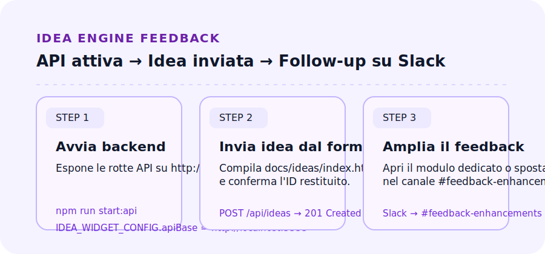

# Tutorial rapido — Idea Engine end-to-end

## Obiettivo

Attivare il percorso completo dall'ideazione alla raccolta feedback con il widget pubblico, il backend Node e la tassonomia condivisa.

## Prerequisiti

- Repository installato con dipendenze Node: `npm install` dalla root.
- Accesso al file [`config/idea_engine_taxonomy.json`](../../config/idea_engine_taxonomy.json) per verificare slug e categorie.
- Permessi per il canale Slack `#feedback-enhancements` e per il modulo espresso (Google Forms).

## Passaggi

1. **Avvia il backend** — esegui `npm run start:api` per esporre l'API su `http://0.0.0.0:3333` e verifica `GET /api/health` dal browser.
2. **Configura il widget** — apri `docs/ideas/index.html`, imposta `window.IDEA_WIDGET_CONFIG.apiBase = "http://localhost:3333"` e, se necessario, `categoriesUrl` verso la tassonomia pubblicata.
3. **Invia un'idea completa** — compila tutti i campi sfruttando i suggerimenti tassonomici; conferma l'invio con **Invia al backend** e salva il brief Codex generato.
4. **Condividi feedback immediato** — utilizza il callout finale del report oppure apri direttamente il [modulo feedback](feedback-form.md) per annotare follow-up.
5. **Sincronizza con il Support Hub** — archivia l'idea in `docs/ideas/IDEAS_INDEX.md` (workflow CI) e inoltra highlight nel canale `#feedback-enhancements` con link a `docs/ideas/index.html`.

## Prossimi passi

- Rigenera la tassonomia con `npm run build:idea-taxonomy` quando aggiorni biomi, specie o tratti.
- Traccia le revisioni successive nel [changelog Idea Engine](../ideas/changelog.md) citando PR, issue e log di riferimento.
- Mantieni allineati gli slug personalizzati aggiornando `docs/public/idea-taxonomy.json` e segnalando eccezioni nel Support Hub.

👉 Apri subito la pagina [Support Hub Idea Engine](../ideas/index.html) per verificare che CTA e link siano correttamente instradati.
