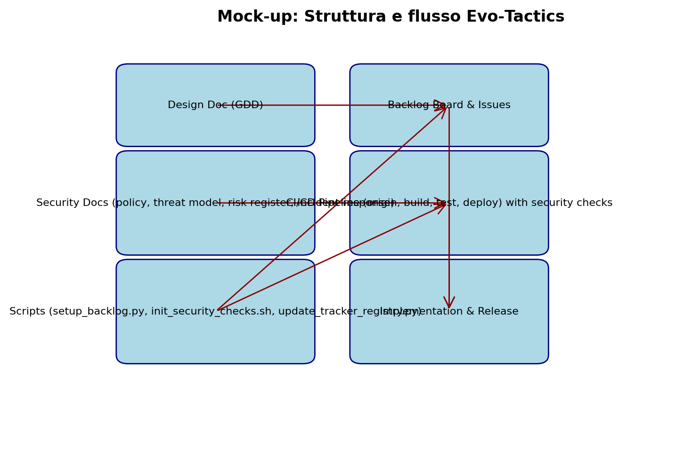

# Mockup Evo Tactics Console

Questo mockup mostra la struttura di navigazione e le principali viste della console Evo Tactics. I punti chiave evidenziati dal disegno sono:

- **Navigazione laterale**: un menu off-canvas che consente di accedere rapidamente alle sezioni Generatore, Mission Control, Mission Console, Ecosystem Pack e alle viste di analisi come Dashboard e Atlas.
- **Barra superiore contestuale**: include lo stato della sessione, controlli rapidi per le principali azioni del game master e indicatori di telemetria.
- **Pannello missioni**: mette in primo piano il flusso di gestione delle missioni con timeline, assegnazioni e stato degli obiettivi.
- **Card modulari**: ogni sezione mostra widget auto-contenuti che riassumono tratti, risorse e suggerimenti generati dal sistema.

Utilizza questo mockup come riferimento visivo per l'implementazione dei layout descritti nella documentazione di progettazione della console Evo Tactics.
